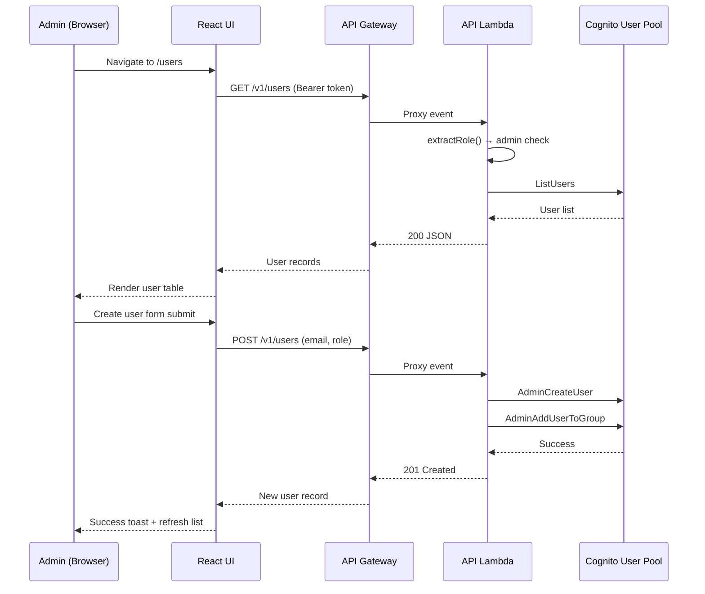

# Design Document: Admin User Management

## Overview

This feature adds an Admin User Management page to the Waiver Data Hub, enabling administrators to create, list, disable, enable, delete, and change roles for Cognito users directly from the UI. Currently, user provisioning requires AWS CLI access. This design introduces:

1. A set of `/v1/users` API endpoints in the existing API Lambda handler that proxy Cognito Admin SDK operations
2. A new `UserManagement` React page with a user table and create-user form
3. Infrastructure changes to grant the API Lambda `cognito-idp` permissions and pass the `USER_POOL_ID` environment variable
4. Sidebar and routing updates to expose the page to admin users only

All user management operations are admin-only. The API handler enforces RBAC by checking the caller's Cognito group before processing any `/v1/users` request.

## Architecture



The design follows the existing patterns:
- The API Lambda (`lambdas/src/api/handler.ts`) gains new route handlers for `/v1/users` paths
- API Gateway gets new resource definitions in `infra/lib/api-stack.ts` using the existing `addRoute` helper and `AwsIntegration`
- The UI adds a new page component and sidebar entry, using the existing `apiGet`/`apiPost`/`apiPut`/`apiDelete` client functions and `react-query`

## Components and Interfaces

### API Endpoints

| Method | Path | Description |
|--------|------|-------------|
| GET | `/v1/users` | List all users with their email, status, role, and creation date |
| POST | `/v1/users` | Create a new user (body: `{ email, role }`) |
| PUT | `/v1/users/{username}/role` | Change a user's role (body: `{ role }`) |
| POST | `/v1/users/{username}/disable` | Disable a user account |
| POST | `/v1/users/{username}/enable` | Enable a user account |
| DELETE | `/v1/users/{username}` | Permanently delete a user |

All endpoints require admin role. Non-admin requests receive 403.

### API Lambda Handler Functions

New functions added to `lambdas/src/api/handler.ts`:

```typescript
// Cognito client setup
import {
  CognitoIdentityProviderClient,
  ListUsersCommand,
  AdminCreateUserCommand,
  AdminSetUserPasswordCommand,
  AdminAddUserToGroupCommand,
  AdminRemoveUserFromGroupCommand,
  AdminDisableUserCommand,
  AdminEnableUserCommand,
  AdminDeleteUserCommand,
  AdminListGroupsForUserCommand,
} from '@aws-sdk/client-cognito-identity-provider';

const cognitoClient = new CognitoIdentityProviderClient({});
const USER_POOL_ID = process.env.USER_POOL_ID ?? '';

// Route handlers
async function listUsers(): Promise<APIGatewayProxyResult>
async function createUser(event: APIGatewayProxyEvent): Promise<APIGatewayProxyResult>
async function changeUserRole(username: string, event: APIGatewayProxyEvent, callerEmail: string): Promise<APIGatewayProxyResult>
async function disableUser(username: string, callerEmail: string): Promise<APIGatewayProxyResult>
async function enableUser(username: string): Promise<APIGatewayProxyResult>
async function deleteUser(username: string, callerEmail: string): Promise<APIGatewayProxyResult>
```

### Self-Action Prevention

The `changeUserRole`, `disableUser`, and `deleteUser` functions compare the target username against the caller's email (extracted from `event.requestContext.authorizer.claims.email`). If they match, the API returns a 400 error to prevent accidental self-lockout.

### UI Components

**`ui/src/pages/UserManagement.tsx`** — Main page component:
- User table displaying email, role, status, created date
- "Create User" form with email input and role select
- Action buttons per row: change role, disable/enable toggle, delete
- Confirmation dialogs for disable and delete actions
- Loading and error states
- Uses `react-query` for data fetching and cache invalidation

### Infrastructure Changes

**`infra/lib/api-stack.ts`**:
- Pass `userPool.userPoolId` as `USER_POOL_ID` environment variable to the API Lambda
- Add IAM policy granting `cognito-idp:AdminCreateUser`, `AdminSetUserPassword`, `AdminAddUserToGroup`, `AdminRemoveUserFromGroup`, `AdminDisableUser`, `AdminEnableUser`, `AdminDeleteUser`, `ListUsers`, `AdminListGroupsForUser` on the User Pool ARN
- Add API Gateway resources: `/v1/users`, `/v1/users/{username}`, `/v1/users/{username}/role`, `/v1/users/{username}/disable`, `/v1/users/{username}/enable`

**`ui/src/components/Sidebar.tsx`**:
- Add `{ to: '/users', label: 'Users', icon: '👥', requiredRole: 'admin' }` to `navItems`

**`ui/src/components/ProtectedRoute.tsx`**:
- Add `/users` to `ADMIN_ONLY_ROUTES`

**`ui/src/App.tsx`**:
- Add `<Route path="users" element={<UserManagement />} />`

## Data Models

### User Record (API Response)

```typescript
interface UserRecord {
  username: string;       // Cognito username (typically email)
  email: string;          // Email attribute
  role: 'admin' | 'user'; // Derived from Cognito group membership
  status: string;         // Cognito UserStatus (e.g. CONFIRMED, FORCE_CHANGE_PASSWORD)
  enabled: boolean;       // Whether the account is enabled
  createdAt: string;      // ISO 8601 timestamp
}
```

### Create User Request

```typescript
interface CreateUserRequest {
  email: string;  // Must be valid email format
  role: 'admin' | 'user';
}
```

### Change Role Request

```typescript
interface ChangeRoleRequest {
  role: 'admin' | 'user';
}
```

### API Error Response

Uses the existing `errorResponse` helper pattern:

```typescript
{ error: { code: string; message: string } }
```

Status codes: 400 (validation/self-action), 403 (unauthorized), 409 (duplicate email), 500 (internal).


## Correctness Properties

*A property is a characteristic or behavior that should hold true across all valid executions of a system — essentially, a formal statement about what the system should do. Properties serve as the bridge between human-readable specifications and machine-verifiable correctness guarantees.*

### Property 1: RBAC enforcement on /v1/users endpoints

*For any* HTTP method, *for any* `/v1/users` path, and *for any* user whose role is not `admin` (including `user` role and `null`/missing role), the API handler SHALL return a 403 Forbidden response.

**Validates: Requirements 1.5, 8.1, 8.2**

### Property 2: User record mapping preserves all Cognito attributes

*For any* valid Cognito `ListUsers` response containing N users, the `listUsers` handler function SHALL return exactly N `UserRecord` objects, and each record's `email`, `enabled`, `status`, and `createdAt` fields SHALL match the corresponding Cognito user attributes.

**Validates: Requirements 1.1**

### Property 3: Email validation rejects invalid formats

*For any* string that does not match a valid email format (e.g. missing `@`, missing domain, empty string, whitespace-only), the email validation function SHALL reject it. *For any* string that matches a valid email format, the validation function SHALL accept it.

**Validates: Requirements 2.4**

### Property 4: Create user assigns the selected Cognito group

*For any* valid email and *for any* role in `{admin, user}`, when the create user handler succeeds, it SHALL call `AdminAddUserToGroup` with the group name matching the selected role.

**Validates: Requirements 2.3**

### Property 5: Role change removes old group and adds new group

*For any* user with a current role and *for any* different target role, the change role handler SHALL call `AdminRemoveUserFromGroup` for the current role's group and `AdminAddUserToGroup` for the new role's group.

**Validates: Requirements 3.1**

### Property 6: Self-action prevention

*For any* admin user, *for any* self-targeted destructive operation (change own role, disable own account, delete own account), the API handler SHALL return a 400 error and SHALL NOT execute the Cognito operation.

**Validates: Requirements 3.5, 4.5, 6.4**

## Error Handling

| Scenario | HTTP Status | Error Code | Message |
|----------|-------------|------------|---------|
| Non-admin calls any `/v1/users` endpoint | 403 | FORBIDDEN | Forbidden: insufficient permissions |
| Missing or invalid request body | 400 | VALIDATION_ERROR | Descriptive validation message |
| Invalid email format in create request | 400 | VALIDATION_ERROR | Invalid email format |
| Missing role in create request | 400 | VALIDATION_ERROR | Role is required (admin or user) |
| Email already exists in Cognito | 409 | CONFLICT | User with this email already exists |
| Admin attempts self-action (role change, disable, delete) | 400 | SELF_ACTION | Cannot [action] your own account |
| User not found in Cognito | 404 | NOT_FOUND | User not found |
| Cognito SDK error | 500 | INTERNAL_ERROR | Internal server error |

Error responses use the existing `errorResponse(code, message, statusCode)` helper to maintain consistency with the rest of the API.

## Testing Strategy

### Unit Tests (Jest)

Unit tests use the existing Jest setup in `lambdas/` with mocked Cognito SDK calls. Focus areas:

- Each route handler (list, create, change role, disable, enable, delete) with mocked Cognito responses
- RBAC enforcement: verify 403 for non-admin callers
- Self-action prevention: verify 400 when caller targets themselves
- Error handling: duplicate email (409), user not found (404), Cognito errors (500)
- Email validation edge cases: empty, whitespace, missing @, missing domain
- Request body validation: missing fields, invalid role values

### Property-Based Tests (fast-check)

Property-based tests use `fast-check` (to be added as a dev dependency in `lambdas/package.json`). Each property test runs a minimum of 100 iterations.

- **Feature: admin-user-management, Property 1: RBAC enforcement** — Generate random non-admin roles and random `/v1/users` paths, verify all return 403
- **Feature: admin-user-management, Property 2: User record mapping** — Generate random Cognito user lists, verify the mapping produces correct UserRecord arrays
- **Feature: admin-user-management, Property 3: Email validation** — Generate random strings (valid and invalid emails), verify the validation function correctly accepts/rejects
- **Feature: admin-user-management, Property 4: Create user group assignment** — Generate random valid emails and roles, verify AdminAddUserToGroup is called with the correct group
- **Feature: admin-user-management, Property 5: Role change group swap** — Generate random (currentRole, newRole) pairs, verify remove-from-old and add-to-new calls
- **Feature: admin-user-management, Property 6: Self-action prevention** — Generate random admin emails and self-targeted operations, verify all are rejected with 400

Each property-based test MUST be implemented as a single test using `fc.assert(fc.property(...))` and MUST reference its design property in a comment tag.
