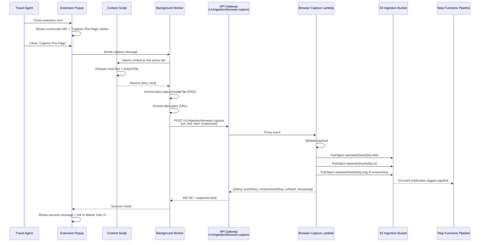
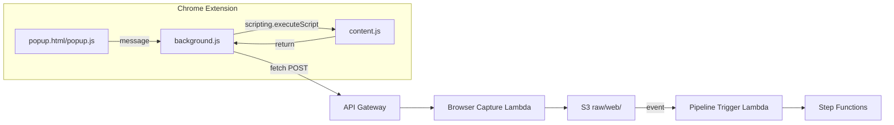

# Design Document: Chrome Extension Capture

## Overview

This feature adds a Chrome Manifest V3 browser extension and a companion API endpoint that together allow travel agents to capture fully rendered page content from authenticated browser sessions and submit it to the Waiver Data Hub ingestion pipeline. The existing web-fetcher Lambda uses server-side HTTP fetch which cannot access SPA sites behind authentication (e.g. SalesLink by American Airlines). The extension solves this by extracting content directly from the user's browser where they are already logged in.

The system has two main parts:

1. **Chrome Extension** (`extension/` directory) — vanilla JS, no build step. Captures page text, HTML, and a screenshot from the active tab, then POSTs a JSON payload to the API.
2. **Browser Capture Lambda** (`lambdas/src/browser-capture/`) — receives the payload, validates it, stores HTML/text/screenshot in S3 under `raw/web/{urlHash}/{timestamp}.*`, which triggers the existing Step Functions pipeline via the S3 event notification already configured on the `raw/` prefix.

The extension is for internal distribution only (loaded unpacked via `chrome://extensions`).

## Architecture



### Component Interaction



## Components and Interfaces

### 1. Chrome Extension Files (`extension/`)

All files live in a new `extension/` directory at the project root.

#### manifest.json
- `manifest_version`: 3
- `permissions`: `["activeTab", "scripting"]`
- `host_permissions`: `["https://1xwh2q6cxd.execute-api.eu-west-2.amazonaws.com/*"]`
- `action.default_popup`: `popup.html`
- `background.service_worker`: `background.js`

#### popup.html + popup.js
- Displays current tab URL and a "Capture This Page" button
- Validates the active tab URL is HTTP/HTTPS before enabling capture
- Shows loading state ("Capturing and submitting…") during capture
- On success: shows "Capture submitted successfully" + link to Waiver Hub UI
- On error: shows error description from the API or content extraction failure message
- Communicates with background.js via `chrome.runtime.sendMessage`

#### background.js (Service Worker)
- Listens for `"capture"` messages from popup.js
- Orchestrates the capture flow:
  1. Gets active tab URL via `chrome.tabs.query`
  2. Injects `content.js` via `chrome.scripting.executeScript`
  3. Captures screenshot via `chrome.tabs.captureVisibleTab` (PNG, base64)
  4. Strips the `data:image/png;base64,` prefix from the screenshot
  5. POSTs the `CapturePayload` to the API
  6. Returns the result to popup.js via `sendResponse`

#### content.js
- Injected into the active tab by background.js
- Returns `{ text: document.body.innerText, html: document.documentElement.outerHTML }`

### 2. Browser Capture Lambda (`lambdas/src/browser-capture/handler.ts`)

Follows the same pattern as `web-fetcher/api-handler.ts`:

#### Interface: `CapturePayload`
```typescript
interface CapturePayload {
  url: string;        // required — source page URL
  text: string;       // required — visible text (innerText)
  html: string;       // required — full rendered HTML (outerHTML)
  screenshot?: string; // optional — base64-encoded PNG (no data URI prefix)
}
```

#### Interface: `CaptureResult`
```typescript
interface CaptureResult {
  s3Key: string;           // raw/web/{urlHash}/{timestamp}.html
  textS3Key: string;       // raw/web/{urlHash}/{timestamp}.txt
  screenshotS3Key: string; // raw/web/{urlHash}/{timestamp}.png or ""
  urlHash: string;         // SHA-256 hex of the URL
  timestamp: string;       // ISO 8601
}
```

#### Handler Logic
1. Parse and validate the JSON body (see Requirement 4 validation rules)
2. Compute `urlHash` = SHA-256 hex of `url` (reuse `computeUrlHash` from `web-fetcher/handler.ts`)
3. Generate `timestamp` = `new Date().toISOString()`
4. Store HTML to `raw/web/{urlHash}/{timestamp}.html` with metadata `source-url` and `render-method: browser-capture`
5. Store text to `raw/web/{urlHash}/{timestamp}.txt` with metadata `source-url` and `render-method: browser-capture`
6. If screenshot provided, decode base64 and store to `raw/web/{urlHash}/{timestamp}.png` with metadata `source-url`
7. Return `CaptureResult`

### 3. CDK Infrastructure Changes (`infra/lib/api-stack.ts`)

Add to the existing `ApiStack`:
- New `NodejsFunction` for `browser-capture/handler.ts` with 512 MB memory, 30s timeout
- Grant `grantWrite` on `ingestionBucket`
- New API Gateway resource: `/v1/ingestion/browser-capture` with POST method
- Same Cognito authorizer as other ingestion endpoints
- CORS already configured at the API level with `ALL_ORIGINS`

## Data Models

### CapturePayload (Extension → API)

| Field | Type | Required | Description |
|-------|------|----------|-------------|
| `url` | string | Yes | The URL of the captured page |
| `text` | string | Yes | Visible text extracted via `document.body.innerText` |
| `html` | string | Yes | Full rendered HTML via `document.documentElement.outerHTML` |
| `screenshot` | string | No | Base64-encoded PNG screenshot (no `data:` prefix) |

### CaptureResult (API → Extension)

| Field | Type | Description |
|-------|------|-------------|
| `s3Key` | string | S3 key for the stored HTML file |
| `textS3Key` | string | S3 key for the stored text file |
| `screenshotS3Key` | string | S3 key for the screenshot (empty string if none) |
| `urlHash` | string | SHA-256 hex hash of the source URL |
| `timestamp` | string | ISO 8601 timestamp of the capture |

### Error Response (API → Extension)

| Field | Type | Description |
|-------|------|-------------|
| `error.code` | string | Machine-readable error code (e.g. `MISSING_URL`, `INVALID_URL`) |
| `error.message` | string | Human-readable error description |

### S3 Object Layout

All objects stored under the existing `raw/web/` prefix to trigger the pipeline:

```
raw/web/{urlHash}/{timestamp}.html   — Content-Type: text/html
raw/web/{urlHash}/{timestamp}.txt    — Content-Type: text/plain
raw/web/{urlHash}/{timestamp}.png    — Content-Type: image/png (optional)
```

S3 object metadata on all objects:
- `source-url`: the original page URL
- `render-method`: `browser-capture` (on HTML and text objects only)

### Validation Rules

| Condition | HTTP Status | Error Code |
|-----------|-------------|------------|
| Missing `url` | 400 | `MISSING_URL` |
| Invalid URL (not HTTP/HTTPS) | 400 | `INVALID_URL` |
| Missing `text` | 400 | `MISSING_TEXT` |
| Missing `html` | 400 | `MISSING_HTML` |
| Empty `text` (empty string) | 400 | `EMPTY_TEXT` |
| Missing `screenshot` | Accepted | N/A (screenshot is optional) |


## Correctness Properties

*A property is a characteristic or behavior that should hold true across all valid executions of a system — essentially, a formal statement about what the system should do. Properties serve as the bridge between human-readable specifications and machine-verifiable correctness guarantees.*

### Property 1: Valid payload storage correctness

*For any* valid CapturePayload (valid HTTP/HTTPS URL, non-empty text, non-empty html), the Browser Capture Lambda SHALL store an HTML object at `raw/web/{SHA256(url)}/{timestamp}.html` with Content-Type `text/html` and metadata `source-url` and `render-method: browser-capture`, a text object at `raw/web/{SHA256(url)}/{timestamp}.txt` with Content-Type `text/plain` and the same metadata, and if a screenshot is provided, a PNG object at `raw/web/{SHA256(url)}/{timestamp}.png` with Content-Type `image/png` and metadata `source-url`. If no screenshot is provided, only the HTML and text objects SHALL be stored.

**Validates: Requirements 2.3, 2.4, 2.5, 2.6, 2.7, 4.6**

### Property 2: Invalid payload rejection

*For any* request payload that is missing the `url` field, has a `url` that is not a valid HTTP or HTTPS URL, is missing the `text` field, or is missing the `html` field, the Browser Capture Lambda SHALL return HTTP 400 with the corresponding error code (`MISSING_URL`, `INVALID_URL`, `MISSING_TEXT`, or `MISSING_HTML`) and SHALL NOT store any objects in S3.

**Validates: Requirements 4.1, 4.2, 4.3, 4.4**

### Property 3: Response contains all required fields

*For any* valid CapturePayload, the Browser Capture Lambda response SHALL contain `s3Key`, `textS3Key`, `screenshotS3Key`, `urlHash`, and `timestamp` fields, where `s3Key` ends with `.html`, `textS3Key` ends with `.txt`, `urlHash` equals the SHA-256 hex of the input URL, and `timestamp` is a valid ISO 8601 string.

**Validates: Requirements 2.9**

### Property 4: URL hash determinism

*For any* URL string, computing the URL hash SHALL always produce the same SHA-256 hex output, and two different URLs SHALL produce different hashes (collision resistance).

**Validates: Requirements 2.3, 2.4, 2.5**

### Property 5: Non-capturable URL detection

*For any* URL string whose protocol is not `http:` or `https:` (e.g. `chrome://`, `about://`, `file://`, `ftp://`), the extension popup SHALL identify it as non-capturable and disable the capture button.

**Validates: Requirements 6.2**

## Error Handling

### Lambda Error Handling

The Browser Capture Lambda follows the same error response pattern as `web-fetcher/api-handler.ts`:

| Scenario | Status | Error Code | Message |
|----------|--------|------------|---------|
| No request body | 400 | `MISSING_BODY` | Request body is required |
| Invalid JSON body | 400 | `INVALID_JSON` | Request body must be valid JSON |
| Missing `url` | 400 | `MISSING_URL` | url is required and must be a string |
| Invalid URL (not HTTP/HTTPS) | 400 | `INVALID_URL` | url must be a valid HTTP or HTTPS URL |
| Missing `text` | 400 | `MISSING_TEXT` | text is required and must be a string |
| Missing `html` | 400 | `MISSING_HTML` | html is required and must be a string |
| Empty `text` | 400 | `EMPTY_TEXT` | text must not be empty |
| S3 write failure | 500 | `STORAGE_ERROR` | Failed to store captured content |
| Unexpected error | 500 | `INTERNAL_ERROR` | Internal server error |

All error responses use the format: `{ "error": { "code": "...", "message": "..." } }`

All responses include CORS headers: `Access-Control-Allow-Origin: *`, `Access-Control-Allow-Headers: *`, `Access-Control-Allow-Methods: *`.

### Extension Error Handling

| Scenario | User-Facing Message |
|----------|-------------------|
| Non-HTTP/HTTPS tab | "This page cannot be captured (only HTTP/HTTPS pages are supported)" |
| Content script injection fails | "Content extraction failed — the page may block extensions" |
| Content script returns empty text | "No text content found on this page" |
| API returns 4xx/5xx | Display the `error.message` from the API response |
| Network error (API unreachable) | "Could not reach the Waiver Hub API — check your connection" |

## Testing Strategy

### Unit Tests

Unit tests cover specific examples, edge cases, and error conditions for the Lambda handler:

- Valid payload with all fields → 200 + correct S3 keys
- Valid payload without screenshot → 200 + empty screenshotS3Key
- Missing url → 400 MISSING_URL
- Invalid URL (ftp://) → 400 INVALID_URL
- Missing text → 400 MISSING_TEXT
- Missing html → 400 MISSING_HTML
- Empty text → 400 EMPTY_TEXT
- No body → 400 MISSING_BODY
- Invalid JSON → 400 INVALID_JSON
- S3 failure → 500 STORAGE_ERROR

Unit tests for the extension popup logic (if extracted to testable functions):
- `isCapturableUrl("https://example.com")` → true
- `isCapturableUrl("chrome://extensions")` → false
- `isCapturableUrl("about:blank")` → false

### Property-Based Tests

Property-based testing library: **fast-check** (already available in the Node.js/TypeScript ecosystem used by this project).

Each property test runs a minimum of 100 iterations and references the design property it validates.

Configuration:
- Library: `fast-check`
- Min iterations: 100 per property
- Each test tagged with: `Feature: chrome-extension-capture, Property {N}: {title}`

Property tests to implement:

1. **Feature: chrome-extension-capture, Property 1: Valid payload storage correctness**
   Generate random valid CapturePayloads (random HTTP/HTTPS URLs, random non-empty text, random non-empty HTML, optional random base64 screenshot). Verify the handler calls S3 PutObject with the correct keys, content types, and metadata.

2. **Feature: chrome-extension-capture, Property 2: Invalid payload rejection**
   Generate random payloads with one required field removed or with invalid URLs (random non-HTTP protocols, malformed strings). Verify the handler returns 400 with the correct error code and does not call S3.

3. **Feature: chrome-extension-capture, Property 3: Response contains all required fields**
   Generate random valid CapturePayloads. Verify the response body contains all required fields with correct types and formats.

4. **Feature: chrome-extension-capture, Property 4: URL hash determinism**
   Generate random URL strings. Verify that `computeUrlHash(url)` always returns the same value for the same input, and different values for different inputs.

5. **Feature: chrome-extension-capture, Property 5: Non-capturable URL detection**
   Generate random URLs with non-HTTP/HTTPS protocols. Verify the `isCapturableUrl` function returns false. Generate random HTTP/HTTPS URLs and verify it returns true.
