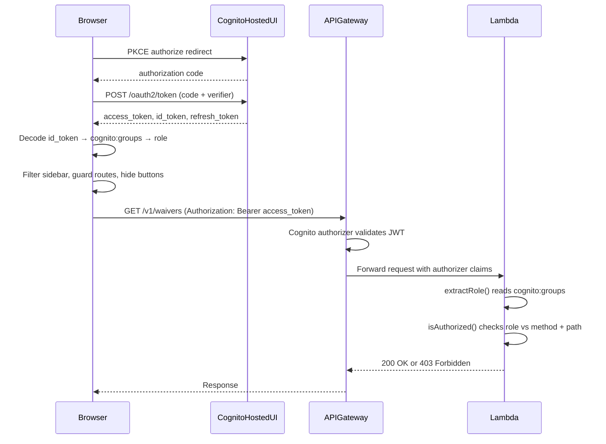

# Design Document: Cognito Auth Roles

## Overview

This design implements a two-role authorization model (admin / user) for the Waiver Data Hub application by removing the existing authentication bypass, reconfiguring Cognito groups, and enforcing role-based access at three layers: API Gateway (JWT validation), Lambda RBAC middleware (endpoint + method restrictions), and UI (navigation filtering, route guards, action button visibility).

The current system has a `disableAuth` CDK context flag that bypasses the Cognito authorizer at API Gateway, a `DISABLE_AUTH` Lambda env var that makes all requests act as admin, and a `VITE_DISABLE_AUTH` UI env var that skips login and sends unauthenticated requests. All three bypasses are removed. The legacy three-role model (admin, reviewer, api_consumer) is replaced with two roles: admin (full access) and user (read-only on a subset of pages).

### Key Design Decisions

1. **Role resolution from JWT**: The `cognito:groups` claim in the ID token is the single source of truth for the user's role. The UI decodes it client-side; the Lambda reads it from the authorizer claims. No extra API call is needed.
2. **Highest-privilege-wins**: If a user belongs to both "admin" and "user" groups, they get admin access.
3. **Allowlist approach for user role**: Rather than blocking specific endpoints, the user role has an explicit allowlist of permitted path prefixes and methods. Everything else is denied.
4. **UI guards are defense-in-depth**: The API enforces authorization server-side. UI guards (sidebar filtering, route redirects, hidden buttons) improve UX but are not the security boundary.

## Architecture

The authorization flow spans three layers:



### Layer Responsibilities

| Layer | Responsibility |
|-------|---------------|
| Cognito User Pool | Authenticate users, issue JWTs with `cognito:groups` claim |
| API Gateway Authorizer | Reject requests without a valid JWT (401) |
| Lambda RBAC Middleware | Enforce role-based method + path restrictions (403) |
| UI ProtectedRoute | Redirect unauthenticated users to Cognito login |
| UI RoleContext | Expose decoded role to components |
| UI Sidebar | Show/hide nav items based on role |
| UI Route Guards | Redirect user-role users away from admin-only routes |
| UI WaiverDetail | Show/hide action buttons and toggle field editability |

## Components and Interfaces

### 1. Infrastructure Changes (CDK)

**AuthStack** (`infra/lib/auth-stack.ts`):
- Remove `CfnUserPoolGroup` for "reviewer" and "api_consumer"
- Keep "admin" group as-is
- Add "user" group: `groupName: 'user'`, description: "Read-only access to Dashboard, Waivers, and Reports"

**ApiStack** (`infra/lib/api-stack.ts`):
- Remove `disableAuth` prop and all conditional logic around it
- Always create the `CognitoUserPoolsAuthorizer` and apply `authOpts` to all methods
- Remove `DISABLE_AUTH` from Lambda environment variables
- `userPool` prop becomes required (not optional)

**app.ts** (`infra/bin/app.ts`):
- Remove `disableAuth` context variable lookup
- Always pass `auth.userPool` to `ApiStack`

### 2. Lambda RBAC Middleware

**handler.ts** (`lambdas/src/api/handler.ts`):

Replace the current three-role model with two roles:

```typescript
type Role = 'admin' | 'user';

const USER_ALLOWED_PATHS: string[] = [
  '/v1/waivers',
  '/v1/dashboard',
  '/v1/reports',
];

const USER_ALLOWED_EXACT: string[] = [
  '/v1/settings/extraction-fields',  // needed for WaiverDetail field schema
];

function isUserAllowedPath(path: string): boolean {
  return USER_ALLOWED_PATHS.some(prefix => path.startsWith(prefix))
    || USER_ALLOWED_EXACT.includes(path);
}
```

Updated `extractRole`:
- Remove `AUTH_DISABLED` bypass
- Return `'admin'` if groups include "admin", `'user'` if groups include "user", `null` otherwise

Updated `isAuthorized`:
- Admin: all methods, all paths → allowed
- User: GET only, and only on allowed paths → allowed
- Everything else → denied

### 3. UI Role Context

New file: `ui/src/auth/role.ts`

```typescript
export type AppRole = 'admin' | 'user' | null;

export function resolveRole(groups: string[] | undefined): AppRole {
  if (!groups || groups.length === 0) return null;
  const lower = groups.map(g => g.toLowerCase());
  if (lower.includes('admin')) return 'admin';
  if (lower.includes('user')) return 'user';
  return null;
}
```

New React context: `ui/src/auth/RoleContext.tsx`

Provides `{ role: AppRole; isAdmin: boolean }` to the component tree. Reads from `getUserInfo().groups` on mount and after token refresh.

### 4. UI Sidebar Changes

**Sidebar.tsx** (`ui/src/components/Sidebar.tsx`):
- Import `useRole` from RoleContext
- Add a `requiredRole` field to each nav item (optional, defaults to allowing all roles)
- Filter `navItems` based on current role before rendering
- Admin sees all 8 items; user sees Dashboard, Waivers, Reports

### 5. UI ProtectedRoute Changes

**ProtectedRoute.tsx** (`ui/src/components/ProtectedRoute.tsx`):
- Remove `VITE_DISABLE_AUTH` bypass entirely
- Add role-based route guarding: if user role navigates to `/review`, `/ingest`, `/rules`, `/settings`, or `/monitoring`, redirect to `/`
- If role is `null` (no recognized group), show an "Access Denied" page

### 6. UI WaiverDetail Changes

**WaiverDetail.tsx** (`ui/src/pages/WaiverDetail.tsx`):
- Import `useRole` from RoleContext
- If role is `'user'`: hide Approve, Reject, Save Draft buttons; render all form inputs with `readOnly` / `disabled`
- If role is `'admin'`: current behavior (editable fields, action buttons visible)

### 7. UI API Client Changes

**client.ts** (`ui/src/api/client.ts`):
- Remove `AUTH_DISABLED` / `VITE_DISABLE_AUTH` check
- Always attach `Authorization: Bearer <token>` header when a token exists

### 8. UI TopNav Changes

**TopNav.tsx** (`ui/src/components/TopNav.tsx`):
- Remove `AUTH_DISABLED` bypass for username display
- Always read from `getUserInfo()`

### 9. Token Refresh

**pkce.ts** (`ui/src/auth/pkce.ts`):
- Add a `refreshAccessToken()` function that POSTs to the Cognito `/oauth2/token` endpoint with `grant_type=refresh_token`
- Add a `ensureFreshToken()` function that checks if the access token expires within 5 minutes and triggers refresh if needed
- Call `ensureFreshToken()` from `getAccessToken()` (or from the API client before each request)
- On refresh failure (expired refresh token), clear tokens and redirect to login

## Data Models

### Cognito Groups

| Group Name | Description | Permissions |
|-----------|-------------|-------------|
| admin | Full access to all resources | All HTTP methods on all endpoints |
| user | Read-only access to Dashboard, Waivers, and Reports | GET only on `/v1/waivers/**`, `/v1/dashboard/**`, `/v1/reports/**`, `/v1/settings/extraction-fields` |

### Role Resolution Logic

```
Input: cognito:groups claim (comma-separated string)
Output: 'admin' | 'user' | null

1. Parse groups into lowercase array
2. If array includes 'admin' → return 'admin'
3. If array includes 'user' → return 'user'
4. Otherwise → return null
```

### User-Role Endpoint Allowlist

| Path Pattern | Methods | Notes |
|-------------|---------|-------|
| `/v1/waivers` | GET | List waivers |
| `/v1/waivers/active` | GET | Active waivers |
| `/v1/waivers/search` | GET | Search waivers |
| `/v1/waivers/:id` | GET | Waiver detail |
| `/v1/waivers/:id/source` | GET | Source document |
| `/v1/waivers/:id/versions` | GET | Version history |
| `/v1/waivers/group` | GET | Duplicate group copies |
| `/v1/dashboard/metrics` | GET | Dashboard data |
| `/v1/reports/**` | GET | Reports |
| `/v1/settings/extraction-fields` | GET | Field schema (needed by WaiverDetail) |

All other paths and all non-GET methods return 403 for the user role.

### UI Route Access Matrix

| Route | Admin | User |
|-------|-------|------|
| `/` (Dashboard) | ✅ | ✅ |
| `/waivers` | ✅ | ✅ |
| `/waivers/:id` | ✅ | ✅ (read-only) |
| `/reports` | ✅ | ✅ |
| `/review` | ✅ | ❌ → redirect to `/` |
| `/ingest` | ✅ | ❌ → redirect to `/` |
| `/rules` | ✅ | ❌ → redirect to `/` |
| `/settings` | ✅ | ❌ → redirect to `/` |
| `/monitoring` | ✅ | ❌ → redirect to `/` |


## Correctness Properties

*A property is a characteristic or behavior that should hold true across all valid executions of a system — essentially, a formal statement about what the system should do. Properties serve as the bridge between human-readable specifications and machine-verifiable correctness guarantees.*

### Property 1: RBAC authorization correctness

*For any* role (admin, user, or null), any HTTP method (GET, POST, PUT, DELETE), and any API path, `isAuthorized(role, method, path)` returns `true` if and only if:
- role is "admin" (all methods, all paths allowed), OR
- role is "user" AND method is "GET" AND the path is in the user-allowed set

In all other cases (null role, user with non-GET method, user with disallowed path), it returns `false`.

**Validates: Requirements 3.1, 3.2, 3.3, 3.4, 3.5**

### Property 2: Role resolution from groups

*For any* array of group name strings, `resolveRole(groups)` returns:
- `'admin'` if the array contains "admin" (regardless of other entries),
- `'user'` if the array contains "user" but not "admin",
- `null` if the array contains neither "admin" nor "user"

This must hold regardless of array ordering, casing, or the presence of unrecognized group names.

**Validates: Requirements 10.1, 10.2**

### Property 3: UI route guard correctness

*For any* application route path and any role, the route guard allows access if and only if:
- role is "admin" (all routes allowed), OR
- role is "user" AND the route is in {`/`, `/waivers`, `/waivers/:id`, `/reports`}

For user-role access to admin-only routes (`/review`, `/ingest`, `/rules`, `/settings`, `/monitoring`), the guard redirects to `/`.

**Validates: Requirements 6.1, 6.2**

### Property 4: Token refresh triggers near expiry

*For any* stored token set where the access token's `expires_at` is within 5 minutes of the current time and a valid refresh token exists, calling `ensureFreshToken()` triggers a refresh request. For tokens with more than 5 minutes remaining, no refresh is triggered.

**Validates: Requirements 8.1**

### Property 5: API client always sends auth header

*For any* API request made when a valid access token exists in session storage, the request includes an `Authorization: Bearer <token>` header. There is no conditional bypass based on environment variables.

**Validates: Requirements 1.3**

## Error Handling

### API Layer (Lambda RBAC)

| Condition | HTTP Status | Error Code | Message |
|-----------|-------------|------------|---------|
| No valid JWT (caught by API Gateway) | 401 | Unauthorized | Handled by API Gateway before Lambda |
| JWT present but no recognized group | 403 | FORBIDDEN | "Forbidden: no valid role assigned" |
| User role attempts non-GET method | 403 | FORBIDDEN | "Forbidden: insufficient permissions" |
| User role attempts GET on admin-only path | 403 | FORBIDDEN | "Forbidden: insufficient permissions" |

### UI Layer

| Condition | Behavior |
|-----------|----------|
| No token in session storage | Redirect to Cognito Hosted UI via PKCE |
| Token exchange fails (callback error) | Clear tokens, redirect to Cognito login |
| Token expired, refresh fails | Clear tokens, redirect to Cognito login |
| Authenticated but no recognized group | Show "Access Denied" informational page |
| User navigates to admin-only route | Redirect to Dashboard (`/`) |
| API returns 401 | Clear tokens, redirect to login |
| API returns 403 | Display error message in UI (toast/banner) |

## Testing Strategy

### Unit Tests

Unit tests cover specific examples and edge cases:

- **extractRole**: test with admin-only groups, user-only groups, both groups, empty groups, unrecognized groups, mixed case
- **isAuthorized**: test specific endpoint/method combinations for each role (e.g., user + GET + `/v1/waivers` → true, user + POST + `/v1/waivers/123/approve` → false)
- **resolveRole**: test with `['admin']`, `['user']`, `['admin', 'user']`, `['unknown']`, `[]`, `undefined`
- **Sidebar filtering**: test that admin sees all 8 nav items, user sees 3 items
- **WaiverDetail**: test that user role hides action buttons and sets fields to read-only
- **Token refresh**: test that refresh is called when token is near expiry, not called when token is fresh
- **ProtectedRoute**: test redirect behavior for unauthenticated users and role-based route blocking

### Property-Based Tests

Property-based tests verify universal properties across generated inputs. Use `fast-check` as the PBT library for TypeScript.

Each property test must:
- Run a minimum of 100 iterations
- Reference the design property with a tag comment
- Use a single property-based test per correctness property

| Property | Generator Strategy |
|----------|-------------------|
| Property 1: RBAC authorization | Generate random roles (admin, user, null), random HTTP methods, random path strings (mix of allowed and disallowed paths) |
| Property 2: Role resolution | Generate random arrays of strings including "admin", "user", random strings, varying lengths and orderings |
| Property 3: UI route guard | Generate random roles and random route paths from the full set of application routes plus some invalid paths |
| Property 4: Token refresh timing | Generate random `expires_at` timestamps relative to `Date.now()`, covering near-expiry, fresh, and expired ranges |
| Property 5: API client auth header | Generate random token strings and verify the header is always attached |

**Tag format**: `Feature: cognito-auth-roles, Property {number}: {title}`

Example:
```typescript
// Feature: cognito-auth-roles, Property 1: RBAC authorization correctness
test.prop([fc.constantFrom('admin', 'user', null), fc.constantFrom('GET', 'POST', 'PUT', 'DELETE'), fc.string()], 
  (role, method, path) => { ... }, { numRuns: 100 });
```
