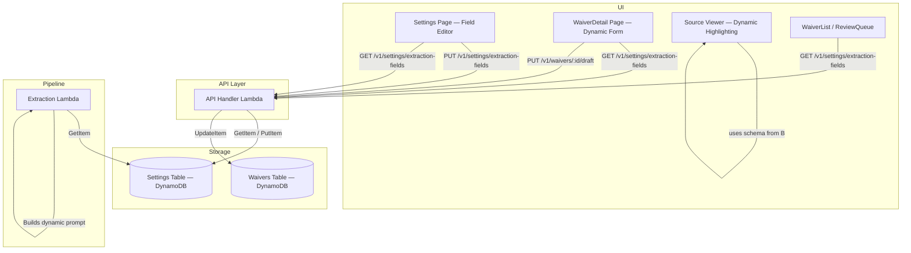

# Design Document: Configurable Extraction Fields

## Overview

This feature replaces the 9 hardcoded extraction fields with a dynamic, admin-configurable field schema stored in DynamoDB. The schema drives the Bedrock extraction prompt, the WaiverDetail form renderer, the source viewer highlighting, and the save-draft API — so adding or removing a field requires zero code changes.

The field schema is a JSON array of `FieldDefinition` objects persisted in the existing Settings table under the key `extraction_fields`. A default schema matching the current 9 fields is returned when no entry exists. Two new API endpoints (`GET/PUT /v1/settings/extraction-fields`) expose the schema to the UI. The extraction Lambda reads the schema at runtime to build a dynamic Bedrock prompt. The WaiverDetail page, Settings page Field Editor, WaiverList, and ReviewQueue all consume the schema to render fields dynamically.

## Architecture



### Data Flow

1. Admin edits fields in Settings → `PUT /v1/settings/extraction-fields` → schema saved to Settings table.
2. New waiver arrives → Extraction Lambda reads schema from Settings table → builds dynamic Bedrock prompt → extracts fields + confidence scores → stores result in S3.
3. Reviewer opens WaiverDetail → page fetches schema via `GET /v1/settings/extraction-fields` → renders form inputs dynamically → source viewer assigns colors from schema.
4. Reviewer saves draft → `PUT /v1/waivers/:id/draft` → API reads schema to determine editable fields → persists only schema-defined fields.

## Components and Interfaces

### 1. FieldDefinition Type (shared)

```typescript
interface FieldDefinition {
  key: string;       // machine name, e.g. "airline_code" — lowercase + digits + underscores only
  label: string;     // display name, e.g. "Airline Code"
  type: 'text' | 'date' | 'array' | 'textarea';
  definition: string; // AI guidance text for Bedrock prompt
  required: boolean;
  order: number;      // display position (ascending)
}

type FieldSchema = FieldDefinition[];
```

### 2. API Endpoints

#### GET /v1/settings/extraction-fields

- Returns the current `FieldSchema` sorted by `order`.
- If no `extraction_fields` entry exists in Settings table, returns the `DEFAULT_SCHEMA`.
- Accessible to all authenticated roles.

#### PUT /v1/settings/extraction-fields

- Accepts a `FieldSchema` JSON array in the request body.
- Validates: no duplicate `key` values, all required properties present, `key` matches `/^[a-z][a-z0-9_]*$/`, `type` is one of the allowed values.
- Persists to Settings table under key `extraction_fields` with `value` as the JSON-stringified schema.
- Returns the saved schema.
- Restricted to `admin` role (returns 403 otherwise).

### 3. Default Schema

A constant `DEFAULT_SCHEMA: FieldSchema` containing the 9 original fields with meaningful `definition` strings:

| key | label | type | definition (summary) |
|-----|-------|------|---------------------|
| airline_code | Airline Code | text | IATA 2-letter airline code, e.g. AA, UA, DL |
| waiver_title | Waiver Title | text | Official title or name of the waiver advisory |
| waiver_code | Waiver Code | text | Official waiver/advisory code as shown on source |
| effective_date | Effective Date | date | Start date in ISO 8601 format |
| expiration_date | Expiration Date | date | End date in ISO 8601 format |
| applicable_routes | Applicable Routes | array | Origin-destination route pairs |
| fare_classes | Fare Classes | array | Applicable fare class codes |
| rebooking_rules | Rebooking Rules | textarea | Free-text summary of rebooking policies |
| refund_rules | Refund Rules | textarea | Free-text summary of refund policies |

### 4. Extraction Lambda Changes

- On invocation, fetch schema via `GetItem` on Settings table (key: `extraction_fields`).
- If fetch fails (table unreachable), fall back to `DEFAULT_SCHEMA` and log a warning.
- `buildExtractionPrompt()` iterates over the schema to produce per-field instructions including type-specific formatting guidance and the `definition` text.
- `parseBedrockResponse()` becomes dynamic: iterates schema keys instead of hardcoded fields.
- `computeOverallConfidence()` computes `Math.min()` over all schema-defined field scores.
- The `SETTINGS_TABLE` env var and `dynamodb:GetItem` permission are added in the Pipeline stack.

### 5. Dynamic Prompt Construction

The prompt template iterates over each `FieldDefinition`:

```
For each field:
- "key": <type-specific instruction>
  Description: <definition>
```

Type-specific instructions:
- `text` / `textarea` → "string"
- `date` → "string (ISO 8601 date, e.g. '2024-01-15')"
- `array` → "array of strings"

The prompt also requests a `confidence_scores` object with a 0.0–1.0 score for each field key.

### 6. WaiverDetail Page Changes

- On mount, fetch `FieldSchema` from `GET /v1/settings/extraction-fields`.
- Replace hardcoded `FormFields` type, `FIELD_LABELS`, `REQUIRED_FIELDS`, and `FIELD_COLORS` with schema-driven equivalents.
- Render form inputs dynamically: `text` → `<input type="text">`, `date` → `<input type="date">`, `array` → `<input type="text">` (comma-separated), `textarea` → `<textarea>`.
- Display fields in `order` sequence, using `label` for labels.
- Mark `required` fields and validate non-empty before save.
- Source viewer assigns colors from a palette based on field index in the schema.

### 7. Settings Page Field Editor

- New "Field Definitions" card below the existing Confidence Threshold card.
- Lists all fields from the schema with inline editing for label, type, definition, required, order.
- Add button creates a new field with defaults.
- Remove button deletes a field (with confirmation).
- Drag-to-reorder or up/down buttons to change `order`.
- Save button sends `PUT /v1/settings/extraction-fields`.
- Displays API validation errors on failure.

### 8. Save Draft API Changes

- `saveDraft()` reads the schema from Settings table.
- Builds the editable field list dynamically from `schema.map(f => f.key)` instead of the hardcoded array.
- Ignores request body fields not in the schema.

### 9. WaiverList / ReviewQueue Changes

- Fetch schema on mount.
- Display columns for fields where `required` is true (or all fields, space permitting).
- New fields appear automatically.

### 10. Infrastructure Changes (Pipeline Stack)

- Add `SETTINGS_TABLE` environment variable to the extraction Lambda.
- Add `dynamodb:GetItem` IAM permission on the Settings table ARN for the extraction Lambda.

## Data Models

### Settings Table Entry

```json
{
  "key": "extraction_fields",
  "value": "[{\"key\":\"airline_code\",\"label\":\"Airline Code\",\"type\":\"text\",\"definition\":\"The IATA 2-letter airline code...\",\"required\":true,\"order\":1}, ...]",
  "updated_at": "2024-01-15T10:30:00.000Z"
}
```

The `value` field is a JSON-stringified `FieldSchema` array. This matches the existing pattern used by `confidence_threshold` (which stores its value as a string).

### FieldDefinition Validation Rules

| Property | Type | Constraints |
|----------|------|-------------|
| key | string | Required. Unique within schema. Matches `/^[a-z][a-z0-9_]*$/`. |
| label | string | Required. Non-empty. |
| type | string | Required. One of: `text`, `date`, `array`, `textarea`. |
| definition | string | Required. Non-empty. |
| required | boolean | Required. |
| order | number | Required. Integer ≥ 0. |

### Dynamic Waiver Record

After this feature, waiver records in DynamoDB are no longer limited to the 9 original fields. Each record contains whatever fields the schema defined at extraction time. The `confidence_scores` object similarly contains scores for all schema-defined fields.

### Color Assignment for Source Viewer

Colors are assigned deterministically from a fixed palette based on field index:

```typescript
const COLOR_PALETTE = [
  '#bbdefb', '#c8e6c9', '#fff9c4', '#f8bbd0', '#e1bee7',
  '#b2dfdb', '#ffe0b2', '#d1c4e9', '#ffccbc', '#b3e5fc',
  '#dcedc8', '#f0f4c3', '#ffcdd2', '#d1c4e9', '#cfd8dc',
];

function getFieldColor(index: number): string {
  return COLOR_PALETTE[index % COLOR_PALETTE.length];
}
```


## Correctness Properties

*A property is a characteristic or behavior that should hold true across all valid executions of a system — essentially, a formal statement about what the system should do. Properties serve as the bridge between human-readable specifications and machine-verifiable correctness guarantees.*

### Property 1: Schema storage round-trip

*For any* valid `FieldSchema`, persisting it via `PUT /v1/settings/extraction-fields` and then retrieving it via `GET /v1/settings/extraction-fields` should return an equivalent schema (same fields, same values, sorted by `order`).

**Validates: Requirements 1.1, 2.1, 2.2**

### Property 2: Schema validation rejects invalid schemas

*For any* `FieldSchema` that contains duplicate `key` values, or a `FieldDefinition` missing a required property (`key`, `label`, `type`, `definition`, `required`, `order`), or a `key` that does not match `/^[a-z][a-z0-9_]*$/`, or a `type` not in `['text', 'date', 'array', 'textarea']`, the validation function should reject it and the API should return a 400 error.

**Validates: Requirements 1.3, 1.4, 1.5, 2.3, 2.4**

### Property 3: Non-admin PUT returns 403

*For any* user with role `reviewer` or `api_consumer`, a PUT request to `/v1/settings/extraction-fields` should return a 403 status code regardless of the request body.

**Validates: Requirements 2.5**

### Property 4: Dynamic prompt contains all schema fields

*For any* valid `FieldSchema`, the prompt string produced by `buildExtractionPrompt` should contain every field's `key`, a type-appropriate format instruction (e.g. "array of strings" for `array` type, "ISO 8601 date" for `date` type, "string" for `text`/`textarea`), the field's `definition` text, and a `confidence_scores` section referencing every field key.

**Validates: Requirements 3.2, 3.3, 3.4, 3.5, 3.6, 3.7**

### Property 5: Confidence score completeness and overall computation

*For any* valid `FieldSchema` and any parsed Bedrock response containing numeric scores, the parsed confidence scores object should contain a key for every field in the schema, and the computed overall confidence should equal the minimum of all per-field scores.

**Validates: Requirements 4.1, 4.2, 4.3**

### Property 6: Form renders correct input type per field in schema order

*For any* valid `FieldSchema`, the dynamically rendered form should contain one input element per field definition, where `text` fields render a text input, `date` fields render a date input, `array` fields render a text input (comma-separated), and `textarea` fields render a textarea element. The inputs should appear in ascending `order` sequence, and each input should be labeled with the field's `label`.

**Validates: Requirements 5.1, 5.2, 5.3, 5.4, 5.5, 5.6, 5.7**

### Property 7: Required field validation

*For any* `FieldSchema` and any form state where a field marked `required: true` has an empty (whitespace-only) value, the validation function should return an error referencing that field, and the save/approve action should be blocked.

**Validates: Requirements 5.8**

### Property 8: Distinct highlight color per field

*For any* `FieldSchema` with N fields (N ≤ palette size), the color assignment function should return N distinct colors — one per field.

**Validates: Requirements 6.1, 6.2**

### Property 9: Save draft persists only schema-defined fields

*For any* valid `FieldSchema` and any request body containing both schema-defined and non-schema fields, the save draft operation should persist values for all schema-defined fields present in the body and ignore all fields not in the schema.

**Validates: Requirements 8.1, 8.2, 8.3**

## Error Handling

| Scenario | Behavior |
|----------|----------|
| Settings table unreachable during extraction | Fall back to `DEFAULT_SCHEMA`, log warning, continue extraction |
| Settings table unreachable during API GET | Return `DEFAULT_SCHEMA` (same fallback) |
| Invalid schema on PUT (duplicate keys, missing props, bad key format) | Return 400 with descriptive error message |
| Non-admin attempts PUT on extraction-fields | Return 403 |
| Bedrock returns empty or unparseable response | Throw `ExtractionError` (existing behavior unchanged) |
| Bedrock response missing a schema-defined field | Default to empty string / empty array; confidence score defaults to 0 |
| Schema has 0 fields | Validation rejects — at least 1 field required |
| Field key conflicts with DynamoDB reserved attributes | The `key` regex (`/^[a-z][a-z0-9_]*$/`) prevents most conflicts; `UpdateExpression` uses expression attribute names for safety |

## Testing Strategy

### Unit Tests

Unit tests cover specific examples and edge cases:

- Default schema returns exactly 9 fields with correct keys, types, and non-empty definitions (Req 10.1–10.4)
- GET with no stored schema returns default (Req 1.2)
- PUT with valid schema stores and returns it (Req 2.2)
- PUT with duplicate keys returns 400 (Req 2.3)
- PUT with missing property returns 400 (Req 2.4)
- PUT by non-admin returns 403 (Req 2.5)
- Extraction Lambda falls back to default on DynamoDB error (Req 3.8)
- Settings page Field Editor renders, allows add/edit/remove/reorder (Req 7.1–7.7)
- WaiverList and ReviewQueue display schema-driven columns (Req 9.1–9.3)
- Pipeline stack grants GetItem permission and sets SETTINGS_TABLE env var (Req 11.1–11.2)

### Property-Based Tests

Property-based tests verify universal properties across randomly generated inputs. Each property test runs a minimum of 100 iterations.

The project uses TypeScript with Vitest, so property-based tests will use **fast-check** (`fc`) as the PBT library.

Each test is tagged with a comment referencing the design property:

- **Feature: configurable-extraction-fields, Property 1: Schema storage round-trip** — Generate random valid schemas, PUT then GET, assert equivalence.
- **Feature: configurable-extraction-fields, Property 2: Schema validation rejects invalid schemas** — Generate schemas with random invalidity (duplicate keys, missing props, bad key format, bad type), assert validation rejects.
- **Feature: configurable-extraction-fields, Property 3: Non-admin PUT returns 403** — Generate random schemas and non-admin roles, assert 403.
- **Feature: configurable-extraction-fields, Property 4: Dynamic prompt contains all schema fields** — Generate random schemas, build prompt, assert all keys/types/definitions/confidence present.
- **Feature: configurable-extraction-fields, Property 5: Confidence score completeness and overall computation** — Generate random schemas and score maps, assert all fields have scores and overall = min.
- **Feature: configurable-extraction-fields, Property 6: Form renders correct input type per field in schema order** — Generate random schemas, render form, assert correct input types in order with labels.
- **Feature: configurable-extraction-fields, Property 7: Required field validation** — Generate schemas with random required flags and form states with empty required fields, assert validation errors.
- **Feature: configurable-extraction-fields, Property 8: Distinct highlight color per field** — Generate random schemas, assign colors, assert all distinct.
- **Feature: configurable-extraction-fields, Property 9: Save draft persists only schema-defined fields** — Generate random schemas and request bodies with extra fields, assert only schema fields persisted.
