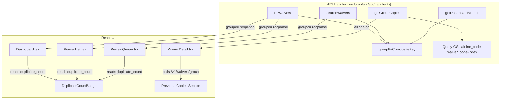

# Design Document: Duplicate Grouping UI

## Overview

This feature extends the existing duplicate-waiver-detection system by adding server-side grouping and UI-level collapsing of duplicate waivers. Currently, every duplicate copy appears as a separate row in list views, cluttering the interface. This design introduces:

1. A server-side grouping layer in the API handler that collapses waivers sharing the same `airline_code` + `waiver_code` into a single row, returning only the "latest copy" (by `updated_at`, then `ingestion_timestamp` as tiebreaker) with a `duplicate_count` field.
2. A new `GET /v1/waivers/group` endpoint that returns all copies within a group for drill-down.
3. UI updates across Dashboard, WaiverList, ReviewQueue, and WaiverDetail to display count badges and a "Previous copies" section.

The grouping logic operates purely at query time — no data migration or schema changes are needed. It leverages the existing `airline_code-waiver_code-index` GSI for the group copies endpoint and in-memory grouping for list responses.

## Architecture



### Key design decisions

1. **In-memory grouping on list endpoints.** The `listWaivers`, `searchWaivers`, and `getDashboardMetrics` functions already perform full table scans. Grouping is applied as a post-filter step on the scanned results — no additional DynamoDB calls are needed. This keeps the change minimal and avoids new infrastructure.

2. **`updated_at` as the primary sort key for Latest_Copy.** When a reviewer saves draft edits, the record's `updated_at` is bumped. Using `updated_at` (descending) as the primary sort ensures user-edited records are always preferred over newer but unedited ingestions. `ingestion_timestamp` is the tiebreaker when `updated_at` values match.

3. **Dedicated group endpoint uses the GSI.** The `GET /v1/waivers/group?airline=X&waiverCode=Y` endpoint queries the `airline_code-waiver_code-index` GSI directly, which is an efficient single-partition query. This avoids scanning the entire table just to fetch one group's copies.

4. **No data migration.** Records created before the duplicate-waiver-detection feature (without `is_duplicate` flags) are included in grouping purely by their `airline_code` + `waiver_code` values. The grouping logic is key-based, not flag-based.

5. **Shared `DuplicateCountBadge` component.** All three list views (Dashboard, WaiverList, ReviewQueue) use the same badge component for visual consistency.

## Components and Interfaces

### 1. Grouping utility function (new)

**File:** `lambdas/src/api/handler.ts` (inline helper)

```typescript
interface GroupedWaiver extends Record<string, unknown> {
  duplicate_count: number;
}

/**
 * Group waiver records by airline_code + waiver_code.
 * Returns only the "latest copy" per group with a duplicate_count field.
 * Latest copy = highest updated_at, then highest ingestion_timestamp as tiebreaker.
 */
function groupWaivers(items: Record<string, unknown>[]): GroupedWaiver[];
```

This function:
- Builds a `Map<string, Record<string, unknown>[]>` keyed by `${airline_code}::${waiver_code}`
- For each group, picks the record with the most recent `updated_at` (tiebreaker: `ingestion_timestamp`)
- Attaches `duplicate_count` (group size) to the selected record
- Returns the array of selected records

### 2. Group copies endpoint (new route handler)

**File:** `lambdas/src/api/handler.ts`

```typescript
/**
 * GET /v1/waivers/group?airline=XX&waiverCode=YYY
 * Returns all waiver records in the group, sorted by ingestion_timestamp desc.
 */
async function getGroupCopies(event: APIGatewayProxyEvent): Promise<APIGatewayProxyResult>;
```

Queries the `airline_code-waiver_code-index` GSI with the provided `airline` and `waiverCode` parameters. Returns all matching records sorted by `ingestion_timestamp` descending. Each record includes `id`, `ingestion_timestamp`, `source_type`, `status`, `created_at`, and `updated_at`.

### 3. Modified list endpoints

- **`listWaivers`**: After filtering and before pagination, call `groupWaivers()` on the filtered set. Paginate the grouped results.
- **`searchWaivers`**: After filtering, call `groupWaivers()` on the result set before returning.
- **`getDashboardMetrics`**: Apply `groupWaivers()` to the recent waivers slice. Include `duplicate_count` in each recent waiver object.

### 4. Router addition

Add a new route in the `handler` function:

```typescript
// GET /v1/waivers/group
if (method === 'GET' && segments[2] === 'group' && !segments[3]) {
  return await getGroupCopies(event);
}
```

This must be placed before the single-item `GET /v1/waivers/{id}` route to avoid `"group"` being interpreted as a waiver ID.

### 5. UI: DuplicateCountBadge (shared component)

**Used in:** Dashboard.tsx, WaiverList.tsx, ReviewQueue.tsx

```tsx
function DuplicateCountBadge({ count }: { count: number }) {
  if (count <= 1) return null;
  return (
    <span className="badge" style={{ background: '#fff3e0', color: '#e65100', marginLeft: 6 }}>
      Duplicate ({count})
    </span>
  );
}
```

Replaces the existing `DuplicateBadge` component (which shows a simple "Duplicate" label) and the inline duplicate badge in Dashboard.tsx.

### 6. UI: WaiverDetail Previous Copies section

**File:** `ui/src/pages/WaiverDetail.tsx`

When the current waiver has `duplicate_count > 1`, fetch all copies via `GET /v1/waivers/group?airline={airline_code}&waiverCode={waiver_code}`. Display a "Previous copies" section below the main content with a table of all other copies (excluding the current one), each row showing:
- `ingestion_timestamp`
- `source_type`
- `updated_at` (to distinguish user-edited records)
- Clickable link navigating to `/waivers/{copy.id}`

Sorted by `ingestion_timestamp` descending.

### 7. API client addition

**File:** `ui/src/api/client.ts`

No new functions needed — the existing `apiGet` function handles the new endpoint. The UI calls:
```typescript
apiGet('/v1/waivers/group', { airline: waiver.airline_code, waiverCode: waiver.waiver_code })
```

## Data Models

### Grouped waiver response (list endpoints)

Each waiver record in list responses gains one new field:

| Field | Type | Description |
|---|---|---|
| duplicate_count | number | Total records in the waiver group (≥ 1). Added at query time, not persisted. |

All existing fields remain unchanged. The `is_duplicate` and `duplicate_of_id` fields are still present on individual records but are no longer the primary mechanism for UI display — `duplicate_count` drives the badge.

### Group copies endpoint response

`GET /v1/waivers/group?airline=XX&waiverCode=YYY`

```json
{
  "data": [
    {
      "id": "uuid-1",
      "ingestion_timestamp": "2024-01-15T10:00:00Z",
      "source_type": "email",
      "status": "active",
      "created_at": "2024-01-15T10:00:00Z",
      "updated_at": "2024-01-16T14:30:00Z"
    },
    {
      "id": "uuid-2",
      "ingestion_timestamp": "2024-01-14T08:00:00Z",
      "source_type": "web",
      "status": "pending_review",
      "created_at": "2024-01-14T08:00:00Z",
      "updated_at": "2024-01-14T08:00:00Z"
    }
  ]
}
```

### Grouping key

| Component | Source | Example |
|---|---|---|
| airline_code | `WaiverRecord.airline_code` | `AA` |
| waiver_code | `WaiverRecord.waiver_code` | `WVR-1234` |
| Composite key | `${airline_code}::${waiver_code}` | `AA::WVR-1234` |

### Latest Copy selection algorithm

```
1. Group all records by airline_code + waiver_code
2. Within each group, sort by:
   a. updated_at DESC (primary)
   b. ingestion_timestamp DESC (tiebreaker)
3. Select the first record as Latest_Copy
4. Set duplicate_count = group.length on the selected record
```


## Correctness Properties

*A property is a characteristic or behavior that should hold true across all valid executions of a system — essentially, a formal statement about what the system should do. Properties serve as the bridge between human-readable specifications and machine-verifiable correctness guarantees.*

### Property 1: Grouping produces exactly one record per composite key with correct count

*For any* set of waiver records with arbitrary `airline_code` and `waiver_code` values (including records with and without `is_duplicate` flags), applying `groupWaivers` should produce exactly one output record per unique `airline_code + waiver_code` pair, and each output record's `duplicate_count` should equal the number of input records sharing that composite key.

**Validates: Requirements 1.1, 1.2, 1.3, 1.6, 7.1, 7.2, 7.3, 8.4**

### Property 2: Latest copy is the record with the most recent updated_at

*For any* waiver group containing multiple records with distinct `updated_at` timestamps, the record selected as the Latest_Copy by `groupWaivers` should have the maximum `updated_at` value among all records in that group.

**Validates: Requirements 1.4, 8.1**

### Property 3: Tiebreaker selects the most recent ingestion_timestamp

*For any* waiver group where two or more records share the same maximum `updated_at` timestamp, the record selected as the Latest_Copy should have the maximum `ingestion_timestamp` among those tied records.

**Validates: Requirements 8.2**

### Property 4: Group copies endpoint returns all matching records sorted by ingestion_timestamp descending

*For any* `airline_code` and `waiver_code` pair that has N records in the database, the group copies endpoint should return exactly N records, and for every consecutive pair of records in the response, the earlier record's `ingestion_timestamp` should be greater than or equal to the later record's `ingestion_timestamp`.

**Validates: Requirements 2.1, 2.2, 6.4**

### Property 5: Group copies response includes required fields

*For any* record returned by the group copies endpoint, the record should contain the fields `id`, `ingestion_timestamp`, `source_type`, `status`, `created_at`, and `updated_at`, and none of these fields should be undefined.

**Validates: Requirements 2.3, 8.3**

### Property 6: DuplicateCountBadge renders if and only if count exceeds 1

*For any* integer `duplicate_count`, the `DuplicateCountBadge` component should render a badge containing the text `Duplicate (N)` if and only if `duplicate_count > 1`. When `duplicate_count <= 1`, the component should render nothing.

**Validates: Requirements 3.1, 3.2, 4.1, 4.2, 5.1, 5.2**

### Property 7: Previous copies section visibility matches duplicate count

*For any* waiver record, the "Previous copies" section in WaiverDetail should be displayed if and only if `duplicate_count > 1`. When displayed, each copy row should contain a navigable link to `/waivers/{id}`, the `ingestion_timestamp`, `source_type`, and `updated_at` values.

**Validates: Requirements 6.1, 6.2, 6.3, 6.5, 8.3**

## Error Handling

| Scenario | Handling |
|---|---|
| `airline` or `waiverCode` query param missing on group endpoint | Return 400 with `VALIDATION_ERROR` message indicating required parameters. |
| GSI query fails on group copies endpoint | Return 500 with `INTERNAL_ERROR`. Log the DynamoDB error. |
| Waiver record missing `airline_code` or `waiver_code` | Exclude from grouping. Treat as a singleton group with `duplicate_count: 1`. |
| Waiver record missing `updated_at` field | Fall back to `created_at` for Latest_Copy selection. If both are missing, use empty string (sorts last). |
| Waiver record missing `ingestion_timestamp` | Use empty string for tiebreaker (sorts last). |
| Group copies endpoint returns empty list | Return `{ data: [] }` with 200 status. UI shows no "Previous copies" section since `duplicate_count` would be 1. |
| Network error fetching group copies in WaiverDetail | Show an inline error message in the "Previous copies" section. Do not block the rest of the detail page. |

## Testing Strategy

### Unit Tests (Jest)

Unit tests cover specific examples and edge cases:

- `groupWaivers` with an empty input array returns an empty array.
- `groupWaivers` with all unique keys returns all records with `duplicate_count: 1`.
- `groupWaivers` with two records sharing a key returns one record with `duplicate_count: 2` and the correct Latest_Copy.
- `groupWaivers` with records missing `is_duplicate` flag — verify they are still grouped by key.
- `groupWaivers` tiebreaker: two records with same `updated_at` — verify `ingestion_timestamp` breaks the tie.
- `getGroupCopies` with missing query params returns 400.
- `getGroupCopies` with non-existent airline+waiverCode returns empty array with 200.
- `getGroupCopies` returns records sorted by `ingestion_timestamp` descending.
- `DuplicateCountBadge` renders nothing when `count` is 0 or 1.
- `DuplicateCountBadge` renders "Duplicate (5)" when `count` is 5.
- Integration: `listWaivers` response contains `duplicate_count` on each record.
- Integration: `getDashboardMetrics` recent waivers contain `duplicate_count`.

### Property-Based Tests (fast-check)

The project uses Jest for testing in the `lambdas` package. Property-based tests will use the `fast-check` library with Jest. Each property test runs a minimum of 100 iterations.

Each test is tagged with a comment referencing the design property:

```
// Feature: duplicate-grouping-ui, Property N: <property text>
```

Properties to implement:

1. **Property 1** — Generate random arrays of waiver-like objects with random `airline_code` (2-char uppercase) and `waiver_code` values (some overlapping). Apply `groupWaivers`. Verify: output length equals the number of unique `airline_code::waiver_code` keys, and each output record's `duplicate_count` equals the count of input records with that key. Include records with and without `is_duplicate` flags.

2. **Property 2** — Generate random groups of 2+ waiver records sharing the same key, with distinct `updated_at` timestamps. Apply `groupWaivers`. Verify the selected record's `updated_at` equals the maximum `updated_at` in the group.

3. **Property 3** — Generate random groups of 2+ waiver records sharing the same key and the same `updated_at`, but with distinct `ingestion_timestamp` values. Apply `groupWaivers`. Verify the selected record's `ingestion_timestamp` equals the maximum `ingestion_timestamp` among the tied records.

4. **Property 4** — Generate random arrays of waiver records for a single group key. Pass them through the group copies sorting logic. Verify the output length equals the input length, and `ingestion_timestamp` values are in non-increasing order.

5. **Property 5** — Generate random waiver records with all required fields. Pass through the group copies response mapper. Verify each output record contains `id`, `ingestion_timestamp`, `source_type`, `status`, `created_at`, and `updated_at`.

6. **Property 6** — Generate random integers for `duplicate_count` (0 to 100). For values > 1, verify the badge component output contains `Duplicate (N)`. For values <= 1, verify it returns null/empty.

7. **Property 7** — Generate random `duplicate_count` values. For values > 1, verify the previous copies section is rendered. For values <= 1, verify it is not rendered.

Each correctness property is implemented by a single property-based test. Property tests for the `groupWaivers` function (Properties 1–3) and sorting logic (Property 4–5) live in `lambdas/src/api/__tests__/`. UI component property tests (Properties 6–7) would require a React testing setup with `@testing-library/react` and `fast-check`.
