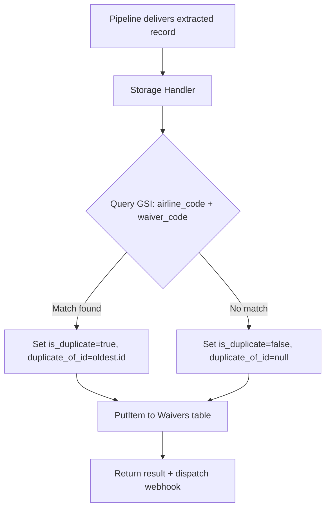

# Design Document: Duplicate Waiver Detection

## Overview

This feature adds duplicate detection to the waiver ingestion pipeline. When the storage handler persists a new waiver, it queries DynamoDB for existing records with the same `airline_code` and `waiver_code`. If a match is found, the incoming record is flagged with `is_duplicate: true` and `duplicate_of_id` pointing to the earliest matching record. Waivers with update-number suffixes (e.g. `WVR-1234-U2`) are treated as related but distinct records — only exact full `waiver_code` matches count as duplicates.

A new GSI (`airline_code-waiver_code-index`) on the Waivers table enables efficient composite-key lookups without scanning. The API passes through the new metadata fields, and the UI renders a "Duplicate" badge in the waiver list, review queue, and detail page with a link to the original.

## Architecture

The duplicate detection logic lives entirely within the storage handler Lambda (`lambdas/src/storage/handler.ts`). No new Lambda functions or Step Functions steps are needed.



### Key design decisions

1. **Detection at storage time, not post-hoc.** Running detection inline during PutItem keeps the data consistent from the moment of insertion. A background reconciliation job would introduce a window where duplicates exist without flags.

2. **Always persist duplicates.** The requirements explicitly state no ingested data should be silently discarded. Duplicates are stored with metadata so users can decide what to do.

3. **Full waiver_code match only.** Update-number variants like `WVR-1234-U2` vs `WVR-1234-U3` share a base code but are distinct waivers. The detector parses the base code to understand the relationship but only flags exact `waiver_code` matches as duplicates.

4. **GSI for lookups.** The existing `airline_code-index` GSI requires a FilterExpression on `waiver_code`, which scans all items for that airline. A composite GSI with `airline_code` as partition key and `waiver_code` as sort key enables a single precise query.

## Components and Interfaces

### 1. Duplicate Detector (new module)

**File:** `lambdas/src/storage/duplicate-detector.ts`

```typescript
export interface DuplicateCheckResult {
  isDuplicate: boolean;
  duplicateOfId: string | null;
}

/**
 * Parse a waiver code into base code and optional update number.
 * e.g. "WVR-1234-U2" → { baseCode: "WVR-1234", updateNumber: "U2" }
 *      "WVR-1234"    → { baseCode: "WVR-1234", updateNumber: null }
 */
export function parseWaiverCode(waiverCode: string): {
  baseCode: string;
  updateNumber: string | null;
};

/**
 * Query the GSI for existing waivers with the same airline_code and waiver_code.
 * Returns the ID of the earliest matching record, or null if no match.
 */
export async function checkForDuplicate(
  airlineCode: string,
  waiverCode: string,
): Promise<DuplicateCheckResult>;
```

### 2. Storage Handler (modified)

**File:** `lambdas/src/storage/handler.ts`

The `handler` function is modified to call `checkForDuplicate` before the PutItem call and include `is_duplicate` and `duplicate_of_id` in the persisted item.

### 3. WaiverRecord type (modified)

**File:** `shared/src/waiver-record.ts`

Two new optional fields added to the `WaiverRecord` interface:

```typescript
is_duplicate?: boolean;
duplicate_of_id?: string | null;
```

These are optional to maintain backward compatibility with records created before this feature.

### 4. API Handler (modified)

**File:** `lambdas/src/api/handler.ts`

- `listWaivers` and `searchWaivers`: already return all DynamoDB attributes, so `is_duplicate` and `duplicate_of_id` flow through automatically.
- New optional `duplicate` query parameter on `listWaivers` to filter by duplicate status.

### 5. Database Stack (modified)

**File:** `infra/lib/database-stack.ts`

Add a new GSI to the Waivers table:

```typescript
this.waiversTable.addGlobalSecondaryIndex({
  indexName: 'airline_code-waiver_code-index',
  partitionKey: { name: 'airline_code', type: dynamodb.AttributeType.STRING },
  sortKey: { name: 'waiver_code', type: dynamodb.AttributeType.STRING },
  projectionType: dynamodb.ProjectionType.ALL,
});
```

### 6. UI Components (modified)

- **WaiverList.tsx**: Add a "Duplicate" badge column/indicator when `is_duplicate === true`.
- **ReviewQueue.tsx**: Add a "Duplicate" badge in the Impact column area when `is_duplicate === true`.
- **WaiverDetail.tsx**: Add a notice banner at the top when `is_duplicate === true`, with a link to `/waivers/{duplicate_of_id}`. Handle the case where the original waiver no longer exists.

## Data Models

### WaiverRecord (updated)

| Field | Type | Description |
|---|---|---|
| id | string | Primary key (UUID) |
| airline_code | string | Two-letter airline code |
| waiver_code | string | Full waiver code including any update suffix |
| is_duplicate | boolean | `true` if this record is a duplicate of an existing waiver |
| duplicate_of_id | string \| null | ID of the original waiver this duplicates, or `null` |
| *(all existing fields)* | ... | Unchanged |

### GSI: airline_code-waiver_code-index

| Key | Attribute | Type |
|---|---|---|
| Partition Key | airline_code | String |
| Sort Key | waiver_code | String |
| Projection | ALL | — |

This GSI enables the duplicate detector to query `airline_code = :ac AND waiver_code = :wc` in a single operation, returning all matching records. The detector picks the one with the earliest `created_at` as the original.

### parseWaiverCode output

| Field | Type | Example |
|---|---|---|
| baseCode | string | `WVR-1234` |
| updateNumber | string \| null | `U2` or `null` |

The parser recognises suffixes matching the pattern `-U\d+`, `-REV\d+`, or `-V\d+` (case-insensitive) at the end of the waiver code.


## Correctness Properties

*A property is a characteristic or behavior that should hold true across all valid executions of a system — essentially, a formal statement about what the system should do. Properties serve as the bridge between human-readable specifications and machine-verifiable correctness guarantees.*

### Property 1: Duplicate detection correctness

*For any* two waiver records with the same `airline_code` and `waiver_code`, when the second record is stored, it should have `is_duplicate` set to `true` and `duplicate_of_id` set to the `id` of the first (earliest) record. Conversely, *for any* waiver record whose `airline_code` + `waiver_code` combination does not match any existing record, it should have `is_duplicate` set to `false` and `duplicate_of_id` set to `null`.

**Validates: Requirements 1.1, 1.2, 1.3, 2.3**

### Property 2: Record always persisted

*For any* waiver record passed to the storage handler — whether it is a duplicate or not — the record should exist in the Waivers table after the handler completes. No ingested data is silently discarded.

**Validates: Requirements 1.4**

### Property 3: Waiver code parsing round-trip

*For any* waiver code string, `parseWaiverCode` should produce a `baseCode` and optional `updateNumber` such that concatenating them (with the appropriate separator) reconstructs the original waiver code. Additionally, *for any* waiver code without a recognised update suffix, `updateNumber` should be `null` and `baseCode` should equal the original code.

**Validates: Requirements 2.1**

### Property 4: Update-number variants are not duplicates

*For any* two waiver records with the same `airline_code` and the same base waiver code but different update numbers (e.g. `WVR-1234-U1` vs `WVR-1234-U2`), neither record should be flagged as a duplicate of the other.

**Validates: Requirements 2.2**

### Property 5: Duplicate metadata consistency invariant

*For any* stored waiver record, `is_duplicate` must be a boolean. If `is_duplicate` is `true`, then `duplicate_of_id` must be a non-null string referencing a valid waiver ID. If `is_duplicate` is `false`, then `duplicate_of_id` must be `null`.

**Validates: Requirements 3.1, 3.2**

### Property 6: API duplicate filter correctness

*For any* set of waiver records with mixed duplicate statuses, when the API is called with `duplicate=true`, every returned record should have `is_duplicate === true`. When called with `duplicate=false`, every returned record should have `is_duplicate === false` (or `is_duplicate` absent, treated as `false`).

**Validates: Requirements 4.3**

## Error Handling

| Scenario | Handling |
|---|---|
| GSI query fails (DynamoDB error) | Log the error. Store the waiver with `is_duplicate: false` and `duplicate_of_id: null` as a safe default. The record is never lost. |
| GSI query returns multiple matches | Pick the record with the earliest `created_at` as the original. Log a warning if more than one match exists. |
| `waiver_code` is missing or empty | Skip duplicate detection. Store with `is_duplicate: false`. |
| `airline_code` is missing or empty | Skip duplicate detection. Store with `is_duplicate: false`. |
| Original waiver referenced by `duplicate_of_id` is later deleted | The UI handles this gracefully by showing "Original waiver has been removed" instead of a link. The `duplicate_of_id` value is not retroactively cleared. |
| Pre-existing records without `is_duplicate` field | The API and UI treat missing `is_duplicate` as `false`. No migration needed. |

## Testing Strategy

### Unit Tests (Jest)

Unit tests cover specific examples and edge cases:

- `parseWaiverCode` with various formats: `WVR-1234`, `WVR-1234-U2`, `WVR-1234-REV3`, `WVR-1234-V1`, codes with no suffix, codes with unusual casing.
- `checkForDuplicate` with mocked DynamoDB responses: no match, single match, multiple matches (picks earliest).
- Storage handler integration: verify `is_duplicate` and `duplicate_of_id` are set on the PutItem call.
- API handler: verify `duplicate` filter parameter works correctly.
- Edge cases: empty `waiver_code`, empty `airline_code`, GSI query failure fallback.

### Property-Based Tests (fast-check)

The project uses Jest for testing. Property-based tests will use the `fast-check` library with Jest. Each property test runs a minimum of 100 iterations.

Each test is tagged with a comment referencing the design property:

```
// Feature: duplicate-waiver-detection, Property N: <property text>
```

Properties to implement:

1. **Property 1** — Generate random pairs of `(airline_code, waiver_code)`. For pairs that match, verify `checkForDuplicate` returns `isDuplicate: true` with the correct `duplicateOfId`. For non-matching pairs, verify `isDuplicate: false`.

2. **Property 2** — Generate random waiver records (both duplicate and non-duplicate). After calling the storage handler, verify the record exists in the (mocked) table.

3. **Property 3** — Generate random waiver code strings (with and without update suffixes). Parse them and verify the round-trip: `baseCode + separator + updateNumber` reconstructs the original, or `baseCode === original` when no suffix.

4. **Property 4** — Generate random `(airline_code, baseCode)` pairs and two distinct update numbers. Verify that `checkForDuplicate` does not flag the second as a duplicate of the first.

5. **Property 5** — Generate random waiver records after storage. Verify the invariant: `is_duplicate === true` implies `duplicate_of_id` is a non-null string, and `is_duplicate === false` implies `duplicate_of_id` is `null`.

6. **Property 6** — Generate random sets of waiver records with mixed `is_duplicate` values. Apply the API filter logic and verify all returned records match the filter.
