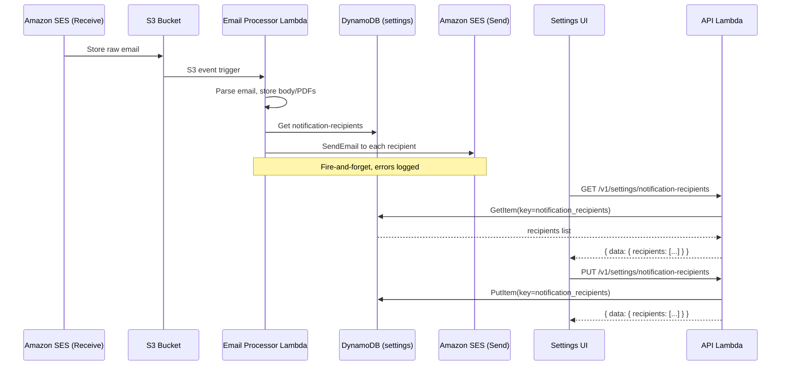

# Design Document: Email Arrival Notification

## Overview

This feature adds email notifications to the existing waiver email ingestion pipeline. When the Email Processor Lambda successfully processes a waiver email received via SES, it sends a notification email to a configurable list of recipients. The notification includes metadata about the incoming email (sender, subject, timestamp, attachment count).

Recipients are managed through a new Settings API endpoint (`/v1/settings/notification-recipients`) backed by the existing DynamoDB `settings` table, and a new UI card on the Settings page. Notifications are sent via Amazon SES using the same domain already configured for email receipt.

The design prioritizes non-disruption of the existing ingestion pipeline — notification failures are logged but never block waiver processing.

## Architecture



### Key Design Decisions

1. **Notification in Email Processor Lambda**: The notification is sent directly from the existing `email-processor/handler.ts` rather than introducing a separate Lambda or SNS topic. This keeps the architecture simple — the email processor already has all the metadata needed (sender, subject, attachments) and adding an SES SendEmail call is lightweight.

2. **DynamoDB settings table for recipients**: Reuses the existing `settings` table with a `notification_recipients` key, consistent with how `confidence_threshold` and `extraction_fields` are stored.

3. **SES for sending**: The domain is already verified for SES receipt. Using SES for sending from the same domain (e.g., `notifications@waiverhub.info`) avoids needing a separate email service and keeps deliverability high.

4. **Fire-and-forget notifications**: Notification failures must never block the ingestion pipeline. The send is wrapped in a try/catch that logs errors and continues.

## Components and Interfaces

### 1. Notification Service Module

**File**: `lambdas/src/email-processor/notification.ts`

A standalone module exporting a single function that the email processor handler calls after successful processing.

```typescript
export interface NotificationParams {
  from: string;
  subject: string;
  timestamp: string;
  pdfAttachmentCount: number;
  messageId: string;
}

export async function sendArrivalNotification(params: NotificationParams): Promise<void>;
```

Internally:
- Reads `notification_recipients` from DynamoDB settings table
- If empty or missing, logs and returns
- Reads `NOTIFICATION_SENDER` env var for the From address
- If not set, logs warning and returns
- Calls SES `SendEmail` for each recipient (or uses a single call with multiple `ToAddresses`)
- Catches and logs any SES errors without re-throwing

### 2. API Routes for Notification Recipients

**File**: `lambdas/src/api/handler.ts` (additions to existing router)

Two new route handlers added to the existing API handler:

```typescript
// GET /v1/settings/notification-recipients
async function getNotificationRecipients(): Promise<APIGatewayProxyResult>;

// PUT /v1/settings/notification-recipients
async function updateNotificationRecipients(event: APIGatewayProxyEvent, role: Role | null): Promise<APIGatewayProxyResult>;
```

**GET** returns `{ data: { recipients: string[] } }`.

**PUT** accepts `{ recipients: string[] }`, validates:
- `recipients` is an array
- Length is between 0 and 20
- Each entry matches a basic email regex pattern
- Returns 400 with descriptive error on validation failure

Stores as `{ key: "notification_recipients", value: JSON.stringify(recipients), updated_at: ... }` in the settings table.

### 3. Settings UI — Notification Recipients Card

**File**: `ui/src/pages/Settings.tsx` (new `NotificationRecipientsCard` component)

A new card component rendered on the Settings page between the existing cards. Features:
- Displays current recipients as a list
- "Add Recipient" button reveals an email input field
- Client-side email validation before API call
- Remove button (✕) per recipient
- Save button sends PUT to API
- Success/error banners consistent with existing cards

### 4. Infrastructure Changes

**File**: `infra/lib/email-ingestion-stack.ts` (modifications)

- Add `NOTIFICATION_SENDER` and `SETTINGS_TABLE` environment variables to the Email Processor Lambda
- Add IAM policy for `ses:SendEmail` on the verified identity ARN
- Add IAM policy for `dynamodb:GetItem` on the settings table

**File**: `infra/lib/api-stack.ts` (modifications)

- Add `/v1/settings/notification-recipients` resource with GET and PUT methods wired to the existing API Lambda

## Data Models

### DynamoDB Settings Table Entry

Uses the existing `settings` table (partition key: `key`).

| Attribute    | Type   | Value                                          |
|-------------|--------|------------------------------------------------|
| `key`       | String | `"notification_recipients"`                    |
| `value`     | String | JSON-encoded array, e.g. `'["a@b.com","c@d.com"]'` |
| `updated_at`| String | ISO 8601 timestamp                             |

### Email Validation

Email addresses are validated with a basic regex pattern: `/^[^\s@]+@[^\s@]+\.[^\s@]+$/`

This is intentionally simple — it catches obvious mistakes (missing @, missing domain) without being overly strict about RFC 5322 edge cases.

### Notification Email Format

- **From**: Value of `NOTIFICATION_SENDER` env var (e.g., `notifications@waiverhub.info`)
- **To**: Each address in the recipients list
- **Subject**: `New Waiver Email Received — {original subject}`
- **Body** (text):
  ```
  A new waiver email has been received and is being processed.

  From: {sender address}
  Subject: {original subject}
  Received: {timestamp}
  PDF Attachments: {count}

  This is an automated notification from Waiver Data Hub.
  ```


## Correctness Properties

*A property is a characteristic or behavior that should hold true across all valid executions of a system — essentially, a formal statement about what the system should do. Properties serve as the bridge between human-readable specifications and machine-verifiable correctness guarantees.*

### Property 1: Notification body contains all email metadata

*For any* sender address, subject line, timestamp, and PDF attachment count, the generated notification email body should contain all four values as substrings.

**Validates: Requirements 1.2, 1.3**

### Property 2: Notification sent to every configured recipient

*For any* non-empty list of recipient email addresses and any valid email metadata, calling the notification service should invoke SES SendEmail with all recipients as destinations.

**Validates: Requirements 1.1**

### Property 3: Notification failures never propagate

*For any* SES error (timeout, throttle, invalid address, service error), the notification function should resolve successfully (not throw), ensuring the ingestion pipeline is never interrupted.

**Validates: Requirements 1.5**

### Property 4: Recipients round-trip through settings API

*For any* list of 0–20 valid email addresses, storing the list via PUT `/v1/settings/notification-recipients` and then retrieving it via GET should return the same list.

**Validates: Requirements 2.2, 2.4**

### Property 5: Invalid email addresses are rejected

*For any* string that does not match a valid email format (missing @, missing domain, whitespace-only, empty string), a PUT request containing that string in the recipients array should return a 400 status code.

**Validates: Requirements 2.3, 3.3**

### Property 6: Recipients list size is bounded

*For any* list of valid email addresses with length greater than 20, a PUT request should return a 400 status code. For any list with length 0–20, the request should succeed.

**Validates: Requirements 2.5**

## Error Handling

| Scenario | Behavior |
|----------|----------|
| SES SendEmail fails (throttle, bounce, service error) | Log error with recipient and error details, continue processing. Never re-throw. |
| `NOTIFICATION_SENDER` env var not set | Log warning "No notification sender configured, skipping notification", return early. |
| `notification_recipients` key missing from DynamoDB | Treat as empty list — log "No notification recipients configured", skip sending. |
| DynamoDB GetItem fails when reading recipients | Log error, skip notification. Do not block pipeline. |
| PUT with invalid email format | Return 400 with `{ error: { code: "VALIDATION_ERROR", message: "Invalid email address: {address}" } }` |
| PUT with >20 recipients | Return 400 with `{ error: { code: "VALIDATION_ERROR", message: "Maximum 20 recipients allowed" } }` |
| PUT with non-array body | Return 400 with `{ error: { code: "VALIDATION_ERROR", message: "recipients must be an array" } }` |
| GET when no recipients configured | Return 200 with `{ data: { recipients: [] } }` |

## Testing Strategy

### Unit Tests (Jest)

Unit tests cover specific examples and edge cases:

- **Notification module**: Test that `sendArrivalNotification` calls SES with correct parameters for a known input. Test empty recipients list skips SES. Test missing sender env var skips SES. Test SES error is caught and logged.
- **API routes**: Test GET returns empty array when no setting exists. Test PUT stores and returns valid recipients. Test PUT rejects invalid emails with 400. Test PUT rejects >20 recipients. Test admin-only access control.
- **UI component**: Test that the NotificationRecipientsCard renders the current list. Test add/remove interactions. Test client-side validation shows error for invalid email.

### Property-Based Tests (fast-check)

The project uses Jest for testing. Property-based tests will use the `fast-check` library (to be added as a dev dependency) with a minimum of 100 iterations per property.

Each property test must be tagged with a comment referencing the design property:

```typescript
// Feature: email-arrival-notification, Property 1: Notification body contains all email metadata
```

Property tests to implement:

1. **Property 1**: Generate random sender, subject, timestamp, and attachment count. Call the body-building function. Assert all four values appear in the output string.
2. **Property 2**: Generate a random non-empty list of email addresses and random metadata. Call `sendArrivalNotification` with a mocked SES client. Assert the mock was called with all recipients.
3. **Property 3**: Generate random SES error types. Configure mock SES to throw. Call `sendArrivalNotification`. Assert it resolves without throwing.
4. **Property 4**: Generate a random list of 0–20 valid email addresses. PUT to the API, then GET. Assert the returned list equals the input list.
5. **Property 5**: Generate random invalid email strings (no @, no domain, whitespace, empty). PUT a list containing the invalid string. Assert 400 response.
6. **Property 6**: Generate random list lengths from 0–30. PUT lists of valid emails at each length. Assert 200 for length ≤ 20, 400 for length > 20.
