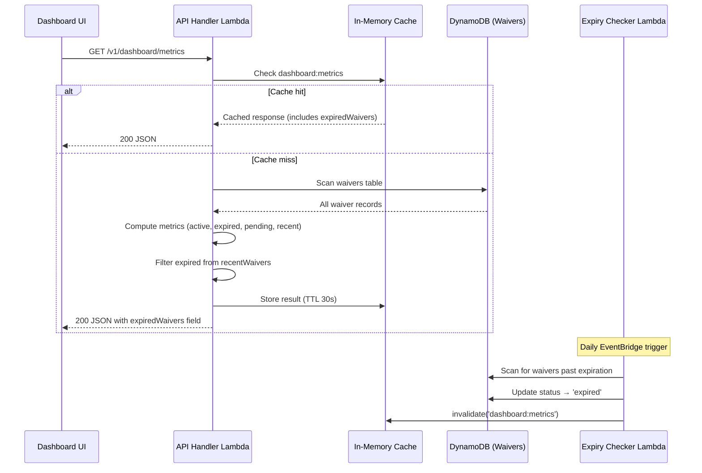

# Design Document: Expired Waivers Dashboard

## Overview

This feature extends the existing WaiverHub Dashboard to surface expired waiver visibility. It adds an "Expired Waivers" KPI tile to the dashboard metrics, filters expired waivers out of the recent waivers list, and ensures the expiry checker invalidates the dashboard cache when it transitions waivers.

The changes are minimal and localised:
- **API layer** (`lambdas/src/api/handler.ts`): Add an `expiredWaivers` count to the `getDashboardMetrics` response and filter expired records from the recent waivers list.
- **UI layer** (`ui/src/pages/Dashboard.tsx`): Add a fifth KPI tile and adjust the grid to 5 columns.
- **Expiry checker** (`lambdas/src/expiry-checker/handler.ts`): Invalidate the `dashboard:metrics` cache key after transitioning waivers.

No new infrastructure, tables, or Lambda functions are required.

## Architecture



## Components and Interfaces

### 1. API Handler — `getDashboardMetrics()` changes

**File:** `lambdas/src/api/handler.ts`

The existing `getDashboardMetrics` function already scans all waivers and computes counts by status. The changes are:

1. Add an `expiredCount` accumulator alongside `activeCount`, `pendingCount`, etc.
2. When iterating items, increment `expiredCount` when `status === 'expired'`.
3. Filter the `recent` array to exclude items with `status === 'expired'` before sorting and slicing.
4. Include `expiredWaivers: expiredCount` in the response payload.

**Updated response shape:**

```typescript
interface DashboardMetricsResponse {
  data: {
    activeWaivers: number;
    processedToday: number;
    pendingReview: number;
    expiredWaivers: number;       // NEW
    averageConfidence: number;
    ingestionVolume: { date: string; count: number }[];
    airlineDistribution: { airline: string; count: number }[];
    recentWaivers: RecentWaiver[];
  };
}
```

### 2. Expiry Checker — Cache Invalidation

**File:** `lambdas/src/expiry-checker/handler.ts`

After the expiry checker finishes updating waiver statuses, it will call `cache.invalidate('dashboard:metrics')`. Since the expiry checker runs in a separate Lambda invocation from the API handler, and the cache is in-memory per Lambda instance, this invalidation only helps if both run in the same container (unlikely). However, the 30-second TTL on the cache already ensures staleness is bounded. The invalidation is added for correctness in the edge case where the same container handles both.

**Design decision:** The cache is in-memory (per Lambda instance), so cross-Lambda invalidation is not possible without an external cache (e.g., ElastiCache). Given the 30-second TTL is already acceptable per the requirements, we add the `cache.invalidate` call for local correctness but acknowledge the primary freshness guarantee comes from the short TTL. This avoids introducing new infrastructure.

### 3. Dashboard UI — KPI Tile and Grid

**File:** `ui/src/pages/Dashboard.tsx`

Changes:
1. Update the `DashboardMetrics` interface to include `expiredWaivers: number`.
2. Add a fifth `<KpiCard>` for "Expired Waivers" between "Pending Review" and "Avg Confidence".
3. The tile's `onClick` navigates to `/waivers?status=expired`.
4. Update the `kpiGrid` style from `gridTemplateColumns: 'repeat(4, 1fr)'` to `'repeat(5, 1fr)'`.

### 4. Shared Cache Module

**File:** `lambdas/src/shared/cache.ts`

No changes needed. The expiry checker will import and call `invalidate('dashboard:metrics')` using the existing API.

## Data Models

No new data models are introduced. The existing `WaiverRecord` type already has `status: 'expired'` as a valid value. The only data change is the addition of the `expiredWaivers` field to the dashboard metrics API response.

**Existing WaiverRecord status enum (from `shared/src/waiver-record.ts`):**
```typescript
status: 'pending_review' | 'active' | 'rejected' | 'expired' | 'auto_approved';
```

**New field in dashboard metrics response:**
```typescript
expiredWaivers: number  // count of records where status === 'expired'
```

## Correctness Properties

*A property is a characteristic or behavior that should hold true across all valid executions of a system — essentially, a formal statement about what the system should do. Properties serve as the bridge between human-readable specifications and machine-verifiable correctness guarantees.*

### Property 1: Expired count accuracy

*For any* set of waiver records with arbitrary statuses, the `expiredWaivers` value returned by the dashboard metrics computation SHALL equal the number of records whose `status` field is exactly `'expired'`.

**Validates: Requirements 1.1, 1.4**

### Property 2: Recent waivers exclude expired

*For any* set of waiver records with arbitrary statuses, the `recentWaivers` list returned by the dashboard metrics computation SHALL contain no items with `status` equal to `'expired'`.

**Validates: Requirements 2.1**

### Property 3: Recent waivers list capping

*For any* set of waiver records (after filtering out expired), the `recentWaivers` list returned by the dashboard metrics computation SHALL contain at most 10 items.

**Validates: Requirements 2.3**

## Error Handling

This feature introduces minimal new error surface:

1. **API Handler**: The `getDashboardMetrics` function already has try/catch around the full scan. The new `expiredCount` accumulator is a simple integer increment — no new failure modes. If the scan fails, the existing error handling returns a 500 response.

2. **Expiry Checker**: The `cache.invalidate` call is a synchronous in-memory map deletion — it cannot throw. No additional error handling is needed.

3. **UI**: The Dashboard already handles loading and error states for the metrics query. The new `expiredWaivers` field defaults gracefully — if the API response doesn't include it (e.g., during a rolling deployment), the KPI tile will show `undefined`. To handle this, the UI should default to `0` if the field is missing: `m.expiredWaivers ?? 0`.

## Testing Strategy

### Unit Tests (Jest)

- **API Handler tests** (`lambdas/src/api/__tests__/handler.test.ts`):
  - Verify `getDashboardMetrics` returns `expiredWaivers` field with correct count
  - Verify recent waivers list excludes expired waivers
  - Verify recent waivers list is capped at 10 after filtering

- **Expiry Checker tests** (`lambdas/src/expiry-checker/__tests__/handler.test.ts`):
  - Verify `cache.invalidate('dashboard:metrics')` is called after processing

- **UI tests** (if component tests exist):
  - Verify "Expired Waivers" KPI tile renders with correct value
  - Verify click navigates to `/waivers?status=expired`
  - Verify grid has 5 columns

### Property-Based Tests (fast-check with Jest)

The project uses Jest as its test runner. Property-based tests will use the `fast-check` library integrated with Jest.

- **Property 1**: Generate random arrays of objects with `status` drawn from the valid enum values. Pass through the metrics computation logic (extracted as a pure function). Assert `expiredWaivers === items.filter(i => i.status === 'expired').length`.

- **Property 2**: Generate random arrays of waiver-like objects. Pass through the recent waivers computation. Assert `recentWaivers.every(w => w.status !== 'expired')`.

- **Property 3**: Generate random arrays of 0–50 waiver-like objects (non-expired). Pass through the recent waivers computation. Assert `recentWaivers.length <= 10`.

**Configuration:**
- Minimum 100 iterations per property test
- Each test tagged with: `Feature: expired-waivers-dashboard, Property {N}: {title}`
