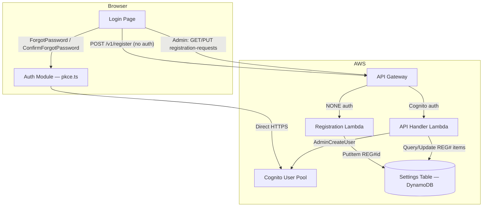

# Design Document — Login Flows

## Overview

This design adds two new flows to the existing custom Login page (`ui/src/pages/Login.tsx`):

1. **Forgot Password** — a client-side flow that calls Cognito's `ForgotPassword` and `ConfirmForgotPassword` APIs directly from the browser (no backend Lambda needed). The existing `COGNITO_REGION` and `CLIENT_ID` constants in `ui/src/auth/pkce.ts` are reused.

2. **Registration / Request Access** — a form that POSTs to a new *public* (unauthenticated) API Gateway endpoint. The backend Lambda stores the request in the existing Settings DynamoDB table using a `REG#<id>` prefix key (avoids deploying the DatabaseStack, which uses `--exclusively` and has drift). Admins review pending requests on the existing User Management page; approving a request triggers the existing `AdminCreateUser` flow.

Both flows are rendered as additional "views" inside the Login component, toggled via local state — no new routes are needed.

## Architecture



### Key Design Decisions

| Decision | Rationale |
|---|---|
| Use Settings table with `REG#` prefix key | Avoids adding a new table to DatabaseStack (which has drift and uses `--exclusively` deploys). The Settings table already exists and is passed to both Lambdas. |
| Client-side Cognito calls for forgot password | Cognito's `ForgotPassword` and `ConfirmForgotPassword` are public APIs — no backend proxy needed. Reduces infrastructure and latency. |
| Separate Registration Lambda (or reuse public API Lambda) | The registration endpoint must be unauthenticated (`NONE` auth type). The existing public API Lambda already has a `publicApiGatewayRole` and integration pattern we can extend. |
| State-machine views in Login component | Keeps all pre-auth UI in one component. No router changes needed since the user isn't authenticated yet. |
| GSI on Settings table for status queries | A GSI with partition key `gsi1pk` (= `REG#<status>`) enables efficient queries for pending requests without scanning the whole table. |

## Components and Interfaces

### 1. Login Page — View State Machine

The Login component manages a `view` state with these values:

```
'signIn' → 'forgotPassword' → 'confirmReset' → 'signIn'
'signIn' → 'register' → 'signIn'
```

Each view renders its own form. Transitions happen via link clicks and successful submissions.

### 2. Auth Module Extensions (`ui/src/auth/pkce.ts`)

Two new exported functions:

```typescript
export async function forgotPassword(email: string): Promise<{ success: boolean; error?: string }>;
export async function confirmForgotPassword(email: string, code: string, newPassword: string): Promise<{ success: boolean; error?: string }>;
```

Both call the Cognito endpoint at `https://cognito-idp.${COGNITO_REGION}.amazonaws.com/` using the existing `CLIENT_ID` constant. They use `X-Amz-Target` headers for `ForgotPassword` and `ConfirmForgotPassword` actions respectively.

### 3. Registration API Endpoint

**Route:** `POST /v1/register`
**Auth:** `NONE` (public, no Cognito authorizer)
**Handler:** New Lambda or extend the existing public API Lambda

Request body:
```json
{
  "name": "string",
  "email": "string",
  "company": "string"
}
```

Success response (201):
```json
{
  "data": { "id": "string", "status": "pending" }
}
```

Error response (409 — duplicate pending):
```json
{
  "error": { "code": "DUPLICATE_REQUEST", "message": "A registration request is already pending for this email." }
}
```

### 4. Admin Registration Management Endpoints

All require Cognito auth + admin role (existing RBAC pattern).

| Method | Path | Description |
|---|---|---|
| GET | `/v1/registration-requests` | List all pending requests |
| POST | `/v1/registration-requests/{id}/approve` | Approve → create Cognito user, update status |
| POST | `/v1/registration-requests/{id}/reject` | Reject → update status |

### 5. Infrastructure Changes (`infra/lib/api-stack.ts`)

- Add a `POST /v1/register` route with `authorizationType: NONE` using the public API Lambda (or a dedicated registration Lambda).
- Grant the handler Lambda `PutItem` and `Query` permissions on the Settings table.
- Add a GSI to the Settings table for querying by registration status (or use a `Scan` with filter on the `REG#` prefix — acceptable given low volume).

### 6. User Management Page Extensions

Add a "Pending Requests" section above the existing users table:
- Fetches `GET /v1/registration-requests`
- Displays name, email, company, date for each pending request
- "Approve" button → `POST /v1/registration-requests/{id}/approve`
- "Reject" button → `POST /v1/registration-requests/{id}/reject`

## Data Models

### Registration Request (stored in Settings table)

| Attribute | Type | Description |
|---|---|---|
| `key` | String | Partition key. Format: `REG#<uuid>` |
| `gsi1pk` | String | GSI partition key. Format: `REG#pending`, `REG#approved`, `REG#rejected` |
| `id` | String | UUID of the request |
| `name` | String | Requester's full name |
| `email` | String | Requester's email address |
| `company` | String | Requester's company name |
| `status` | String | `pending` | `approved` | `rejected` |
| `createdAt` | String | ISO 8601 timestamp |

### Settings Table GSI

The Settings table needs a GSI to query registration requests by status:

| GSI Name | Partition Key | Sort Key | Projection |
|---|---|---|---|
| `gsi1pk-index` | `gsi1pk` (String) | `createdAt` (String) | ALL |

This GSI is also useful for future Settings table use cases beyond registration.

### Password Validation Rules (Cognito policy)

- Minimum 8 characters
- At least 1 uppercase letter
- At least 1 digit
- At least 1 symbol

These are validated client-side before calling `ConfirmForgotPassword`.

## Correctness Properties

*A property is a characteristic or behavior that should hold true across all valid executions of a system — essentially, a formal statement about what the system should do. Properties serve as the bridge between human-readable specifications and machine-verifiable correctness guarantees.*

### Property 1: Password policy validation

*For any* string, the password validation function should return `true` if and only if the string has at least 8 characters, contains at least one uppercase letter, at least one digit, and at least one symbol. Strings that fail any of these criteria should be rejected.

**Validates: Requirements 2.4**

### Property 2: Registration form validation

*For any* tuple of (name, email, company) strings, the registration form validation function should return valid only when all three are non-empty (after trimming) and the email matches a valid email format. Any tuple with an empty/whitespace-only field or an invalid email should be rejected.

**Validates: Requirements 3.2**

### Property 3: Registration storage round-trip

*For any* valid registration input (name, email, company), after the registration handler stores the request, querying the record by its returned ID should yield a record containing the same name, email, and company, with status `"pending"` and a valid ISO 8601 `createdAt` timestamp.

**Validates: Requirements 3.4, 5.3**

### Property 4: Duplicate pending email rejection

*For any* email address, if a registration request with that email already exists in `"pending"` status, submitting a new registration request with the same email should return an error and not create a second pending record.

**Validates: Requirements 3.5**

### Property 5: Registration request resolution updates status

*For any* pending registration request and any resolution action (`approve` or `reject`), after the action is performed the request's status should equal the action taken (`"approved"` or `"rejected"`), and the request should no longer appear in the list of pending requests.

**Validates: Requirements 4.3, 4.4**

### Property 6: RBAC on registration management endpoints

*For any* user without the `"admin"` role, requests to the registration management endpoints (`GET /v1/registration-requests`, `POST .../approve`, `POST .../reject`) should be denied with a 403 status code.

**Validates: Requirements 4.5**

### Property 7: Error propagation to UI

*For any* error message string returned by an API call (Cognito ForgotPassword, ConfirmForgotPassword, or registration endpoint), the Login page should display that exact error message to the user.

**Validates: Requirements 1.4, 2.3, 3.7**

## Error Handling

| Scenario | Handling |
|---|---|
| Cognito ForgotPassword fails (e.g. user not found, rate limit) | Display Cognito error message in the forgot-password form. Cognito returns user-friendly messages. |
| Cognito ConfirmForgotPassword fails (invalid/expired code) | Display Cognito error message in the confirm-reset form. |
| Password doesn't meet policy | Client-side validation prevents submission. Display specific validation message (e.g. "Password must contain at least 1 uppercase letter"). |
| Registration POST fails (network error) | Display generic "Network error. Please try again." message. |
| Registration POST returns 409 (duplicate pending) | Display "A registration request is already pending for this email." |
| Registration POST returns 400 (validation error) | Display the error message from the response body. |
| Admin approve fails (Cognito AdminCreateUser error) | Return 500 with error details. The registration request status remains `"pending"` (no partial update). |
| Admin approve/reject on non-pending request | Return 400 "Request is not in pending status." |
| Non-admin accesses registration management endpoints | Return 403 via existing RBAC middleware. |

## Testing Strategy

### Property-Based Tests

Use `fast-check` (already available in the Node.js ecosystem) with minimum 100 iterations per property.

Each property test must be tagged with a comment:
```
// Feature: login-flows, Property N: <property title>
```

| Property | Test approach |
|---|---|
| P1: Password policy validation | Generate random strings via `fc.string()`. Assert the validator agrees with a reference implementation that checks length ≥ 8, has uppercase, digit, and symbol. |
| P2: Registration form validation | Generate random `(name, email, company)` tuples via `fc.record(...)`. Assert the validator returns valid iff all non-empty and email matches format. |
| P3: Registration storage round-trip | Generate random valid registration inputs. Call the handler, then read back from DynamoDB (mocked). Assert all fields match and status is `"pending"`. |
| P4: Duplicate pending email rejection | Generate a random email. Insert a pending request, then attempt a second. Assert the second returns 409 and only one pending record exists. |
| P5: Resolution updates status | Generate a random pending request and a random action (`approve`/`reject`). Execute the action. Assert status matches and request is absent from pending list. |
| P6: RBAC restriction | Generate random non-admin roles. Assert all registration management endpoints return 403. |
| P7: Error propagation | Generate random error message strings. Mock the API to return them. Assert the UI state contains the exact error string. |

### Unit Tests

Unit tests complement property tests for specific examples and edge cases:

- Forgot password form renders email input when view is `'forgotPassword'`
- "Back to sign in" links return to sign-in view from each sub-form
- Registration form shows all three fields (name, email, company)
- Success message displays after successful registration submission
- Approve action triggers `AdminCreateUser` with the correct email
- Reject action does not call `AdminCreateUser`
- Registration endpoint returns 400 for missing fields
- Password validator rejects: empty string, 7-char string, no uppercase, no digit, no symbol
- Password validator accepts: `"Abcdef1!"` (meets all criteria)
- GSI query returns only pending requests (not approved/rejected)
