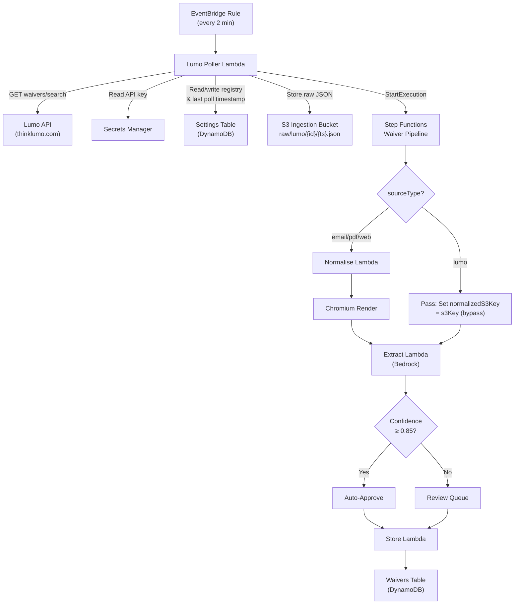

# Design Document: Lumo API Ingestion

## Overview

This feature integrates WaiverHub with the Lumo (thinklumo.com) third-party API to automatically poll for airline waiver data and ingest it into the existing pipeline. Unlike existing ingestion sources (email, PDF, web scraping), Lumo data arrives as pre-structured JSON from the `waivers/search` endpoint, so it bypasses the normalisation and Chromium rendering steps and proceeds directly to AI-driven extraction via Bedrock.

The design introduces a new **Lumo Poller Lambda** triggered every 2 minutes by EventBridge. The poller retrieves the API key from Secrets Manager, calls the Lumo API, detects new/updated waivers via a content-hash registry in the Settings table, stores raw JSON in S3, and starts the existing Step Functions pipeline with `sourceType=lumo`. The pipeline's Choice state routes `lumo` sources to skip normalisation/Chromium and jump straight to extraction. The extraction prompt includes a Lumo-specific preamble mapping Lumo field names to WaiverHub schema fields. Storage, duplicate detection, webhooks, and the corrections learning loop all work unchanged — they just see `source_type=lumo`.

On the UI side, the WaiverDetail source viewer renders pretty-printed JSON (instead of HTML/screenshot tabs) when `source_type` is `lumo`.

### Key Design Decisions

1. **Poller-based ingestion (not webhook)**: Lumo's API is pull-based (`waivers/search`). A 2-minute EventBridge schedule keeps data fresh without requiring Lumo to push to us.
2. **Content-hash change detection**: Rather than relying on Lumo-provided timestamps (which may not reflect content changes), we SHA-256 hash each waiver payload and compare against the stored hash. This mirrors the pattern used in the web-monitor scheduler.
3. **AI extraction over direct mapping**: Although Lumo JSON is structured, we route through Bedrock extraction rather than hard-coding a field mapper. This lets human corrections feed the learning loop and handles schema drift gracefully.
4. **Pipeline reuse with Choice-state bypass**: Instead of a separate pipeline, we add a Choice state to the existing Step Functions state machine that skips normalise/Chromium for `lumo` sources. This keeps one pipeline to monitor and debug.
5. **CDK additions in PipelineStack**: The Lumo poller Lambda and EventBridge rule are added to the existing `PipelineStack` rather than a new stack, since the poller needs direct references to the state machine ARN, S3 bucket, and table names.

## Architecture



## Components and Interfaces

### 1. Lumo Poller Lambda (`lambdas/src/lumo-poller/handler.ts`)

**Responsibility**: Poll the Lumo API, detect new/changed waivers, store raw JSON, and trigger the pipeline.

**Interface**:
```typescript
// Triggered by EventBridge scheduled event (no meaningful payload)
export async function handler(event: ScheduledEvent): Promise<void>;
```

**Internal functions**:
```typescript
/** Fetch the Lumo API key from Secrets Manager */
async function getLumoApiKey(secretArn: string): Promise<string>;

/** Call Lumo waivers/search endpoint and return the waiver array */
async function fetchLumoWaivers(apiKey: string): Promise<LumoWaiver[]>;

/** Compute SHA-256 content hash of a waiver payload */
function computeContentHash(waiver: LumoWaiver): string;

/** Load the active waiver registry from Settings table */
async function loadWaiverRegistry(): Promise<WaiverRegistry>;

/** Save the updated waiver registry to Settings table */
async function saveWaiverRegistry(registry: WaiverRegistry): Promise<void>;

/** Store raw waiver JSON to S3 and return the S3 key */
async function storeRawJson(waiver: LumoWaiver, lumoWaiverId: string): Promise<string>;

/** Start the Step Functions pipeline execution */
async function startPipeline(s3Key: string, recordId: string): Promise<void>;

/** Update the last poll timestamp in Settings table */
async function updateLastPollTimestamp(): Promise<void>;
```

**Environment variables**:
- `LUMO_API_SECRET_ARN` — ARN of the Secrets Manager secret
- `LUMO_API_BASE_URL` — Base URL for the Lumo API (default: `https://flifo-qa.flightstats.com/flex`)
- `INGESTION_BUCKET` — S3 bucket name
- `STATE_MACHINE_ARN` — Step Functions state machine ARN
- `SETTINGS_TABLE` — DynamoDB Settings table name

### 2. Lumo Waiver Types (`lambdas/src/lumo-poller/types.ts`)

```typescript
/** Raw Lumo API waiver structure (from waivers/search response) */
export interface LumoWaiver {
  id: string;
  location: {
    airports: string[];
    countries: string[];
  };
  period: {
    start: string; // ISO date
    end: string;   // ISO date
  };
  alert: {
    summary: string;
    description: string;
  };
  date_restrictions?: string;
  waiver_codes?: string[];
  dom_intl?: string;
  remarks?: string;
}

/** Registry entry tracking a known Lumo waiver */
export interface WaiverRegistryEntry {
  contentHash: string;
  lastSeen: string; // ISO timestamp
  waiverHubRecordId?: string; // most recent WaiverHub record ID
}

/** The full registry stored in Settings table under key 'lumo_waiver_registry' */
export interface WaiverRegistry {
  [lumoWaiverId: string]: WaiverRegistryEntry;
}
```

### 3. Step Functions Pipeline Modification

The existing `PipelineStack` state machine definition is modified to add a **Choice state** at the entry point:

```
Entry → SourceTypeCheck (Choice)
  ├─ sourceType == "lumo" → LumoBypass (Pass) → AddExtractStage → Extract → ...
  └─ otherwise → AddNormaliseStage → Normalise → Chromium → Extract → ...
```

The `LumoBypass` Pass state sets:
```json
{
  "normalizedS3Key.$": "$.s3Key",
  "sourceS3Key.$": "$.s3Key",
  "sourceType.$": "$.sourceType",
  "recordId.$": "$.recordId",
  "sourceUrl": ""
}
```

### 4. Extraction Lambda Modifications (`lambdas/src/extraction/handler.ts`)

**Changes**:
- Accept `sourceType: 'lumo'` in the `ExtractionEvent` type union
- When `sourceType === 'lumo'`, include a Lumo-specific preamble in the Bedrock prompt that maps Lumo field names to WaiverHub schema fields
- Fetch corrections with `source_type=lumo` for few-shot learning

**Lumo extraction preamble** (added to `buildExtractionPrompt` when sourceType is lumo):
```
The source document is structured JSON from the Lumo API (thinklumo.com).
Map the following Lumo fields to WaiverHub fields:
- id → waiver_code
- alert.summary → waiver_title
- location.airports → airports
- period.start → effective_date
- period.end → expiration_date
- waiver_codes → fare_classes (if applicable)
- remarks + alert.description → rebooking_rules, refund_rules, release_notes
- dom_intl → airports_qualifier (domestic="From", international="From-To")
Infer airline_code and airline_name from the waiver content where possible.
```

### 5. Storage Lambda — No Changes

The existing `Storage Lambda` already handles any `source_type` value. It persists `source_type` as-is, stores the `ai_extraction` snapshot, runs duplicate detection, and fires the `waiver.created` webhook. No code changes needed.

### 6. WaiverDetail Source Viewer Modifications (`ui/src/pages/WaiverDetail.tsx`)

**Changes to `SourceViewer` component**:
- When `sourceType === 'lumo'` (or `resolvedSourceType === 'lumo'`), render a single "JSON Source" tab
- Display the raw JSON content with pretty-printing and syntax highlighting
- Hide the "Screenshot" and "Source Page" tabs (no HTML or screenshot for Lumo sources)

### 7. API Handler — No Changes

The existing corrections flow in the API handler already records `source_type` from the waiver record. When a user edits a Lumo-sourced waiver, corrections are stored with `source_type=lumo` automatically.

## Data Models

### Settings Table Entries

**Last poll timestamp** (key: `lumo_last_poll`):
```json
{
  "key": "lumo_last_poll",
  "value": "2025-01-15T10:30:00.000Z"
}
```

**Active waiver registry** (key: `lumo_waiver_registry`):
```json
{
  "key": "lumo_waiver_registry",
  "value": "{\"waiver-123\":{\"contentHash\":\"abc123...\",\"lastSeen\":\"2025-01-15T10:30:00Z\",\"waiverHubRecordId\":\"uuid-456\"},\"waiver-789\":{\"contentHash\":\"def456...\",\"lastSeen\":\"2025-01-15T10:28:00Z\"}}"
}
```

### S3 Key Pattern

Raw Lumo JSON: `raw/lumo/{lumo_waiver_id}/{ISO_timestamp}.json`

Example: `raw/lumo/waiver-123/2025-01-15T10:30:00.000Z.json`

**S3 Object Metadata**:
- `source-type`: `lumo`
- `lumo-waiver-id`: the Lumo waiver ID

### Waivers Table Record (Lumo-sourced)

Same schema as existing records, with:
- `source_type`: `"lumo"`
- `source_s3_key`: `"raw/lumo/{id}/{timestamp}.json"`
- `source_url`: `""` (no URL for API-sourced data)
- All 16 WaiverHub schema fields populated by Bedrock extraction
- `ai_extraction`: snapshot of the AI-mapped fields (for corrections loop)

### Secrets Manager

Secret name: configurable via CDK context (default: `waiverhub/lumo-api-key`)

Secret value structure:
```json
{
  "apiKey": "your-lumo-api-key-here"
}
```


## Correctness Properties

*A property is a characteristic or behavior that should hold true across all valid executions of a system — essentially, a formal statement about what the system should do. Properties serve as the bridge between human-readable specifications and machine-verifiable correctness guarantees.*

### Property 1: HTTP error resilience

*For any* HTTP error status code in the 4xx or 5xx range returned by the Lumo API, the Lumo Poller handler SHALL log the error (including status code and response body) and return without throwing an unhandled exception, leaving the system in a consistent state.

**Validates: Requirements 1.3**

### Property 2: Change detection correctness

*For any* Lumo waiver payload and any active waiver registry state, the poller SHALL trigger ingestion if and only if the waiver's Lumo ID is absent from the registry OR the SHA-256 content hash of the payload differs from the stored hash. Conversely, if the ID is present and the hash matches, no ingestion SHALL occur.

**Validates: Requirements 2.2, 2.3, 2.4**

### Property 3: Registry update after ingestion

*For any* Lumo waiver that is ingested (new or updated), the active waiver registry SHALL contain an entry for that waiver's Lumo ID with the correct content hash and a `lastSeen` timestamp no earlier than the start of the poll cycle.

**Validates: Requirements 2.5**

### Property 4: Raw JSON storage correctness

*For any* Lumo waiver with a given Lumo waiver ID, the S3 object key SHALL match the pattern `raw/lumo/{lumo_waiver_id}/{timestamp}.json`, the content type SHALL be `application/json`, and the object metadata SHALL include `source-type=lumo` and `lumo-waiver-id` equal to the Lumo waiver ID.

**Validates: Requirements 3.1, 3.2**

### Property 5: Pipeline invocation correctness

*For any* Lumo waiver stored to S3, the Step Functions StartExecution call SHALL include `sourceType` equal to `lumo`, an `s3Key` matching the stored object key, and a `recordId` that is a valid UUID.

**Validates: Requirements 3.3**

### Property 6: Bedrock response parsing completeness

*For any* valid JSON response from Bedrock containing all 16 WaiverHub schema field keys and a `confidence_scores` object, `parseBedrockResponse` SHALL return an object with all 16 fields populated (as strings or string arrays) and all 16 confidence scores as numbers between 0.0 and 1.0 inclusive.

**Validates: Requirements 4.3**

## Error Handling

### Lumo API Errors

| Error Condition | Handling |
|---|---|
| HTTP 4xx/5xx from Lumo API | Log status code + response body, terminate poll cycle gracefully. No retry within the same cycle — the next 2-minute cycle will retry. |
| Request timeout (>10s) | Abort the HTTP request via `AbortController` with a 10-second signal. Log timeout error. Terminate poll cycle. |
| Network error (DNS, connection refused) | Caught by the fetch call. Log error, terminate poll cycle. |

### Secrets Manager Errors

| Error Condition | Handling |
|---|---|
| Secret not found or empty | Log error with secret ARN. Terminate poll cycle immediately without calling Lumo API. |
| Secrets Manager service error | Log error. Terminate poll cycle. |

### S3 Storage Errors

| Error Condition | Handling |
|---|---|
| PutObject failure | Log error with S3 key. Skip this waiver, continue processing remaining waivers in the batch. |

### Pipeline Start Errors

| Error Condition | Handling |
|---|---|
| StartExecution failure | Log error with state machine ARN and record ID. The waiver's raw JSON is already in S3, so it can be manually re-triggered. Continue processing remaining waivers. |

### Settings Table Errors

| Error Condition | Handling |
|---|---|
| Registry read failure | Log error. Treat all waivers as new (safe fallback — may cause re-ingestion of unchanged waivers). |
| Registry write failure | Log error. The next poll cycle will re-detect changes since the registry wasn't updated. |
| Last poll timestamp write failure | Log error (non-blocking). |

### Extraction Lambda Errors (existing)

The existing extraction error handling (catch → tag S3 object as `extraction_failed` → re-throw → Step Functions retry with backoff) applies unchanged to Lumo sources.

### UI Errors

| Error Condition | Handling |
|---|---|
| Source content fetch failure for lumo waiver | Display "Failed to load source" error message in the source pane (existing behavior). |
| JSON parse failure in source viewer | Display raw text content as-is with a warning that JSON formatting failed. |

## Testing Strategy

### Unit Tests

Unit tests cover specific examples, edge cases, and integration points:

**Lumo Poller (`lambdas/src/lumo-poller/__tests__/handler.test.ts`)**:
- Successful poll cycle: mock API returns 2 waivers (1 new, 1 unchanged), verify only the new one is ingested
- API returns HTTP 500: verify handler logs error and returns without throwing
- API timeout: verify handler aborts after 10 seconds
- Missing API key secret: verify handler logs error and does not call the API
- Empty API key: verify handler logs error and does not call the API
- Registry read failure: verify handler treats all waivers as new (fallback)
- S3 PutObject failure for one waiver: verify remaining waivers are still processed

**Extraction Lambda (`lambdas/src/extraction/__tests__/handler.test.ts`)**:
- Lumo source type: verify prompt includes Lumo-specific preamble
- Lumo corrections: verify fetchRecentCorrections is called with `source_type=lumo`

**WaiverDetail UI (`ui/src/pages/__tests__/WaiverDetail.test.tsx`)**:
- Lumo source type: verify only "JSON Source" tab is rendered
- Lumo source type: verify Screenshot and Source Page tabs are hidden
- Lumo JSON content: verify pretty-printed JSON is displayed

**CDK Infrastructure (snapshot/assertion tests)**:
- Verify LumoPollerFn Lambda exists with Node.js 20.x, 512 MB, 60s timeout
- Verify EventBridge rule with rate(2 minutes) targeting LumoPollerFn
- Verify Secrets Manager secret resource exists
- Verify IAM policies: Secrets Manager read, Settings table read/write, S3 write (raw/lumo/*), Step Functions startExecution

### Property-Based Tests

Property-based tests verify universal properties across many generated inputs. Each test runs a minimum of 100 iterations.

**Library**: `fast-check` (already available in the project's test ecosystem via vitest)

**Test file**: `lambdas/src/lumo-poller/__tests__/handler.property.test.ts`

- **Property 1** (HTTP error resilience): Generate random HTTP status codes in [400..599], mock API to return that status, verify handler does not throw.
  Tag: `Feature: lumo-api-ingestion, Property 1: HTTP error resilience`

- **Property 2** (Change detection correctness): Generate random waiver payloads and random registry states, verify ingestion is triggered iff the waiver is new or hash differs.
  Tag: `Feature: lumo-api-ingestion, Property 2: Change detection correctness`

- **Property 3** (Registry update after ingestion): Generate random waivers that trigger ingestion, verify registry entry is updated with correct hash and recent timestamp.
  Tag: `Feature: lumo-api-ingestion, Property 3: Registry update after ingestion`

- **Property 4** (Raw JSON storage correctness): Generate random Lumo waiver IDs (alphanumeric strings), verify S3 key matches `raw/lumo/{id}/{timestamp}.json` pattern and metadata is correct.
  Tag: `Feature: lumo-api-ingestion, Property 4: Raw JSON storage correctness`

- **Property 5** (Pipeline invocation correctness): Generate random waivers, verify StartExecution params include sourceType=lumo, matching s3Key, and valid UUID recordId.
  Tag: `Feature: lumo-api-ingestion, Property 5: Pipeline invocation correctness`

**Test file**: `lambdas/src/extraction/__tests__/handler.property.test.ts`

- **Property 6** (Bedrock response parsing completeness): Generate random JSON objects with all 16 schema field keys (random strings/arrays) and random confidence scores [0..1], verify parseBedrockResponse returns all fields and valid scores.
  Tag: `Feature: lumo-api-ingestion, Property 6: Bedrock response parsing completeness`

### Integration Tests

- End-to-end CDK synth: verify the synthesized CloudFormation template contains the expected resources (Lambda, EventBridge rule, Secrets Manager secret, IAM policies, Choice state in Step Functions)
- Pipeline routing: deploy to a test environment and verify a `sourceType=lumo` execution skips normalise/Chromium and reaches the Extract step
