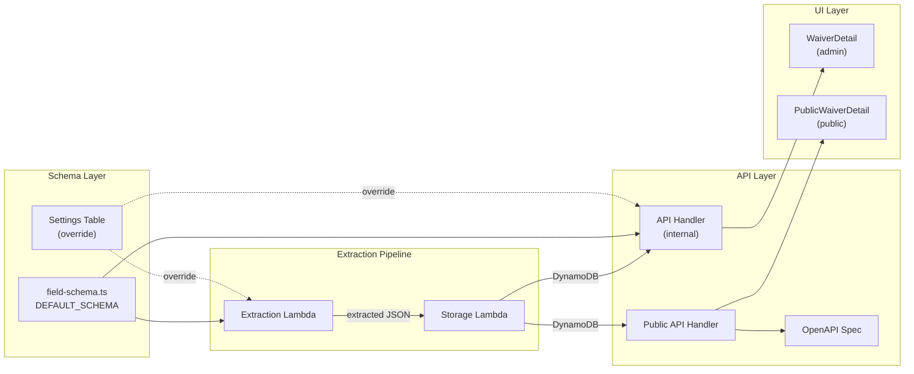

# Design Document

## Overview

This feature aligns the WaiverHub extraction schema with the Mantic Point Solutions "Waiver Automation Fields" specification. The changes span six files across three layers (shared schema, backend Lambdas, public API, and UI) but follow a single principle: the `DEFAULT_SCHEMA` in `field-schema.ts` is the source of truth, and all downstream consumers already read from it dynamically — so the primary work is updating that schema and fixing the few places that use hardcoded field lists.

### Key Changes

1. **Schema expansion**: Add 7 new fields (`issued_date`, `airline_name`, `release_notes`, `ticket_issued_qualifier`, `ticket_issued_date`, `travel_dates_qualifier`, `airports_qualifier`) and rename `applicable_routes` → `airports`.
2. **Storage Lambda**: Replace hardcoded field lists with schema-driven persistence; add backward-compat mapping for `applicable_routes` → `airports`.
3. **Public API**: Update OpenAPI spec with new fields; change search filter from `applicable_routes` to `airports`; add `airport` and `search` query params.
4. **API Handler**: Add `release_notes` 500-character validation in `saveDraft`.
5. **UI (PublicWaiverDetail)**: Replace hardcoded `FIELDS` array with dynamic schema-driven rendering.
6. **UI (WaiverDetail)**: Add character counter and maxLength enforcement for `release_notes`; backward-compat fallback for `applicable_routes`.

### What Does NOT Change

- DynamoDB table schema (schemaless attributes — no migration needed)
- Extraction Lambda prompt-building logic (already reads field definitions dynamically from schema)
- WaiverDetail page form rendering (already schema-driven via `/v1/settings/extraction-fields`)
- Settings table override behavior (custom schemas remain untouched)
- CDK infrastructure stacks

## Architecture

The system follows a pipeline architecture where each stage reads the field schema dynamically:



The schema flows top-down: `DEFAULT_SCHEMA` (or Settings override) → Extraction prompt → Storage → API → UI. Because the extraction and WaiverDetail UI already consume the schema dynamically, those layers require no structural changes — only the DEFAULT_SCHEMA content update propagates through them automatically.

### Change Impact by Layer

| Layer | File | Change Type |
|-------|------|-------------|
| Schema | `field-schema.ts` | Add 7 fields, rename 1, reorder |
| Storage | `storage/handler.ts` | Schema-driven persistence, backward compat |
| Public API | `openapi-spec.ts` | Add field properties, rename route→airport param |
| Public API | `public-api/handler.ts` | Filter on `airports` instead of `applicable_routes` |
| Internal API | `api/handler.ts` | `release_notes` 500-char validation in saveDraft |
| UI | `PublicWaiverDetail.tsx` | Dynamic field rendering from API data |
| UI | `WaiverDetail.tsx` | Character counter for `release_notes`, backward compat |

## Components and Interfaces

### 1. DEFAULT_SCHEMA Update (`field-schema.ts`)

The schema array grows from 9 to 16 fields. The `applicable_routes` entry is replaced by `airports`. Order values are reassigned to match the Mantic Point layout:

| Order | Key | Label | Type | Required |
|-------|-----|-------|------|----------|
| 0 | airline_code | Airline Code | text | true |
| 1 | airline_name | Airline Name | text | true |
| 2 | waiver_title | Waiver Title | text | true |
| 3 | waiver_code | Waiver Code | text | true |
| 4 | issued_date | Issued Date | date | true |
| 5 | effective_date | Effective Date | date | true |
| 6 | expiration_date | Expiration Date | date | true |
| 7 | travel_dates_qualifier | Travel Dates Qualifier | text | true |
| 8 | ticket_issued_qualifier | Ticket Issued Qualifier | text | true |
| 9 | ticket_issued_date | Ticket Issued Date | date | true |
| 10 | airports_qualifier | Airports Qualifier | text | true |
| 11 | airports | Airports | array | false |
| 12 | fare_classes | Fare Classes | array | false |
| 13 | rebooking_rules | Rebooking Rules | textarea | false |
| 14 | refund_rules | Refund Rules | textarea | false |
| 15 | release_notes | Release Notes | textarea | true |

### 2. Storage Lambda Changes (`storage/handler.ts`)

**Current problem**: The `handler` function and `upsertWaiver` function both use hardcoded field names when building the DynamoDB item. The `ai_extraction` snapshot also uses a hardcoded `checkFields` array.

**Solution**: Import `DEFAULT_SCHEMA` and the `fetchFieldSchema` pattern. Build the DynamoDB item dynamically by iterating over the schema fields and copying values from the extracted record. Add a backward-compatibility check: if the extracted record has `applicable_routes` but not `airports`, map it to `airports`.

```typescript
// Pseudocode for dynamic field persistence
const schema = await fetchFieldSchema();
const item: Record<string, unknown> = { id: recordId };
for (const field of schema) {
  if (record[field.key] !== undefined) {
    item[field.key] = record[field.key];
  }
}
// Backward compat: map applicable_routes → airports
if (!item.airports && record.applicable_routes) {
  item.airports = record.applicable_routes;
}
```

The `ai_extraction` snapshot will also iterate over the schema rather than a hardcoded list.

### 3. Public API OpenAPI Spec (`openapi-spec.ts`)

Update the `waiverSchema` object to include all 16 fields. Replace `applicable_routes` with `airports`. Update the search endpoint parameters:
- Replace `route` parameter with `airport` (description: "IATA airport or city code to filter by")
- Add `search` parameter (description: "Search by waiver code, airline code, title, or airport")

### 4. Public API Handler (`public-api/handler.ts`)

In the `searchWaivers` function, change the route filter from:
```typescript
filtered = filtered.filter((w) => {
  const routes = w.applicable_routes as string[] | undefined;
  return routes?.includes(qs.route!) ?? false;
});
```
to:
```typescript
if (qs.airport) {
  filtered = filtered.filter((w) => {
    const airports = (w.airports ?? w.applicable_routes) as string[] | undefined;
    return airports?.some(a => a.toUpperCase() === qs.airport!.toUpperCase()) ?? false;
  });
}
```

Also update `listActiveWaivers` search filter to check `airports` (with `applicable_routes` fallback).

### 5. API Handler Validation (`api/handler.ts`)

In the `saveDraft` function, add validation after parsing the body:
```typescript
if (body.release_notes !== undefined) {
  const notes = String(body.release_notes);
  if (notes.length > 500) {
    return errorResponse('VALIDATION_ERROR', 
      'release_notes must not exceed 500 characters', 400);
  }
}
```

Also update the hardcoded `checkFields` arrays in `saveDraft` and `recordCorrections` to derive from the schema dynamically.

### 6. PublicWaiverDetail UI (`PublicWaiverDetail.tsx`)

**Current problem**: Uses a hardcoded `FIELDS` array with 9 entries.

**Solution**: Fetch the field schema from the public API or derive field metadata from the waiver record keys. Since the public API doesn't expose a schema endpoint, the simplest approach is to render all non-system fields present on the waiver record dynamically. System fields to exclude: `id`, `status`, `overall_confidence`, `confidence_scores`, `source_type`, `source_s3_key`, `normalized_s3_key`, `ingestion_timestamp`, `extraction_timestamp`, `approval_timestamp`, `reviewer_id`, `rejection_reason`, `version_number`, `created_at`, `updated_at`, `is_duplicate`, `duplicate_of_id`, `duplicate_count`, `ai_extraction`, `source_url`, `screenshot_s3_key`.

A known-field-order list will be maintained to control display order, with any unknown fields appended at the end. For backward compatibility, if `applicable_routes` is present but `airports` is not, display `applicable_routes` under the "Airports" label.

### 7. WaiverDetail UI (`WaiverDetail.tsx`)

The WaiverDetail page already renders fields dynamically from the schema API. Two additions:

1. **Character counter for `release_notes`**: When the field key is `release_notes`, render a character counter (`{length}/500`) below the textarea and enforce `maxLength={500}` on the textarea element.

2. **Backward compatibility**: When populating the form from a waiver record, if the schema contains `airports` but the record only has `applicable_routes`, use the `applicable_routes` value for the `airports` form field.

## Data Models

### FieldDefinition (unchanged interface)

```typescript
interface FieldDefinition {
  key: string;       // snake_case identifier, e.g. "airports_qualifier"
  label: string;     // Human-readable label, e.g. "Airports Qualifier"
  type: 'text' | 'date' | 'array' | 'textarea';
  definition: string; // Prompt instruction for Bedrock extraction
  required: boolean;
  order: number;     // Display/prompt ordering (0-based)
}
```

### DynamoDB Waiver Record (schemaless — no migration)

After this change, a waiver record may contain any combination of old and new fields:

```
{
  id: string,                    // partition key
  // Schema-driven fields (all optional at DB level):
  airline_code: string,
  airline_name: string,          // NEW
  waiver_title: string,
  waiver_code: string,
  issued_date: string,           // NEW
  effective_date: string,
  expiration_date: string,
  travel_dates_qualifier: string, // NEW
  ticket_issued_qualifier: string,// NEW
  ticket_issued_date: string,    // NEW
  airports_qualifier: string,    // NEW
  airports: string[],            // RENAMED from applicable_routes
  fare_classes: string[],
  rebooking_rules: string,
  refund_rules: string,
  release_notes: string,         // NEW (max 500 chars)
  // Legacy field (old records only):
  applicable_routes?: string[],  // kept for backward compat reads
  // System fields:
  confidence_scores: Record<string, number>,
  overall_confidence: number,
  status: string,
  source_type: string,
  source_s3_key: string,
  source_url: string,
  normalized_s3_key: string,
  ingestion_timestamp: string,
  extraction_timestamp: string,
  approval_timestamp: string | null,
  reviewer_id: string | null,
  rejection_reason: string | null,
  version_number: number,
  is_duplicate: boolean,
  duplicate_of_id: string | null,
  ai_extraction: Record<string, unknown>,
  created_at: string,
  updated_at: string,
}
```

### OpenAPI Waiver Schema

The `waiverSchema` object in `openapi-spec.ts` will be updated to include all 16 field properties plus system fields. The `applicable_routes` property is removed and replaced with `airports`.


## Correctness Properties

*A property is a characteristic or behavior that should hold true across all valid executions of a system — essentially, a formal statement about what the system should do. Properties serve as the bridge between human-readable specifications and machine-verifiable correctness guarantees.*

### Property 1: Schema-driven field persistence round-trip

*For any* valid field schema and *for any* extracted record containing values for those schema fields, when the Storage Lambda persists the record, all schema field values SHALL appear as top-level attributes on the stored DynamoDB item AND in the `ai_extraction` snapshot object.

**Validates: Requirements 2.2, 5.1, 5.2, 5.3**

### Property 2: Backward-compatible applicable_routes → airports mapping

*For any* extracted record that contains an `applicable_routes` field but no `airports` field, when the Storage Lambda persists the record, the stored DynamoDB item SHALL have an `airports` attribute whose value equals the original `applicable_routes` value.

**Validates: Requirements 2.3**

### Property 3: Extraction prompt includes all field definitions

*For any* valid field schema, when `buildExtractionPrompt` is called with that schema, the resulting prompt string SHALL contain the `definition` text of every field in the schema.

**Validates: Requirements 4.4**

### Property 4: release_notes length validation

*For any* string with length greater than 500 characters, when submitted as `release_notes` in a save-draft request, the API handler SHALL return a 400 status code. Conversely, *for any* string with length ≤ 500 characters, the request SHALL NOT be rejected due to release_notes length.

**Validates: Requirements 6.3**

### Property 5: Airport search filtering correctness

*For any* set of waiver records with `airports` arrays and *for any* airport code query, the public API search filter SHALL return exactly those records whose `airports` array (or legacy `applicable_routes` array) contains the queried airport code (case-insensitive).

**Validates: Requirements 7.3**

## Error Handling

### Backward Compatibility Errors

- **Missing new fields on old records**: The UI and API layers treat missing fields as empty strings or empty arrays. No errors are thrown. The WaiverDetail page already handles `undefined` field values via `String(raw ?? '')`.
- **applicable_routes present, airports absent**: The Storage Lambda maps `applicable_routes` → `airports` during persistence. The UI falls back to `applicable_routes` when `airports` is missing on the record. The public API search checks both `airports` and `applicable_routes`.

### Validation Errors

- **release_notes exceeds 500 characters**: The `saveDraft` endpoint returns HTTP 400 with error code `VALIDATION_ERROR` and message "release_notes must not exceed 500 characters". The UI enforces `maxLength={500}` on the textarea to prevent this client-side.
- **Invalid qualifier values**: No server-side validation is added for qualifier values in this iteration. The Bedrock prompt instructs the model to use specific values, and reviewers can correct them in the UI. Future work could add enum validation.

### Schema Fetch Failures

- **Settings table unreachable**: The existing `fetchFieldSchema` function in the extraction handler already catches errors and falls back to `DEFAULT_SCHEMA`. No change needed.
- **Malformed custom schema**: The `validateFieldSchema` function validates schema structure before saving. Invalid schemas cannot be persisted.

## Testing Strategy

### Unit Tests (Example-Based)

These tests verify specific scenarios and static configuration:

1. **DEFAULT_SCHEMA structure tests** (Requirements 1, 2, 3, 10):
   - Verify all 16 fields exist with correct keys, labels, types, definitions, required flags
   - Verify `applicable_routes` is absent and `airports` is present
   - Verify order values produce the correct field sequence
   - Verify `travel_dates_qualifier` definition distinguishes from waiver validity dates

2. **Extraction prompt qualifier tests** (Requirements 4.1–4.3):
   - Call `buildExtractionPrompt` with the updated schema
   - Verify prompt contains "on or before", "on or after", "between" for qualifier fields
   - Verify prompt contains "From", "To", "From-To" for airports_qualifier

3. **OpenAPI spec tests** (Requirement 11):
   - Call `getOpenApiSpec()` and verify `waiverSchema.properties` contains all new field keys
   - Verify `applicable_routes` is absent, `airports` is present
   - Verify search endpoint has `airport` and `search` parameters

4. **UI backward compatibility tests** (Requirement 8):
   - Render WaiverDetail with a record having `applicable_routes` but no `airports`
   - Verify the value displays under "Airports" label
   - Render with missing new fields, verify no errors

5. **Settings override preservation tests** (Requirement 9):
   - Mock Settings table with custom schema
   - Verify extraction uses custom schema
   - Verify API returns custom schema

### Property-Based Tests

Property-based tests use `fast-check` (already available in the project's test dependencies or easily added) with minimum 100 iterations per property.

1. **Property 1: Schema-driven field persistence round-trip**
   - Generate random field schemas and extracted records
   - Call the storage handler logic
   - Assert all schema field values appear in the stored item and ai_extraction
   - Tag: `Feature: mantic-point-field-alignment, Property 1: Schema-driven field persistence round-trip`

2. **Property 2: Backward-compatible applicable_routes → airports mapping**
   - Generate random extracted records with `applicable_routes` but no `airports`
   - Call the storage handler logic
   - Assert stored item has `airports` equal to original `applicable_routes`
   - Tag: `Feature: mantic-point-field-alignment, Property 2: Backward-compatible applicable_routes to airports mapping`

3. **Property 3: Extraction prompt includes all field definitions**
   - Generate random valid field schemas with random definition strings
   - Call `buildExtractionPrompt`
   - Assert every field's definition appears in the prompt
   - Tag: `Feature: mantic-point-field-alignment, Property 3: Extraction prompt includes all field definitions`

4. **Property 4: release_notes length validation**
   - Generate random strings of varying lengths (0–1000 chars)
   - Call saveDraft validation logic
   - Assert strings > 500 chars are rejected, strings ≤ 500 chars are accepted
   - Tag: `Feature: mantic-point-field-alignment, Property 4: release_notes length validation`

5. **Property 5: Airport search filtering correctness**
   - Generate random waiver record sets with random airports arrays
   - Generate random airport code queries
   - Apply the search filter
   - Assert results contain exactly the records whose airports include the query
   - Tag: `Feature: mantic-point-field-alignment, Property 5: Airport search filtering correctness`

### Integration Tests

- Deploy backend with `npx cdk deploy WaiverDataHubApi --exclusively -c recipientDomain=waiverhub.info --require-approval never`
- Deploy UI with `bash scripts/deploy-ui.sh`
- Verify end-to-end: ingest a waiver, confirm all 16 fields are extracted, stored, and displayed
- Verify public API `/v1/public/docs` returns updated OpenAPI spec
- Verify search by airport code works on the public API
