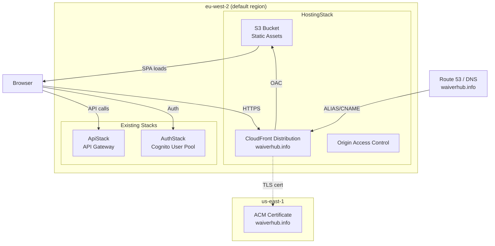
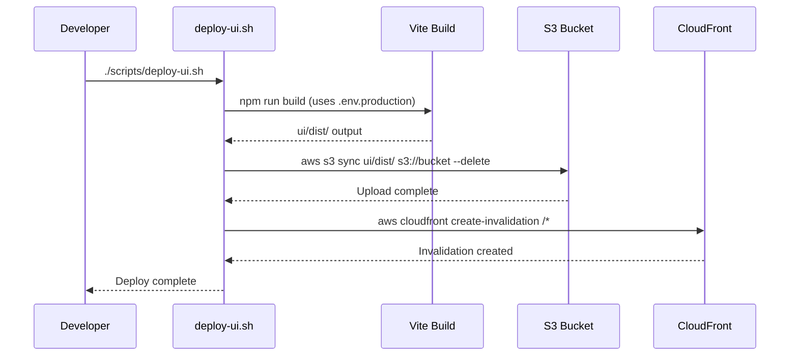
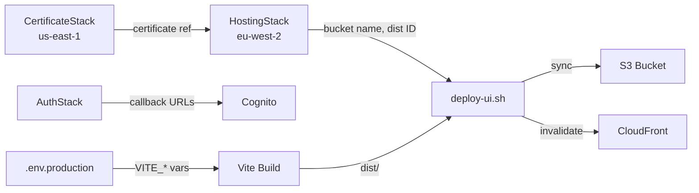

# Design Document: Production Hosting

## Overview

This design provisions production hosting for the Waiver Data Hub React SPA on AWS. The SPA (built with Vite in `ui/`) will be deployed to an S3 bucket, served globally via CloudFront with HTTPS on the custom domain `waiverhub.info`, and integrated with the existing Cognito auth and API Gateway backend in `eu-west-2`.

The key challenge is the cross-region ACM certificate requirement: CloudFront mandates certificates in `us-east-1`, while the rest of the infrastructure lives in `eu-west-2`. We solve this with a dedicated certificate stack in `us-east-1` and cross-stack references.

### Design Decisions

1. **Two-stack approach for cross-region certificate**: A `CertificateStack` in `us-east-1` provisions the ACM certificate, and the `HostingStack` in `eu-west-2` (default region) references it. CDK's `crossRegionReferences: true` handles the SSM-backed cross-region plumbing automatically.
2. **OAC over OAI**: Origin Access Control is the modern, recommended approach for S3+CloudFront. OAI is legacy.
3. **Shell script for deploy**: A simple `scripts/deploy-ui.sh` keeps deployment explicit and avoids adding CI/CD complexity. The script builds, syncs to S3, and invalidates CloudFront.
4. **DNS is manual**: Since the domain is registered externally and already used for SES, DNS record creation is left to the developer. The stack outputs all required values.

## Architecture



### Deployment Flow



## Components and Interfaces

### 1. CertificateStack (`infra/lib/certificate-stack.ts`)

A minimal CDK stack deployed to `us-east-1` that provisions the ACM certificate.

| Property | Type | Description |
|---|---|---|
| `domainName` | `string` | Domain for the certificate (default: `waiverhub.info`) |

**Outputs:**
- Certificate ARN (consumed by HostingStack via cross-region reference)

**Key implementation detail:** Uses `crossRegionReferences: true` in stack props so CDK automatically creates SSM parameters for cross-region lookups.

### 2. HostingStack (`infra/lib/hosting-stack.ts`)

The main hosting stack in the default region (`eu-west-2`).

| Property | Type | Description |
|---|---|---|
| `domainName` | `string` | Custom domain (default: `waiverhub.info`) |
| `certificate` | `ICertificate` | ACM certificate from CertificateStack |

**Resources created:**
- S3 bucket (private, `BlockPublicAccess.BLOCK_ALL`, `RemovalPolicy.DESTROY`, `autoDeleteObjects: true`)
- CloudFront distribution with OAC
- S3 bucket policy granting CloudFront read access

**Outputs:**
- `BucketName` — S3 bucket name for deploy script
- `DistributionId` — CloudFront distribution ID for cache invalidation
- `DistributionDomainName` — CloudFront domain for DNS alias
- `CertificateValidationCName` / `CertificateValidationCValue` — DNS validation records

### 3. Auth Stack Update (`infra/lib/auth-stack.ts`)

Minimal change to the existing `AuthStack`:
- Add `https://waiverhub.info/` to `callbackUrls` array
- Add `https://waiverhub.info/` to `logoutUrls` array
- Retain existing `http://localhost:5173/` and `https://localhost/` entries

### 4. Production Environment File (`ui/.env.production`)

Vite automatically loads `.env.production` when `NODE_ENV=production` (i.e., during `vite build`). Contains:

```
VITE_API_URL=https://1xwh2q6cxd.execute-api.eu-west-2.amazonaws.com/prod/
VITE_COGNITO_USER_POOL_ID=eu-west-2_lrlQ21oKk
VITE_COGNITO_CLIENT_ID=6vkr1fti3cfjcisbjl6e8p5ps1
VITE_COGNITO_DOMAIN=waiverhub-412322926502.auth.eu-west-2.amazoncognito.com
VITE_REDIRECT_SIGN_IN=https://waiverhub.info/
VITE_REDIRECT_SIGN_OUT=https://waiverhub.info/
```

### 5. Deploy Script (`scripts/deploy-ui.sh`)

A bash script that:
1. Runs `npm run build` in `ui/`
2. Reads bucket name and distribution ID from CloudFormation stack outputs
3. Runs `aws s3 sync ui/dist/ s3://$BUCKET --delete`
4. Runs `aws cloudfront create-invalidation --distribution-id $DIST_ID --paths "/*"`

Error handling: exits on S3 sync failure, warns on invalidation failure.

### Interface Between Components



## Data Models

This feature does not introduce new application data models. The relevant configuration data structures are:

### CloudFormation Stack Outputs

| Output Key | Stack | Value |
|---|---|---|
| `BucketName` | HostingStack | S3 bucket name |
| `DistributionId` | HostingStack | CloudFront distribution ID |
| `DistributionDomainName` | HostingStack | e.g., `d1234abcdef.cloudfront.net` |

### Environment Variables (ui/.env.production)

| Variable | Value |
|---|---|
| `VITE_API_URL` | `https://1xwh2q6cxd.execute-api.eu-west-2.amazonaws.com/prod/` |
| `VITE_COGNITO_USER_POOL_ID` | `eu-west-2_lrlQ21oKk` |
| `VITE_COGNITO_CLIENT_ID` | `6vkr1fti3cfjcisbjl6e8p5ps1` |
| `VITE_COGNITO_DOMAIN` | `waiverhub-412322926502.auth.eu-west-2.amazoncognito.com` |
| `VITE_REDIRECT_SIGN_IN` | `https://waiverhub.info/` |
| `VITE_REDIRECT_SIGN_OUT` | `https://waiverhub.info/` |

### CDK Stack Props

```typescript
interface HostingStackProps extends cdk.StackProps {
  domainName?: string;       // default: 'waiverhub.info'
  certificate: acm.ICertificate;
}

interface CertificateStackProps extends cdk.StackProps {
  domainName?: string;       // default: 'waiverhub.info'
}
```


## Correctness Properties

*A property is a characteristic or behavior that should hold true across all valid executions of a system — essentially, a formal statement about what the system should do. Properties serve as the bridge between human-readable specifications and machine-verifiable correctness guarantees.*

This feature is primarily infrastructure provisioning (CDK stacks, config files, shell scripts). Most acceptance criteria describe specific resource configurations rather than behaviors across a range of inputs. As a result, the majority of criteria are best validated with CDK assertion example tests rather than property-based tests.

After prework analysis and reflection, one property was identified:

### Property 1: Cognito environment variable consistency

*For any* Cognito-related `VITE_*` environment variable (`VITE_COGNITO_USER_POOL_ID`, `VITE_COGNITO_CLIENT_ID`, `VITE_COGNITO_DOMAIN`), the value in `ui/.env.production` must equal the value in `ui/.env`.

**Validates: Requirements 5.2**

### Property 2: SPA routing error responses cover all non-200 S3 errors

*For any* HTTP error code in the set {403, 404} returned by S3, the CloudFront distribution's custom error responses must map that code to `/index.html` with response code 200.

**Validates: Requirements 2.5**

### Property 3: Auth callback URLs are a superset of required URLs

*For any* URL in the set {`http://localhost:5173/`, `https://localhost/`, `https://waiverhub.info/`}, both the `callbackUrls` and `logoutUrls` arrays of the Cognito App Client must contain that URL.

**Validates: Requirements 6.1, 6.2, 6.3**

## Error Handling

### CDK Deployment Errors

| Error | Cause | Mitigation |
|---|---|---|
| Certificate validation timeout | DNS CNAME not created within 72 hours | Stack outputs provide exact CNAME records; document in deploy instructions |
| Cross-region reference failure | `crossRegionReferences` not enabled | Explicitly set `crossRegionReferences: true` on both stacks |
| S3 bucket name conflict | Globally unique name already taken | Use CDK auto-generated names (no explicit `bucketName`) |
| Stack dependency on Database | `--exclusively` flag skips dependent stacks | HostingStack has zero dependencies on DatabaseStack |

### Deploy Script Errors

| Error | Cause | Handling |
|---|---|---|
| `aws s3 sync` failure | Bad credentials, bucket doesn't exist, network error | Script exits with non-zero code and error message |
| `aws cloudfront create-invalidation` failure | Bad distribution ID, permissions | Script prints warning but exits 0 (files already uploaded) |
| `npm run build` failure | TypeScript errors, missing deps | Script exits with non-zero code (set -e) |
| Missing stack outputs | HostingStack not deployed yet | Script checks for required outputs and exits with helpful message |

### Runtime Errors

| Error | Cause | Handling |
|---|---|---|
| 403 from S3 | Direct bucket access attempt | OAC policy blocks; CloudFront serves error page |
| 404 from S3 | SPA route not matching S3 key | Custom error response returns `/index.html` with 200 |
| Mixed content | HTTP resources on HTTPS page | `ViewerProtocolPolicy.REDIRECT_HTTPS` enforces HTTPS |
| Auth redirect failure | Production URL not in Cognito callback list | Auth stack update adds `https://waiverhub.info/` to both callback and logout URLs |

## Testing Strategy

### CDK Assertion Tests (Unit Tests)

CDK assertion tests verify that the synthesized CloudFormation template contains the expected resources and configurations. These are example-based tests using `aws-cdk-lib/assertions`.

**HostingStack tests** (`infra/test/hosting-stack.test.ts`):
- S3 bucket has `BlockPublicAccess.BLOCK_ALL`, `RemovalPolicy.DESTROY`, `autoDeleteObjects: true`
- CloudFront distribution has correct origin, OAC, HTTPS redirect, price class, default root object, custom error responses
- Stack outputs exist for BucketName, DistributionId, DistributionDomainName

**CertificateStack tests** (`infra/test/certificate-stack.test.ts`):
- ACM certificate created with `waiverhub.info` domain and DNS validation

**AuthStack tests** (`infra/test/auth-stack.test.ts`):
- Cognito App Client callbackUrls contains both localhost and production URLs
- Cognito App Client logoutUrls contains both localhost and production URLs

### Property-Based Tests

Property-based tests use a PBT library (e.g., `fast-check`) to verify properties across generated inputs.

**Configuration:**
- Library: `fast-check` (TypeScript)
- Minimum iterations: 100 per property
- Test file: `infra/test/hosting-properties.test.ts`

**Property 1: Cognito environment variable consistency**
- Tag: `Feature: production-hosting, Property 1: Cognito environment variable consistency`
- Generate: random selection from the set of Cognito VITE_* variable names
- Assert: value in `.env.production` equals value in `.env` for each selected variable
- Note: This validates that the production config doesn't accidentally diverge from the development config for auth settings

**Property 2: SPA routing error responses cover all non-200 S3 errors**
- Tag: `Feature: production-hosting, Property 2: SPA routing error responses cover all non-200 S3 errors`
- Generate: error codes from {403, 404}
- Assert: CloudFront custom error responses map each code to `/index.html` with status 200
- Note: Verified via CDK template assertions on the synthesized template

**Property 3: Auth callback URLs are a superset of required URLs**
- Tag: `Feature: production-hosting, Property 3: Auth callback URLs are a superset of required URLs`
- Generate: random selection from the required URL set
- Assert: both callbackUrls and logoutUrls contain the selected URL
- Note: Verified via CDK template assertions on the synthesized template

### Deploy Script Validation

The deploy script is validated manually and via edge-case checks:
- Verify `set -e` causes exit on `s3 sync` failure
- Verify CloudFront invalidation failure produces warning but exits 0
- Verify script reads stack outputs correctly

### Test Dependencies

```json
{
  "devDependencies": {
    "fast-check": "^3.0.0",
    "jest": "^29.0.0",
    "@types/jest": "^29.0.0",
    "ts-jest": "^29.0.0"
  }
}
```
