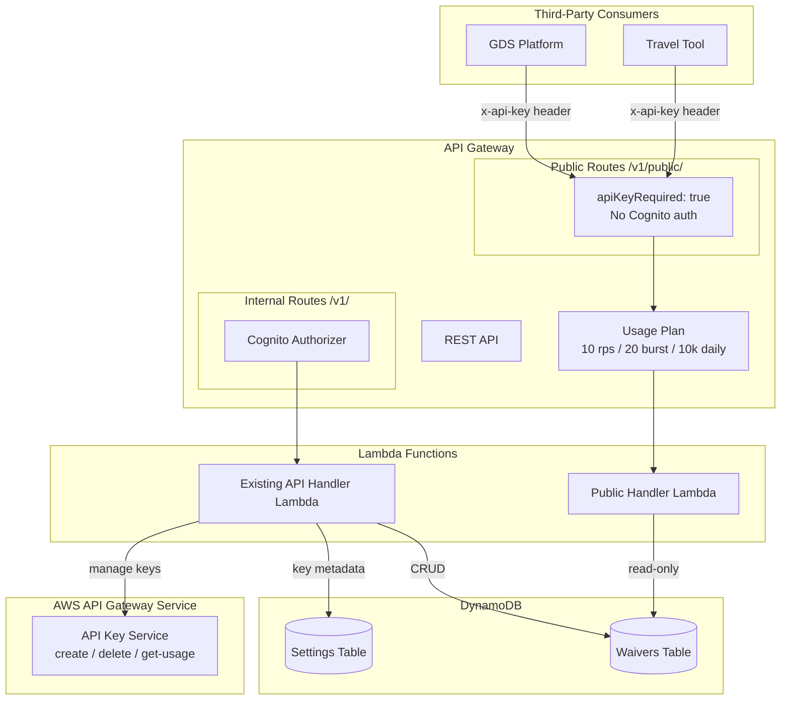

# Design Document: Public API

## Overview

This design adds a read-only public API under `/v1/public/` to the Waiver Data Hub, enabling third-party systems (GDS platforms, travel management tools, airline booking systems) to access approved waiver data using API key authentication instead of Cognito credentials.

The public API is a thin, separate Lambda handler that queries the same DynamoDB `waivers` table as the existing internal API but applies field redaction to strip sensitive internal fields (`source_s3_key`, `normalized_s3_key`, `reviewer_id`) before returning responses. API key authentication and rate limiting are handled entirely by API Gateway's built-in usage plan mechanism — no custom authorizer logic is needed.

Admin users manage API keys through new endpoints on the existing Cognito-protected API (`/v1/settings/api-keys`) and a new card on the Settings page UI. Key metadata is stored in the existing Settings DynamoDB table.

## Architecture



### Key Design Decisions

1. **Separate Lambda handler for public routes** — The public handler (`lambdas/src/public-api/handler.ts`) is a new, focused Lambda rather than adding routes to the existing 900+ line API handler. This keeps the public handler simple (read-only, no RBAC, no write operations) and allows independent scaling/monitoring.

2. **API Gateway native API key validation** — Using `apiKeyRequired: true` on method options means API Gateway validates the `x-api-key` header before the Lambda is even invoked. No custom authorizer Lambda needed.

3. **Reuse existing DynamoDB tables** — The public handler reads from the same `waivers` table. No data duplication. API key metadata is stored in the `settings` table with a `pk` prefix pattern (`apikey#<keyId>`).

4. **Field redaction at the handler level** — A `redactSensitiveFields` utility function strips sensitive fields from waiver objects before serialization. This is a pure function that can be property-tested.

5. **Admin key management via existing API handler** — The `/v1/settings/api-keys` routes are added to the existing Cognito-protected API handler since they require admin RBAC. The handler calls the API Gateway SDK to create/delete keys.

## Components and Interfaces

### 1. Public API Handler (`lambdas/src/public-api/handler.ts`)

New Lambda function handling all `/v1/public/` routes.

```typescript
// Route: GET /v1/public/waivers
// Returns paginated list of active, non-expired waivers with sensitive fields redacted
interface ListWaiversResponse {
  data: RedactedWaiver[];
  pagination: {
    page: number;
    pageSize: number;
    totalCount: number;
    totalPages: number;
  };
}

// Route: GET /v1/public/waivers/{id}
// Returns a single active waiver by ID with sensitive fields redacted
interface GetWaiverResponse {
  data: RedactedWaiver;
}

// Route: GET /v1/public/waivers/search?airline=&dateFrom=&dateTo=&route=
// Returns filtered active waivers with sensitive fields redacted
interface SearchWaiversResponse {
  data: RedactedWaiver[];
}

// Route: GET /v1/public/docs
// Returns OpenAPI 3.0 JSON spec (no API key required)
```

### 2. Field Redaction Utility (`lambdas/src/public-api/redact.ts`)

Pure function that removes sensitive fields from waiver objects.

```typescript
const SENSITIVE_FIELDS = ['source_s3_key', 'normalized_s3_key', 'reviewer_id'] as const;

type SensitiveField = typeof SENSITIVE_FIELDS[number];
type RedactedWaiver = Omit<WaiverRecord, SensitiveField>;

function redactWaiver(waiver: Record<string, unknown>): Record<string, unknown>;
function redactWaivers(waivers: Record<string, unknown>[]): Record<string, unknown>[];
```

### 3. API Key Management Routes (added to `lambdas/src/api/handler.ts`)

New routes in the existing handler for admin key management.

```typescript
// Route: POST /v1/settings/api-keys
// Body: { name: string }
// Returns: { data: { keyId: string, name: string, value: string, createdAt: string } }
// Requires: admin role

// Route: DELETE /v1/settings/api-keys/{keyId}
// Returns: { data: { keyId: string, deleted: true } }
// Requires: admin role

// Route: GET /v1/settings/api-keys
// Returns: { data: ApiKeyRecord[] }
// Requires: admin role
```

### 4. CDK Infrastructure Changes (`infra/lib/api-stack.ts`)

Extensions to the existing ApiStack:

```typescript
// New resources:
// - Usage Plan with rate/burst/quota configuration
// - Public API Lambda function
// - /v1/public/ resource tree with apiKeyRequired: true
// - /v1/public/docs resource WITHOUT apiKeyRequired (open access)
// - /v1/settings/api-keys resource tree (Cognito-protected)
// - CloudFormation outputs for Usage Plan ID and public base URL
```

### 5. Settings Page UI Extension (`ui/src/pages/Settings.tsx`)

New `ApiKeysCard` component added below existing cards.

```typescript
// ApiKeysCard component:
// - Table: name, created date, status badge, usage count, revoke button
// - Create dialog: name input → shows generated key value with copy button
// - Revoke confirmation dialog
// - Uses apiGet/apiPost/apiDelete from existing client
```

### 6. OpenAPI Spec (`lambdas/src/public-api/openapi-spec.ts`)

Static OpenAPI 3.0 JSON object describing the public endpoints.

```typescript
function getOpenApiSpec(apiBaseUrl?: string): object;
```

## Data Models

### RedactedWaiver

The public-facing waiver type, derived from `WaiverRecord` with sensitive fields removed:

```typescript
// Fields INCLUDED in public responses:
{
  id: string;
  airline_code: string;
  waiver_title: string;
  waiver_code: string;
  effective_date: string;
  expiration_date: string;
  applicable_routes: string[];
  fare_classes: string[];
  rebooking_rules: string;
  refund_rules: string;
  confidence_scores: ConfidenceScores;
  overall_confidence: number;
  status: string;                    // always 'active' in public responses
  source_type: string;
  ingestion_timestamp: string;
  extraction_timestamp: string;
  approval_timestamp: string | null;
  rejection_reason: string | null;
  version_number: number;
  created_at: string;
  updated_at: string;
}

// Fields EXCLUDED (redacted):
// - source_s3_key
// - normalized_s3_key
// - reviewer_id
```

### ApiKeyRecord (stored in Settings DynamoDB table)

```typescript
interface ApiKeyRecord {
  key: string;           // partition key: "apikey#<apiGatewayKeyId>"
  name: string;          // human-readable name given by admin
  apiGatewayKeyId: string;
  active: boolean;
  createdAt: string;     // ISO 8601
  usagePlanId: string;
}
```

The `key` field uses the prefix pattern `apikey#` to coexist with other settings in the same table. Listing all API keys uses a Scan with a `begins_with(key, 'apikey#')` filter.

### Query Parameters

| Endpoint | Parameter | Type | Default | Description |
|---|---|---|---|---|
| GET /v1/public/waivers | page | number | 1 | Page number |
| GET /v1/public/waivers | pageSize | number | 20 | Items per page (max 100) |
| GET /v1/public/waivers/search | airline | string | — | IATA airline code filter |
| GET /v1/public/waivers/search | dateFrom | string | — | ISO date, filters effective_date >= |
| GET /v1/public/waivers/search | dateTo | string | — | ISO date, filters expiration_date <= |
| GET /v1/public/waivers/search | route | string | — | Route code, filters applicable_routes contains |

