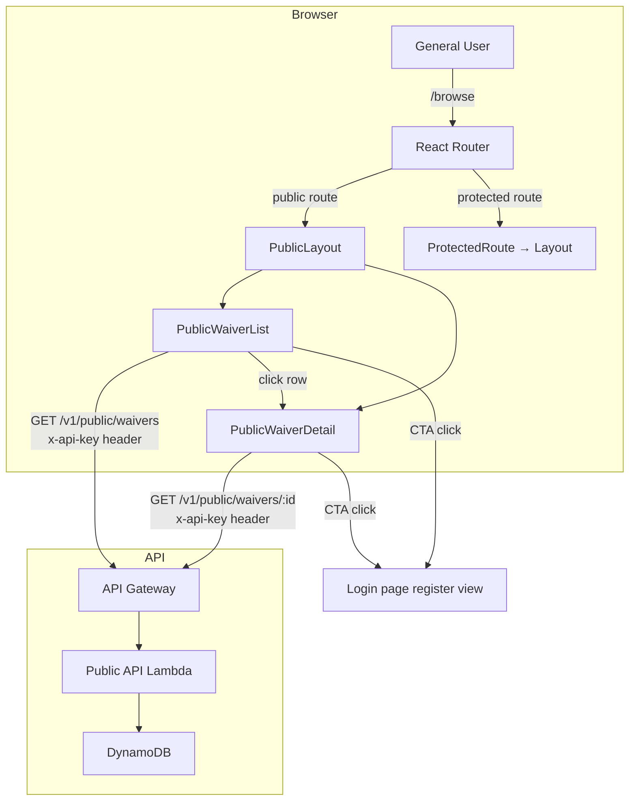

# Design Document: Public Waiver Browsing

## Overview

This feature adds unauthenticated public waiver browsing pages at `/browse` and `/browse/:id`. These routes sit outside the existing `ProtectedRoute` wrapper so General Users can view active, redacted waivers without logging in. The pages reuse the existing public API (`/v1/public/waivers`) with an embedded API key (`VITE_PUBLIC_API_KEY`) and present a simplified layout (no Sidebar/TopNav). A registration CTA banner at the bottom of each page drives visitors toward the existing registration flow.

No backend changes are required — the public API Lambda already serves redacted, active-only waiver data gated by `x-api-key`. The work is entirely frontend routing, new page components, a dedicated API client, and one env var addition.

## Architecture



### Key Design Decisions

1. **Routes outside ProtectedRoute**: `/browse` and `/browse/:id` are rendered as sibling routes to the `ProtectedRoute` block in `App.tsx`, so no Cognito auth check fires.

2. **Separate API client function**: A new `publicApiGet` helper in `ui/src/api/publicClient.ts` sends requests with `x-api-key` header instead of `Authorization: Bearer`. This avoids touching the existing `apiGet` which depends on `getIdToken()`.

3. **Embedded API key via env var**: `VITE_PUBLIC_API_KEY` is added to `ui/.env.production`. Vite bakes it into the bundle at build time. This is acceptable because the API key only grants read access to already-public, redacted data — it's a rate-limiting key, not a secret.

4. **Simplified layout component**: `PublicLayout` provides a minimal header (branding + "Sign In" link) and renders child routes via `<Outlet />`. No Sidebar, no TopNav, no auth context.

5. **No new backend work**: The existing public API Lambda already handles list, detail, and search with redaction. The frontend just needs to call it with the right header.

6. **CloudFront SPA routing already works**: The hosting stack has 403/404 → `/index.html` fallback, so direct links to `/browse/abc-123` will work out of the box.

## Components and Interfaces

### New Files

| File | Purpose |
|------|---------|
| `ui/src/api/publicClient.ts` | `publicApiGet<T>(path, params?)` — fetches from public API with `x-api-key` header |
| `ui/src/components/PublicLayout.tsx` | Minimal layout: header with branding + "Sign In" link, `<Outlet />`, no sidebar |
| `ui/src/components/RegistrationCTA.tsx` | Reusable CTA banner with message + "Register" button linking to `/login?view=register` |
| `ui/src/pages/PublicWaiverList.tsx` | Public browse list page at `/browse` |
| `ui/src/pages/PublicWaiverDetail.tsx` | Public browse detail page at `/browse/:id` |

### Modified Files

| File | Change |
|------|--------|
| `ui/src/App.tsx` | Add `/browse` routes outside `ProtectedRoute`, wrapped in `PublicLayout` |
| `ui/src/vite-env.d.ts` | Add `VITE_PUBLIC_API_KEY` to `ImportMetaEnv` |
| `ui/.env.production` | Add `VITE_PUBLIC_API_KEY=<api-key-value>` |

### Component Interfaces

```typescript
// ui/src/api/publicClient.ts
export async function publicApiGet<T>(
  path: string,
  params?: Record<string, string>
): Promise<T>;

// ui/src/components/PublicLayout.tsx
export function PublicLayout(): JSX.Element;
// Renders: header bar with "✈ Waiver Hub" branding + "Sign In" link, <Outlet />

// ui/src/components/RegistrationCTA.tsx
export function RegistrationCTA(): JSX.Element;
// Renders: colored banner with message + "Register" button

// ui/src/pages/PublicWaiverList.tsx
export function PublicWaiverList(): JSX.Element;
// Uses: publicApiGet, RegistrationCTA, useNavigate, useQuery

// ui/src/pages/PublicWaiverDetail.tsx
export function PublicWaiverDetail(): JSX.Element;
// Uses: publicApiGet, RegistrationCTA, useParams, useQuery
```

### Routing Structure (App.tsx)

```tsx
<BrowserRouter>
  <Routes>
    {/* Public routes — no auth */}
    <Route element={<PublicLayout />}>
      <Route path="browse" element={<PublicWaiverList />} />
      <Route path="browse/:id" element={<PublicWaiverDetail />} />
    </Route>

    {/* Protected routes — existing */}
    <Route element={<ProtectedRoute><RoleProvider><Layout /></RoleProvider></ProtectedRoute>}>
      <Route index element={<Dashboard />} />
      <Route path="waivers" element={<WaiverList />} />
      {/* ... rest unchanged ... */}
    </Route>
  </Routes>
</BrowserRouter>
```

Note: This requires a small refactor of `ProtectedRoute` from a wrapper component to work as a layout route (rendering `<Outlet />` instead of `{children}`), or wrapping the existing `<ProtectedRoute>` block differently. The simplest approach is to keep `ProtectedRoute` as-is wrapping the `RoleProvider > Layout` tree, and place the public routes as siblings before it.

### publicApiGet Implementation

```typescript
const BASE_URL = import.meta.env.VITE_API_URL ?? '';
const PUBLIC_API_KEY = import.meta.env.VITE_PUBLIC_API_KEY ?? '';

export async function publicApiGet<T>(
  path: string,
  params?: Record<string, string>
): Promise<T> {
  const url = new URL(`${BASE_URL}${path}`);
  if (params) {
    Object.entries(params).forEach(([k, v]) => {
      if (v) url.searchParams.set(k, v);
    });
  }
  const res = await fetch(url.toString(), {
    headers: { 'X-Api-Key': PUBLIC_API_KEY },
  });
  if (!res.ok) {
    const body = await res.json().catch(() => ({}));
    throw new Error(body?.error?.message ?? `Request failed: ${res.status}`);
  }
  return res.json();
}
```

### PublicWaiverList Behavior

- Calls `GET /v1/public/waivers?page=N&pageSize=20` via `publicApiGet`
- Displays table with columns: Airline Code, Waiver Code, Effective Date, Expiration Date, Applicable Routes
- Pagination controls (Previous / Next)
- Row click navigates to `/browse/:id`
- `RegistrationCTA` at bottom
- Loading and error states

### PublicWaiverDetail Behavior

- Calls `GET /v1/public/waivers/:id` via `publicApiGet`
- Displays all returned fields in read-only card layout
- No approve/reject/draft/archive/forward buttons
- Shows "Registration required to forward waivers" message
- `RegistrationCTA` at bottom
- 404 handling: shows "Waiver not found" if API returns 404

### PublicLayout

- Minimal header: "✈ Waiver Hub" on left, "Sign In" button on right linking to `/` (which triggers ProtectedRoute → Login)
- White background, same font family as main app
- No sidebar, no TopNav, no auth context
- `<Outlet />` for child routes

### RegistrationCTA

- Distinct background color (e.g., `#e8f0fe` blue tint or `#e6f4ea` green tint)
- Message: "Want to add your own waivers via email? Register for a free account."
- "Register" button navigates to the Login page's register view
- Visually prominent, full-width, padded

## Data Models

No new data models are introduced. The public pages consume the existing public API response shapes:

### Public Waiver List Response (from `/v1/public/waivers`)

```typescript
interface PublicWaiverListResponse {
  data: PublicWaiver[];
  pagination: {
    page: number;
    pageSize: number;
    totalCount: number;
    totalPages: number;
  };
}
```

### Public Waiver (redacted by Lambda)

```typescript
interface PublicWaiver {
  id: string;
  status: string;
  overall_confidence: number;
  airline_code?: string;
  waiver_code?: string;
  effective_date?: string;
  expiration_date?: string;
  applicable_routes?: string[];
  title?: string;
  description?: string;
  travel_window_start?: string;
  travel_window_end?: string;
  [key: string]: unknown;
  // Excluded by redact.ts: source_s3_key, normalized_s3_key, reviewer_id
}
```

### Public Waiver Detail Response (from `/v1/public/waivers/:id`)

```typescript
interface PublicWaiverDetailResponse {
  data: PublicWaiver;
}
```


## Correctness Properties

*A property is a characteristic or behavior that should hold true across all valid executions of a system — essentially, a formal statement about what the system should do. Properties serve as the bridge between human-readable specifications and machine-verifiable correctness guarantees.*

### Property 1: Public list view renders all required columns for any waiver

*For any* valid `PublicWaiver` object (with arbitrary string values for airline_code, waiver_code, effective_date, expiration_date, and applicable_routes), rendering the `PublicWaiverList` table row should produce output containing the airline code, waiver code, effective date, expiration date, and a representation of applicable routes.

**Validates: Requirements 1.5**

### Property 2: Public detail view renders all waiver fields as read-only

*For any* valid `PublicWaiver` object with arbitrary field values, rendering the `PublicWaiverDetail` view should display every non-null field value in the output and should contain zero editable input/textarea elements (i.e., no elements with `contentEditable` or enabled form inputs for waiver data).

**Validates: Requirements 2.4, 2.6**

### Property 3: publicApiGet always includes the X-Api-Key header

*For any* request path string and optional query parameters, calling `publicApiGet` should result in a fetch request that includes the `X-Api-Key` header with the configured API key value.

**Validates: Requirements 3.1, 3.3**

## Error Handling

| Scenario | Handling |
|----------|----------|
| `publicApiGet` receives non-OK response | Parse error body if JSON, throw `Error` with message. Component catches via TanStack Query `error` state and displays user-friendly message. |
| API returns 404 for waiver detail | `PublicWaiverDetail` shows "Waiver not found" message with a link back to `/browse`. |
| API key is missing/invalid (`VITE_PUBLIC_API_KEY` not set) | Requests will fail with 403 from API Gateway. Error state renders "Unable to load waivers. Please try again later." |
| Network failure | TanStack Query retry (1 retry configured globally). On final failure, error state renders friendly message. |
| Waiver data has missing optional fields (null/undefined) | Components render empty string or dash for missing values. No crash on undefined field access. |
| Direct URL access to `/browse/:id` with invalid ID format | API returns 404, handled same as "waiver not found". |

## Testing Strategy

### Unit Tests (Example-Based)

Focus on specific scenarios and edge cases:

- **Routing isolation**: Verify `/browse` renders without auth, `/waivers` still requires auth
- **PublicLayout**: Renders header with branding and "Sign In" link, no Sidebar/TopNav
- **RegistrationCTA**: Renders message text, register button navigates to login register view, has distinct background
- **PublicWaiverList**: Calls correct API endpoint, renders pagination, row click navigates to `/browse/:id`
- **PublicWaiverDetail**: Calls correct endpoint with ID, shows "Waiver not found" on 404, hides forward button, shows registration-required message
- **Error states**: API errors render friendly messages
- **publicApiGet**: Includes `X-Api-Key` header, constructs URL correctly, throws on non-OK response

### Property-Based Tests

Using `fast-check` (already available in the JS/TS ecosystem, pairs with Vitest).

- **Property 1**: Generate random `PublicWaiver` objects with `fc.record(...)`, render list row, assert all required field values appear in output. Minimum 100 iterations.
  - Tag: `Feature: public-waiver-browsing, Property 1: Public list view renders all required columns for any waiver`

- **Property 2**: Generate random `PublicWaiver` objects, render detail view, assert all non-null field values appear and no editable form inputs exist. Minimum 100 iterations.
  - Tag: `Feature: public-waiver-browsing, Property 2: Public detail view renders all waiver fields as read-only`

- **Property 3**: Generate random path strings and query param records, mock `fetch`, call `publicApiGet`, assert `X-Api-Key` header is present with correct value. Minimum 100 iterations.
  - Tag: `Feature: public-waiver-browsing, Property 3: publicApiGet always includes the X-Api-Key header`

### What's NOT Tested Here

- **Server-side redaction**: Already tested in the `public-api` spec (redact.ts unit tests)
- **CloudFront SPA routing**: Infrastructure concern, already configured in hosting-stack.ts
- **API Gateway API key validation**: Infrastructure concern, tested via integration/smoke tests
