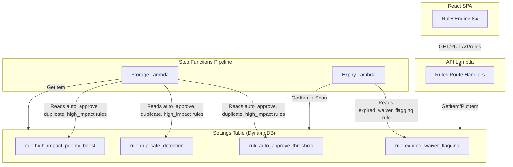

# Design Document: Rules Engine

## Overview

The Rules Engine replaces hardcoded waiver processing behaviours with a configurable, persisted rule system. Rules are stored as individual items in the existing DynamoDB Settings table using a `rule:` key prefix. Admins manage rules through the existing API handler and React UI. The pipeline reads rule configurations at processing time via DynamoDB GetItem calls, enabling immediate effect without redeployment.

The MVP scope covers four built-in rules:
1. **Auto-approve threshold** — routes high-confidence waivers to auto-approval
2. **Duplicate detection** — tags incoming waivers that match existing records
3. **Expired waiver flagging** — marks active waivers past their expiration date
4. **High-impact priority boost** — prioritises waivers with material field changes

## Architecture



**Key architectural decision:** The auto-approve threshold check moves INTO the Storage Lambda rather than remaining in the Step Functions Choice state. Step Functions cannot dynamically read DynamoDB values in a Choice condition. The Storage Lambda already has Settings table access and receives the confidence score, making it the natural place to evaluate the threshold rule.

The Step Functions Choice state will be simplified to always route to the Storage Lambda (removing the hardcoded 0.85 threshold). The Storage Lambda will determine the final status (`auto_approved` or `pending_review`) based on the rule configuration.

## Components and Interfaces

### 1. Rule Data Access Layer (`lambdas/src/shared/rules.ts`)

A shared module for reading and writing rule configurations.

```typescript
export interface RuleRecord {
  key: string;           // e.g. "rule:auto_approve_threshold"
  name: string;
  description: string;
  enabled: boolean;
  parameters: Record<string, unknown>;
  condition: string;     // Human-readable condition description
  action: string;        // Human-readable action description
  updated_at: string;    // ISO 8601
}

export type RuleId =
  | 'auto_approve_threshold'
  | 'duplicate_detection'
  | 'expired_waiver_flagging'
  | 'high_impact_priority_boost';

// Read a single rule, returning defaults if missing
export async function getRule(ruleId: RuleId): Promise<RuleRecord>;

// Read all rules
export async function getAllRules(): Promise<RuleRecord[]>;

// Update a rule (partial update of enabled/parameters)
export async function updateRule(
  ruleId: RuleId,
  updates: { enabled?: boolean; parameters?: Record<string, unknown> }
): Promise<RuleRecord>;

// Seed default rules if they don't exist
export async function seedDefaultRules(): Promise<void>;

// Default rule definitions
export const DEFAULT_RULES: Record<RuleId, Omit<RuleRecord, 'updated_at'>>;
```

### 2. API Route Handlers (added to `lambdas/src/api/handler.ts`)

New routes added to the existing path-based router:

| Method | Path | Description | Auth |
|--------|------|-------------|------|
| GET | `/v1/rules` | List all rules sorted by ID | Admin only |
| PUT | `/v1/rules/{ruleId}` | Update a rule's enabled state and/or parameters | Admin only |

**Validation rules for PUT:**
- `enabled` must be a boolean if provided
- For `auto_approve_threshold`: `parameters.threshold` must be a number in [0.0, 1.0]
- `ruleId` must match one of the four known rule IDs

### 3. Storage Lambda Modifications (`lambdas/src/storage/handler.ts`)

The Storage Lambda gains rule-aware processing:

```typescript
// Before storing, read relevant rules
const autoApproveRule = await getRule('auto_approve_threshold');
const duplicateRule = await getRule('duplicate_detection');
const highImpactRule = await getRule('high_impact_priority_boost');

// Determine final status based on auto-approve rule
let finalStatus: string;
if (autoApproveRule.enabled) {
  const threshold = (autoApproveRule.parameters.threshold as number) ?? 0.85;
  finalStatus = overallConfidence >= threshold ? 'auto_approved' : 'pending_review';
} else {
  finalStatus = 'pending_review';
}

// Conditional duplicate detection
let duplicateResult = { isDuplicate: false, duplicateOfId: null };
if (duplicateRule.enabled) {
  duplicateResult = await checkForDuplicate(airlineCode, waiverCode);
}

// Conditional high-impact priority
if (highImpactRule.enabled && isHighImpact) {
  item.priority = 'high';
}
```

### 4. Expiry Lambda (`lambdas/src/expiry-checker/handler.ts`)

A new Lambda triggered by EventBridge on a schedule (daily):

```typescript
export async function handler(): Promise<void> {
  const rule = await getRule('expired_waiver_flagging');
  if (!rule.enabled) return;

  // Scan for active waivers with expiration_date < today
  // Update their status to 'expired'
}
```

### 5. Step Functions Modification

The `ScoreCheck` Choice state is removed. The pipeline always passes through to the Storage Lambda, which now determines the status internally. The Storage Lambda's `StoreEvent` interface changes:

```typescript
// Before: status was determined by Step Functions
export interface StoreEvent {
  extractedS3Key: string;
  recordId: string;
  overallConfidence: number;
  status: 'auto_approved' | 'pending_review'; // REMOVED
}

// After: Storage Lambda determines status itself
export interface StoreEvent {
  extractedS3Key: string;
  recordId: string;
  overallConfidence: number;
}
```

### 6. UI Component (`ui/src/pages/RulesEngine.tsx`)

Replace hardcoded `SAMPLE_RULES` with API-driven state:

- Fetch rules from `GET /v1/rules` on mount
- Toggle enabled state via `PUT /v1/rules/{ruleId}`
- Editable threshold input for `auto_approve_threshold`
- Loading state, error handling, optimistic updates with rollback

## Data Models

### Rule Record (Settings Table)

| Attribute | Type | Description |
|-----------|------|-------------|
| `key` | String (PK) | `rule:{ruleId}` — e.g. `rule:auto_approve_threshold` |
| `name` | String | Human-readable rule name |
| `description` | String | Rule description |
| `enabled` | Boolean | Whether the rule is active |
| `parameters` | Map/JSON | Rule-specific parameters (e.g. `{ threshold: 0.85 }`) |
| `condition` | String | Human-readable condition |
| `action` | String | Human-readable action |
| `updated_at` | String | ISO 8601 timestamp of last update |

### Default Rule Definitions

| Rule ID | Default Enabled | Default Parameters |
|---------|----------------|-------------------|
| `auto_approve_threshold` | `true` | `{ threshold: 0.85 }` |
| `duplicate_detection` | `true` | `{}` |
| `expired_waiver_flagging` | `true` | `{}` |
| `high_impact_priority_boost` | `true` | `{}` |

## Correctness Properties

*A property is a characteristic or behavior that should hold true across all valid executions of a system — essentially, a formal statement about what the system should do. Properties serve as the bridge between human-readable specifications and machine-verifiable correctness guarantees.*

### Property 1: Rule persistence round-trip

*For any* valid rule ID and rule data, storing a rule in the Settings table and then reading it back should produce an item with key `rule:{ruleId}` containing all required attributes (name, description, enabled, parameters, condition, action, updated_at) with the same values that were stored.

**Validates: Requirements 1.1, 1.3**

### Property 2: Rule update round-trip with timestamp

*For any* valid rule update (valid enabled boolean and/or valid parameters), applying the update and then reading the rule should return the updated values, and the `updated_at` field should be a valid ISO 8601 timestamp that is greater than or equal to the time immediately before the update was applied.

**Validates: Requirements 1.4, 2.2**

### Property 3: Rules list sorted by identifier

*For any* set of rule records in the Settings table, GET `/v1/rules` should return them in ascending alphabetical order by rule identifier (the portion after the `rule:` prefix).

**Validates: Requirements 2.1**

### Property 4: Invalid rule update rejected

*For any* PUT request to `/v1/rules/{ruleId}` where the `enabled` field is present but not a boolean, OR where the rule is `auto_approve_threshold` and `parameters.threshold` is outside [0.0, 1.0], the API should return a 400 status with error code `VALIDATION_ERROR`.

**Validates: Requirements 2.3, 2.4**

### Property 5: Non-admin access forbidden

*For any* HTTP method and any `/v1/rules` path, if the requesting user does not have the `admin` Cognito group, the API should return a 403 status with error code `FORBIDDEN`.

**Validates: Requirements 2.5**

### Property 6: Unknown ruleId returns 404

*For any* string that is not one of the four known rule IDs (`auto_approve_threshold`, `duplicate_detection`, `expired_waiver_flagging`, `high_impact_priority_boost`), a PUT request to `/v1/rules/{unknownId}` should return a 404 status with error code `NOT_FOUND`.

**Validates: Requirements 2.6**

### Property 7: Auto-approve routing decision

*For any* confidence score in [0.0, 1.0] and any threshold in [0.0, 1.0] and any enabled state (true/false), the Storage Lambda should assign status `auto_approved` if and only if the rule is enabled AND the confidence score is greater than or equal to the threshold. Otherwise, the status should be `pending_review`.

**Validates: Requirements 3.1, 3.2**

### Property 8: Duplicate detection conditional

*For any* incoming waiver with airline_code and waiver_code, the `is_duplicate` field should be `true` if and only if the `duplicate_detection` rule is enabled AND a matching record (same airline_code + waiver_code) already exists in the waivers table. When the rule is disabled, `is_duplicate` should always be `false`.

**Validates: Requirements 4.1, 4.2**

### Property 9: Expired waiver flagging conditional

*For any* waiver with `status = 'active'` and `expiration_date < current_date`, the expiry checker should update the status to `'expired'` if and only if the `expired_waiver_flagging` rule is enabled. When the rule is disabled, no waiver status should be modified.

**Validates: Requirements 5.1, 5.2**

### Property 10: High-impact priority conditional

*For any* waiver flagged as high-impact, the Storage Lambda should set `priority = 'high'` if and only if the `high_impact_priority_boost` rule is enabled. When the rule is disabled, the priority field should not be set.

**Validates: Requirements 6.1, 6.2**

### Property 11: Missing rule fallback to defaults

*For any* rule ID, if the corresponding record is missing from the Settings table, the system should behave identically to the default configuration (enabled with default parameters) for that rule.

**Validates: Requirements 9.3**

## Error Handling

| Scenario | Handling |
|----------|----------|
| Rule record missing from Settings table | Fall back to default (enabled with default params). Log a warning. |
| DynamoDB read failure when fetching rule | Log error, fall back to default behaviour. Never block waiver processing due to rule lookup failure. |
| Invalid PUT body (malformed JSON) | Return 400 with `VALIDATION_ERROR` code |
| Threshold out of range | Return 400 with `VALIDATION_ERROR` and descriptive message |
| Non-admin access | Return 403 with `FORBIDDEN` code (existing RBAC pattern) |
| Unknown rule ID in PUT | Return 404 with `NOT_FOUND` code |
| Expiry checker Lambda failure | Log error, CloudWatch alarm. Waivers remain active until next successful run. |
| Concurrent rule updates | Last-write-wins (DynamoDB PutItem). Acceptable for admin-only, low-frequency updates. |

## Testing Strategy

### Property-Based Tests

The feature is well-suited for property-based testing. The core logic (routing decisions, conditional behaviour, validation) involves pure functions with clear input/output relationships where input variation reveals edge cases.

**Library:** [fast-check](https://github.com/dubzzz/fast-check) (already available in the Node.js ecosystem, compatible with Jest)

**Configuration:**
- Minimum 100 iterations per property test
- Each test tagged with: `Feature: rules-engine, Property {N}: {title}`

**Properties to implement:**
1. Rule persistence round-trip
2. Rule update round-trip with timestamp
3. Rules list sorted by identifier
4. Invalid rule update rejected
5. Non-admin access forbidden
6. Unknown ruleId returns 404
7. Auto-approve routing decision
8. Duplicate detection conditional
9. Expired waiver flagging conditional
10. High-impact priority conditional
11. Missing rule fallback to defaults

### Unit Tests (Example-Based)

- Default rule seeding creates exactly 4 rules with correct defaults
- UI renders loading state, then rule cards after fetch
- UI toggle sends correct PUT payload
- UI reverts toggle on API failure
- UI threshold input validates range client-side
- UI displays success/error messages

### Integration Tests

- End-to-end: update rule via API → process waiver → verify behaviour change
- Expiry checker Lambda scans and updates correct waivers
- Storage Lambda reads rules from real DynamoDB (local)

### Deployment Verification

- After deploy, verify 4 default rules exist in Settings table
- Verify EventBridge rule triggers expiry checker Lambda
- Verify Storage Lambda has Settings table read permissions
