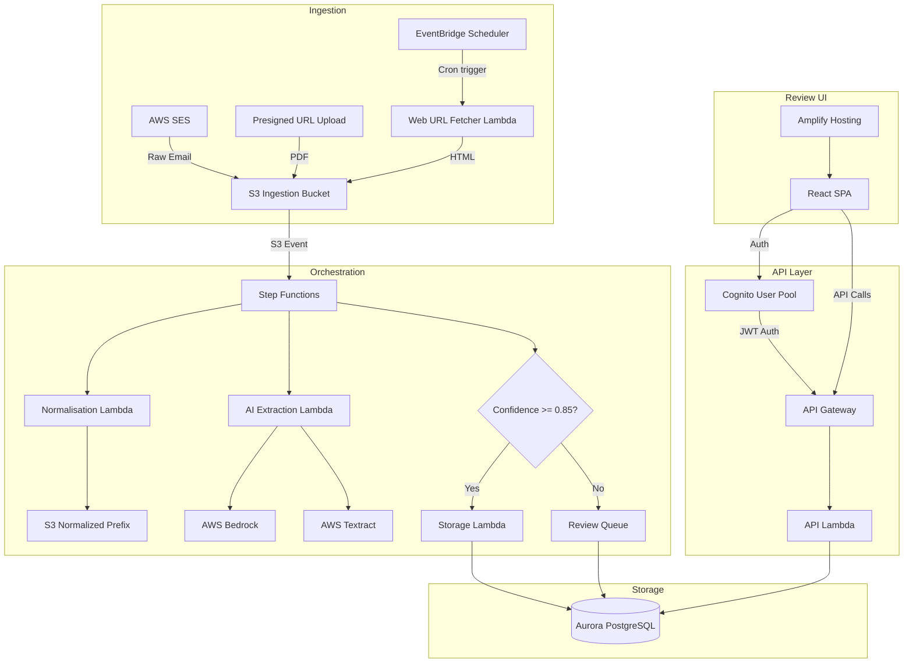
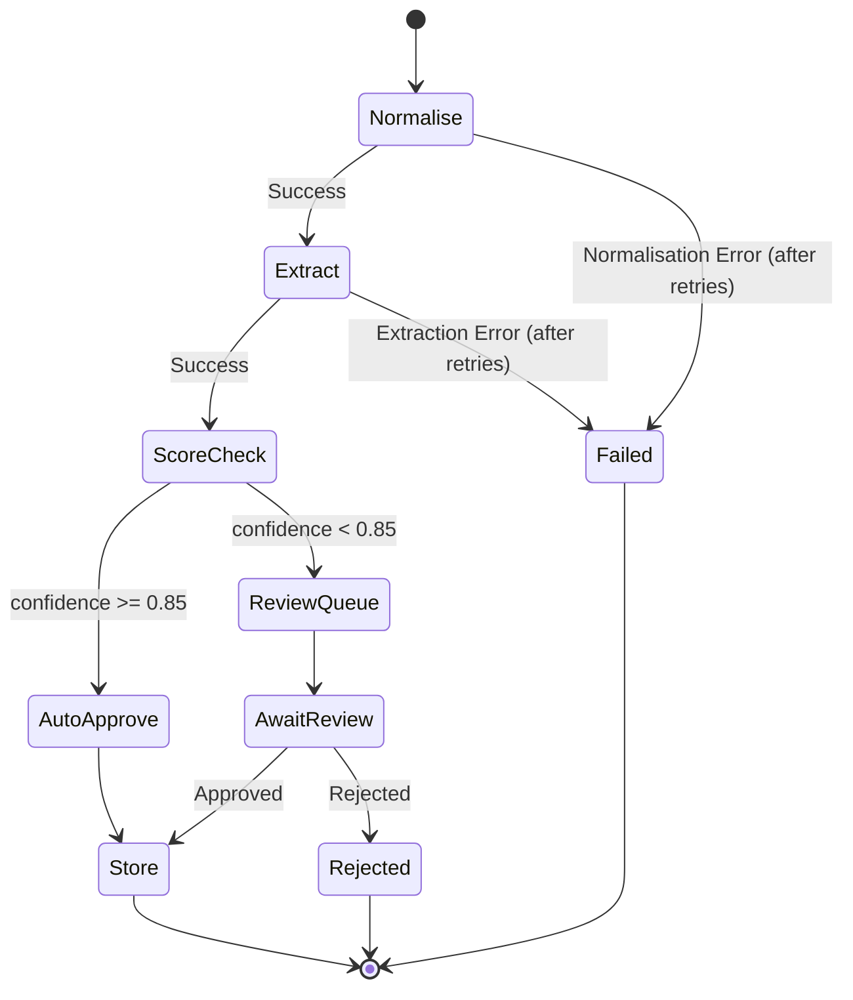

# Design Document: Waiver Data Hub Lite

## Overview

Waiver Data Hub Lite is an AWS-native platform that ingests unstructured airline waiver content from email, PDF, and web sources, normalizes it, extracts structured data using AI, routes low-confidence extractions through human review, and exposes verified waiver data via a secure REST API.

The system is composed of three major subsystems:

1. **Ingestion & Extraction Pipeline** — SES, S3, Lambda, Textract, Bedrock, and Step Functions orchestrate the flow from raw content to structured waiver records.
2. **API & Storage Layer** — Aurora PostgreSQL stores waiver records; API Gateway + Lambda serves a RESTful API protected by Cognito JWT authentication with RBAC.
3. **Review UI** — A React SPA hosted on Amplify provides a HubSpot-inspired interface for human reviewers to verify, edit, approve, or reject AI-extracted waiver data.

### Design Decisions

- **Step Functions over SQS chaining**: Step Functions provide built-in retry, error handling, state tracking, and visual debugging. This simplifies orchestration compared to chaining SQS queues with Lambda consumers.
- **Aurora PostgreSQL over DynamoDB**: Waiver data is relational (airline → waivers → versions → reviews). SQL queries with JOINs, filtering, and pagination are natural fits. Aurora Serverless v2 provides auto-scaling.
- **Bedrock over self-hosted models**: Managed inference removes operational burden. Bedrock supports prompt versioning and model selection without infrastructure management.
- **Amplify Hosting for UI**: Simplifies CI/CD for the React SPA with built-in Cognito integration.
- **Change detection via content hashing**: SHA-256 hashing of normalized HTML content provides a fast, deterministic comparison for web monitoring without storing full diffs.

## Architecture

### High-Level Architecture Diagram



### Data Flow

1. Raw content arrives via SES (email), presigned URL (PDF), or Lambda fetch (web URL).
2. All raw content lands in the S3 ingestion bucket, triggering a Step Functions execution.
3. The Normalisation Lambda converts content to plain text (Textract for PDFs, tag stripping for HTML).
4. The AI Extraction Lambda sends normalized text to Bedrock, receives structured fields + confidence scores.
5. Step Functions evaluates the overall confidence score against the threshold (0.85).
6. High-confidence records are auto-approved and stored directly. Low-confidence records enter the review queue.
7. Reviewers use the React UI to verify, edit, and approve/reject records.
8. Approved records are stored in Aurora PostgreSQL and served via the API.


## Components and Interfaces

### 1. Email Ingestion (SES → S3)

- **SES Receipt Rule**: Configured on the waiver ingestion domain. Stores raw email (RFC 822) to `s3://ingestion-bucket/raw/email/{messageId}`.
- **SES Action Lambda** (optional): Triggered by SES to parse MIME, extract PDF attachments, and store each as `s3://ingestion-bucket/raw/email/{messageId}/attachments/{filename}`. Tags unprocessable emails with `status=unprocessable`.
- **Retry**: SES delivery failures retry 3 times with exponential backoff. Failures publish to SNS alert topic.

### 2. PDF & Web Content Ingestion

- **Presigned URL Generator Lambda**: Exposed via API Gateway. Validates file type (application/pdf) and size (≤25 MB). Returns a presigned S3 PUT URL targeting `s3://ingestion-bucket/raw/pdf/{uploadId}`.
- **Web URL Fetcher Lambda**: Accepts a URL, fetches HTML via HTTP GET, stores to `s3://ingestion-bucket/raw/web/{urlHash}/{timestamp}.html`.
- **Web Monitor Scheduler**: Uses EventBridge Scheduler to invoke the Web URL Fetcher Lambda at user-defined intervals. Stores schedule metadata in a DynamoDB table (`MonitorSchedules`) with fields: `urlHash`, `url`, `intervalMinutes`, `endDateTime`, `status`, `failureCount`.
- **Change Detection**: Computes SHA-256 hash of fetched HTML. Compares against the hash of the most recent stored version. If different, marks as "Updated" and triggers extraction. If same, logs fetch and skips.
- **High-Impact Detection**: After extraction, compares key waiver fields (dates, routes, fare classes, waiver codes) against the previous version. If material changes are detected, flags as "High Impact" and boosts review queue priority.

### 3. Normalisation Service

- **Normalisation Lambda**: Triggered by Step Functions.
  - PDF → Textract `DetectDocumentText` API → plain text.
  - HTML → Strip tags/scripts/styles using a lightweight parser (e.g., `cheerio` or regex-based stripping) → plain text.
  - Email → Parse MIME body → plain text.
- **Output**: Stored at `s3://ingestion-bucket/normalized/{sourceType}/{recordId}.txt` with metadata linking to the raw object.
- **Error handling**: On failure, marks document as `normalisation_failed` and sends to SQS dead-letter queue.

### 4. AI Extraction Service

- **Extraction Lambda**: Invokes Bedrock with a structured prompt containing the normalized text. The prompt instructs the model to return a JSON object matching the Waiver_Record schema.
- **Confidence Scoring**: Each field receives a confidence score (0.0–1.0) from the model's output. The overall score is the minimum of all field scores.
- **Output**: A `Waiver_Record` JSON object stored in S3 at `s3://ingestion-bucket/extracted/{recordId}.json`.
- **Error handling**: Malformed or empty input returns an error result and marks the source as `extraction_failed`.

### 5. Step Functions Orchestrator



- **State tracking**: Each execution stores `currentStage` and `stageTimestamp` in the execution context.
- **Retries**: Each Lambda task retries up to 2 times with exponential backoff before transitioning to `Failed`.
- **Failure notification**: `Failed` state publishes to SNS alert topic with error details.

### 6. Storage Service (Aurora PostgreSQL)

- **Storage Lambda**: Receives approved Waiver_Records from Step Functions or the Review UI. Performs upsert into Aurora PostgreSQL.
- **Versioning**: On update, increments `version_number` and inserts the previous version into a `waiver_versions` audit table.
- **Unique constraint**: Composite unique index on `(airline_code, waiver_code, effective_date)`.

### 7. Waiver API (API Gateway + Lambda)

- **API Gateway**: REST API with Cognito authorizer. Routes:
  - `GET /v1/waivers` — Paginated list (default 20, max 100)
  - `GET /v1/waivers/{id}` — Single record
  - `GET /v1/waivers/active` — Active waivers (status=active, expiration > now)
  - `GET /v1/waivers/search?airline=&dateFrom=&dateTo=&route=&status=` — Filtered search
  - `POST /v1/waivers/{id}/approve` — Approve (reviewer, admin)
  - `POST /v1/waivers/{id}/reject` — Reject with reason (reviewer, admin)
  - `PUT /v1/waivers/{id}/draft` — Save draft edits (reviewer, admin)
  - `POST /v1/ingestion/upload` — Get presigned URL (admin)
  - `POST /v1/ingestion/web-url` — Submit web URL (admin)
  - `GET /v1/monitoring/schedules` — List active schedules (reviewer, admin)
  - `PUT /v1/monitoring/schedules/{id}` — Update schedule (admin)
  - `DELETE /v1/monitoring/schedules/{id}` — Terminate schedule (admin)
  - `GET /v1/dashboard/metrics` — Dashboard KPIs (reviewer, admin)
- **Authorization**: Cognito groups map to roles. API Lambda checks `cognito:groups` claim in JWT.
- **Logging**: All requests logged to CloudTrail via API Gateway access logging.

### 8. Cognito Authentication

- **User Pool**: Configured with email sign-in. Three groups: `reviewer`, `admin`, `api_consumer`.
- **App Client**: Configured for the React SPA with PKCE authorization code flow.
- **Token handling**: Access token (1 hour TTL), refresh token (30 days). React app uses Amplify Auth library for token management.

### 9. Review UI (React SPA)

- **Hosting**: AWS Amplify Hosting with CI/CD from the repository.
- **Routing**: React Router with protected routes. Unauthenticated users redirect to Cognito hosted UI.
- **State management**: React Query for server state (API calls with caching, polling). React Context for auth state.
- **Design system**:
  - Background: `#F5F5F5` (light grey)
  - Cards: White with `box-shadow: 0 1px 3px rgba(0,0,0,0.12)`
  - Primary action: `#1A73E8` (blue)
  - Status badges: Green `#34A853` (active/approved), Red `#EA4335` (rejected/failed), Yellow `#FBBC04` (pending)
- **Key screens**:
  - Dashboard — KPI cards, bar chart (30-day volume), pie chart (airline distribution), recent waivers table. Auto-refreshes every 60s.
  - Waiver List — Paginated table with search bar (substring match on code/airline/title), filter dropdowns (airline, status, date range), row click navigates to detail.
  - Review Queue — Table sorted by confidence ascending. Confidence badges (green >0.7, yellow 0.5–0.7, red <0.5). Bulk approve/reject. Row click navigates to detail.
  - Waiver Detail — Split-screen: left panel (PDF viewer / formatted text), right panel (editable form with per-field confidence indicators). Resizable divider. Actions: Approve, Reject (with reason prompt), Save Draft.
  - Monitoring — View active schedules, modify intervals/end dates, pause/terminate.
- **Navigation**: Persistent left sidebar (Dashboard, Waivers, Review Queue, Rules Engine, Reports, Settings). Top bar with global search, notifications, user profile menu.


## Data Models

### Waiver Record (Canonical JSON Schema)

```json
{
  "id": "uuid",
  "airline_code": "string (IATA 2-letter code)",
  "waiver_title": "string",
  "waiver_code": "string",
  "effective_date": "ISO 8601 date",
  "expiration_date": "ISO 8601 date",
  "applicable_routes": ["string (origin-destination pairs)"],
  "fare_classes": ["string"],
  "rebooking_rules": "string (free text)",
  "refund_rules": "string (free text)",
  "confidence_scores": {
    "airline_code": 0.95,
    "waiver_title": 0.88,
    "waiver_code": 0.92,
    "effective_date": 0.97,
    "expiration_date": 0.91,
    "applicable_routes": 0.78,
    "fare_classes": 0.85,
    "rebooking_rules": 0.72,
    "refund_rules": 0.70
  },
  "overall_confidence": 0.70,
  "status": "pending_review | active | rejected | expired | auto_approved",
  "source_type": "email | pdf | web",
  "source_s3_key": "string",
  "normalized_s3_key": "string",
  "ingestion_timestamp": "ISO 8601 datetime",
  "extraction_timestamp": "ISO 8601 datetime",
  "approval_timestamp": "ISO 8601 datetime | null",
  "reviewer_id": "string | null",
  "rejection_reason": "string | null",
  "version_number": 1,
  "created_at": "ISO 8601 datetime",
  "updated_at": "ISO 8601 datetime"
}
```

### Aurora PostgreSQL Schema

```sql
CREATE TABLE waivers (
    id UUID PRIMARY KEY DEFAULT gen_random_uuid(),
    airline_code VARCHAR(2) NOT NULL,
    waiver_title VARCHAR(500) NOT NULL,
    waiver_code VARCHAR(100) NOT NULL,
    effective_date DATE NOT NULL,
    expiration_date DATE NOT NULL,
    applicable_routes JSONB DEFAULT '[]',
    fare_classes JSONB DEFAULT '[]',
    rebooking_rules TEXT,
    refund_rules TEXT,
    confidence_scores JSONB NOT NULL,
    overall_confidence NUMERIC(3,2) NOT NULL,
    status VARCHAR(20) NOT NULL DEFAULT 'pending_review',
    source_type VARCHAR(10) NOT NULL,
    source_s3_key VARCHAR(1024) NOT NULL,
    normalized_s3_key VARCHAR(1024),
    ingestion_timestamp TIMESTAMPTZ NOT NULL,
    extraction_timestamp TIMESTAMPTZ,
    approval_timestamp TIMESTAMPTZ,
    reviewer_id VARCHAR(100),
    rejection_reason TEXT,
    version_number INTEGER NOT NULL DEFAULT 1,
    created_at TIMESTAMPTZ NOT NULL DEFAULT NOW(),
    updated_at TIMESTAMPTZ NOT NULL DEFAULT NOW(),
    CONSTRAINT uq_airline_waiver_date UNIQUE (airline_code, waiver_code, effective_date)
);

CREATE TABLE waiver_versions (
    id UUID PRIMARY KEY DEFAULT gen_random_uuid(),
    waiver_id UUID NOT NULL REFERENCES waivers(id),
    version_number INTEGER NOT NULL,
    data JSONB NOT NULL,
    changed_by VARCHAR(100),
    changed_at TIMESTAMPTZ NOT NULL DEFAULT NOW()
);

CREATE TABLE monitor_schedules (
    id UUID PRIMARY KEY DEFAULT gen_random_uuid(),
    url TEXT NOT NULL,
    url_hash VARCHAR(64) NOT NULL,
    interval_minutes INTEGER NOT NULL,
    end_date_time TIMESTAMPTZ NOT NULL,
    status VARCHAR(20) NOT NULL DEFAULT 'active',
    failure_count INTEGER NOT NULL DEFAULT 0,
    last_content_hash VARCHAR(64),
    last_fetch_timestamp TIMESTAMPTZ,
    created_at TIMESTAMPTZ NOT NULL DEFAULT NOW(),
    updated_at TIMESTAMPTZ NOT NULL DEFAULT NOW()
);

CREATE TABLE web_content_versions (
    id UUID PRIMARY KEY DEFAULT gen_random_uuid(),
    schedule_id UUID NOT NULL REFERENCES monitor_schedules(id),
    s3_key VARCHAR(1024) NOT NULL,
    content_hash VARCHAR(64) NOT NULL,
    change_detected BOOLEAN NOT NULL DEFAULT FALSE,
    high_impact BOOLEAN NOT NULL DEFAULT FALSE,
    fetched_at TIMESTAMPTZ NOT NULL DEFAULT NOW()
);

CREATE INDEX idx_waivers_status ON waivers(status);
CREATE INDEX idx_waivers_airline ON waivers(airline_code);
CREATE INDEX idx_waivers_confidence ON waivers(overall_confidence);
CREATE INDEX idx_waivers_expiration ON waivers(expiration_date);
CREATE INDEX idx_waiver_versions_waiver_id ON waiver_versions(waiver_id);
CREATE INDEX idx_monitor_schedules_status ON monitor_schedules(status);
CREATE INDEX idx_web_content_versions_schedule ON web_content_versions(schedule_id);
```

### API Response Formats

**GET /v1/waivers (Paginated List)**
```json
{
  "data": [{ "...Waiver_Record..." }],
  "pagination": {
    "page": 1,
    "pageSize": 20,
    "totalCount": 142,
    "totalPages": 8
  }
}
```

**GET /v1/waivers/{id} (Single Record)**
```json
{
  "data": { "...full Waiver_Record..." }
}
```

**Error Response**
```json
{
  "error": {
    "code": "NOT_FOUND",
    "message": "Waiver with ID {id} not found"
  }
}
```

**GET /v1/dashboard/metrics**
```json
{
  "data": {
    "activeWaivers": 87,
    "processedToday": 12,
    "pendingReview": 5,
    "averageConfidence": 0.82,
    "ingestionVolume": [{ "date": "2024-01-15", "count": 8 }],
    "airlineDistribution": [{ "airline": "AA", "count": 34 }],
    "recentWaivers": [{ "...summary..." }]
  }
}
```

